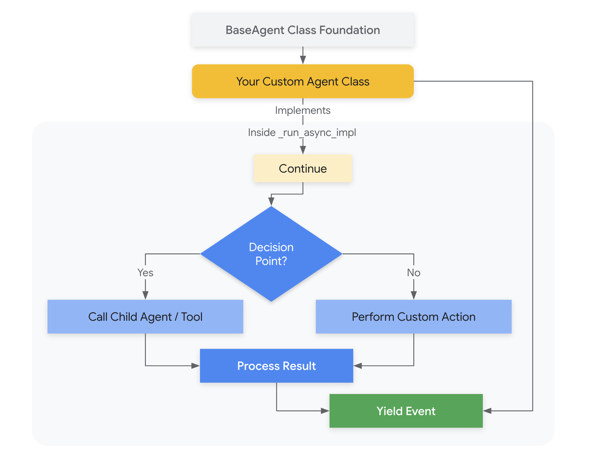

# Custom Agent

Custom Agents in Agent Development Kit (ADK) allow you to define *arbitrary* orchestration logic, going beyond the predefined patterns of `SequentialAgent`, `LoopAgent`, and `ParallelAgent`. This provides maximum flexibility for complex workflows, stateful interactions, and integrating custom business rules.



## Create a Custom Agent

**The StoryFlowAgent Example**

Our aim is to build a system that generates a short story, critiques it, revises it based on the critique, performs grammar and tone checks, and *optionally regenerates the story if the tone is negative*. This requires a workflow that combines sequential, iterative, and conditional execution.

* **Why Not Just `SequentialAgent`, `LoopAgent`, and `ParallelAgent`?**  While we *could* use a combination of these, a purely pre-defined structure wouldn't easily handle the conditional regeneration based on the tone check.  We need the flexibility to *branch* the execution flow. A `LoopAgent` could handle the critic-reviser cycle, and a `SequentialAgent` could handle some steps, but the conditional re-generation requires custom logic.

* **Why This Architecture?**  The `StoryFlowAgent` encapsulates the entire workflow within a single, manageable unit.  It uses child agents (both `LlmAgent` instances and other orchestration agents) to modularize the different steps.  This promotes:

  * **Readability:** The workflow is defined in a single place (`_run_async_impl`).
  * **Maintainability:**  Changes to one part (e.g., the critic's instructions) don't require changes to the overall orchestration.
  * **Reusability:**  The `StoryFlowAgent` can be easily integrated into other applications.
  * **Testability:**  Individual child agents and the overall workflow can be tested independently.

* **Alternative Architectures:**  We *could* technically implement this without a custom agent, by having the main application logic manage the entire flow, calling individual agents and checking conditions. However, this would lead to more complex and less organized code.  The custom agent provides a cleaner, more object-oriented approach.

**Key Concepts**

* **`BaseAgent`:** The foundation for all agents. Custom agents inherit from this.
* **`InvocationContext` (`ctx`):**  Provides access to session state (shared data) and request information. Crucial for passing information between agents.
* **`Event`:**  Represents an interaction within the agent system (e.g., a message, a response).
* **`_run_async_impl`:**  The core method where you define the custom orchestration logic. It's an asynchronous generator.
* **`children`:** This allows the framework to manage the life cycle of the agent

### Part 1: `StoryFlowAgent` Class Definition and Initialization

```py
class StoryFlowAgent(BaseAgent):
    """
    Custom agent for a story generation and refinement workflow.

    This agent orchestrates a sequence of LLM agents to generate a story,
    critique it, revise it, check grammar and tone, and potentially
    regenerate the story if the tone is negative.
    """

    def __init__(
        self,
        name: str,
        story_generator: LlmAgent,
        critic: LlmAgent,
        reviser: LlmAgent,
        grammar_check: LlmAgent,
        tone_check: LlmAgent,
    ):
        """
        Initializes the StoryFlowAgent.

        Args:
            name: The name of the agent.
            story_generator: An LlmAgent to generate the initial story.
            critic: An LlmAgent to critique the story.
            reviser: An LlmAgent to revise the story based on criticism.
            grammar_check: An LlmAgent to check the grammar.
            tone_check: An LlmAgent to analyze the tone.
        """
        super().__init__(name=name)  # Initialize the base class
        self.story_generator = story_generator
        self.critic = critic
        self.reviser = reviser
        self.grammar_check = grammar_check
        self.tone_check = tone_check

        # Create a LoopAgent for the critic-reviser cycle
        self.loop_agent = LoopAgent(
            name="CriticReviserLoop", children=[self.critic, self.reviser], max_iterations=2
        )

        # Create a SequentialAgent for post-processing
        self.sequential_agent = SequentialAgent(
            name="PostProcessing", children=[self.grammar_check, self.tone_check]
        )

        # Important: Define the child agents for framework management.
        self.children = [
            self.story_generator,
            self.loop_agent,
            self.sequential_agent,
        ]

```

**Explanation**

* **Imports:** Imports all necessary classes from the Agent Development Kit (ADK).
* **Class Definition:** Defines the `StoryFlowAgent` class, inheriting from `BaseAgent`.
* **Docstrings:**  Provides clear documentation for the class and the `__init__` method.
* **`__init__`:**
    * Takes the agent's name and instances of the five `LlmAgent` child agents as arguments.
    * Calls `super().__init__(name=name)` to initialize the `BaseAgent`.
    * Assigns the child agents to instance variables (e.g., `self.story_generator`).
    * Creates a `LoopAgent` (`self.loop_agent`) to handle the iterative critic-reviser process.
    * Creates a `SequentialAgent` (`self.sequential_agent`) for the grammar and tone checks.
    * Defines `self.children`:  This list is *essential* for the framework to manage the lifecycle of the child agents, even though the execution is custom.

### Part 2: `StoryFlowAgent` Custom Execution Logic

```py
class StoryFlowAgent(BaseAgent):  # Same class, extending the previous definition
    # ... (previous __init__ method from Part 1) ...

    async def _run_async_impl(
        self, ctx: InvocationContext
    ) -> AsyncGenerator[Event, None]:
        """
        Implements the custom orchestration logic for the story workflow.

        This method is an asynchronous generator that yields Event objects.
        It controls the execution of the child agents and implements the
        conditional regeneration based on tone.

        Args:
            ctx: The InvocationContext, providing access to session state.

        Yields:
            Event: Events generated by the child agents.
        """
        # 1. Initial Story Generation
        async for event in self.story_generator.run_async(ctx):
            yield event
            if event.is_final_response():
                story_content = event.content.model_dump_json()
                ctx.session.state["current_story"] = story_content

        # 2. Critic-Reviser Loop
        async for event in self.loop_agent.run_async(ctx):
            yield event
            # Assuming Reviser updates 'current_story' in session state.

        # 3. Sequential Post-Processing (Grammar and Tone Check)
        async for event in self.sequential_agent.run_async(ctx):
            yield event

        # 4. Tone-Based Conditional Logic
        tone_check_result = ctx.session.state.get("tone_check_result")
        if tone_check_result == "negative":
            # Regenerate story if the tone is negative
            ctx.session.state["current_story"] = ""  # Clear previous story.
            async for event in self.story_generator.run_async(ctx):
                yield event
        else:
            # If tone is not negative, do nothing (keep current story).
            pass
```

**Explanation**

* **`_run_async_impl`:**  This is where the custom orchestration logic resides.  It's an asynchronous generator function.
* **`InvocationContext (ctx)`:**  The `ctx` parameter provides access to the session state, which is used to share data between agents.
* **`AsyncGenerator[Event, None]`:**  The return type annotation indicates that the method yields `Event` objects.
* **Steps 1-3:**  These steps sequentially execute:
    * The `story_generator` (to create the initial story).
    * The `loop_agent` (to critique and revise the story).
    * The `sequential_agent` (to check grammar and tone).
    * In each step, the code iterates through the events generated by the child agent using `async for event in ...` and `yield`s each event.  This passes the events back to the caller.
    * The initial story is placed in the session state (`ctx.session.state["current_story"]`).
* **Step 4: Conditional Logic:**
    * Retrieves the `tone_check_result` from the session state.
    * **Conditional Regeneration:** If the tone is "negative," it clears the `current_story` in the session state and re-runs the `story_generator`. This demonstrates the power of custom agents to implement branching logic.
    * If the tone is not negative, it does nothing, effectively preserving the current story.
* **`yield`:** Events are yielded in all the stages, which allows the end user to view the different operations done by the agent.

### Part 3: Defining the LLM Agents

```py
# --- Define the individual LLM agents ---

story_generator = LlmAgent(
    name="StoryGenerator",
    model="gemini-1.5-flash",
    instruction="""You are a story writer. Write a short story about a cat,
    based on the topic provided in session state with key 'topic'""",
    input_schema=None,  # No specific input schema required
    output_key="current_story",  # Key for storing output in session state
)

critic = LlmAgent(
    name="Critic",
    model="gemini-1.5-flash",
    instruction="""You are a story critic.  Review the story provided in
    session state with key 'current_story'. Provide constructive criticism
    on how to improve it.""",
    input_schema=None,
    output_key="criticism",  # Key for storing criticism in session state
)

reviser = LlmAgent(
    name="Reviser",
    model="gemini-1.5-flash",
    instruction="""You are a story reviser.  Revise the story provided in
    session state with key 'current_story', based on the criticism in
    session state with key 'criticism'. Output the revised story.""",
    input_schema=None,
    output_key="current_story",  # Overwrites the original story
)

grammar_check = LlmAgent(
    name="GrammarCheck",
    model="gemini-1.5-flash",
    instruction="""You are a grammar checker. Check the grammar of the story
    provided in session state with key 'current_story'. Output any suggested
    corrections. If no corrections, output 'Grammar is good!'.""",
    input_schema=None,
    output_key="grammar_suggestions",
)

tone_check = LlmAgent(
    name="ToneCheck",
    model="gemini-1.5-flash",
    instruction="""You are a tone analyzer. Analyze the tone of the story
    provided in session state with key 'current_story'. Output 'positive' if
    the tone is positive, 'negative' if the tone is negative, or 'neutral'
    otherwise.""",
    input_schema=None,
    output_key="tone_check_result",
)

```

**Explanation**

* This section defines the five `LlmAgent` instances that will be used as child agents within the `StoryFlowAgent`.
* Each agent is initialized with:
  * `name`: A unique identifier.
  * `model`: The LLM to use (here, "gemini-1.5-flash").
  * `instruction`:  The prompt that defines the agent's role and behavior.
  * `input_schema`:  Not used in this example (set to `None`).
  * `output_key`:  The key under which the agent's output will be stored in the `InvocationContext`'s session state.  This is *crucial* for communication between agents.  For example, the `reviser` uses the `current_story` (output by the `story_generator` or a previous revision) and the `criticism` (output by the `critic`).

### Part 4: Creating the Custom Agent Instance

```py
# --- Create the custom agent instance ---
story_flow_agent = StoryFlowAgent(
    name="StoryFlowAgent",
    story_generator=story_generator,
    critic=critic,
    reviser=reviser,
    grammar_check=grammar_check,
    tone_check=tone_check,
)

```

**Explanation**

* This section creates an instance of the `StoryFlowAgent`, passing in the previously defined `LlmAgent` instances. This single line instantiates the entire custom workflow.

## When to Use Custom Agents

Custom Agents are essential when:

* **Complex Workflows:**  You need orchestration logic that can't be easily expressed using `SequentialAgent`, `LoopAgent`, or `ParallelAgent` alone.
* **Conditional Execution:**  You need to execute agents based on conditions evaluated *during* the workflow (like the tone check in the example).
* **Stateful Interactions:**  You need to maintain and update state across multiple agent invocations (like storing and updating the `current_story`).
* **Custom Business Logic:** You need to integrate specific rules or algorithms into the orchestration process.
* **Dynamic Agent Selection:**  You need to choose which agents to run *dynamically*, based on runtime information.

## Execution Flow

The `_run_async_impl` method gives you complete control over the execution flow:

1. **Arbitrary Order:** You can call the `run_async` method of child agents in *any order* you need.
2. **Conditional Logic:** You can use `if`, `else`, `while`, or any other Python control flow statements to determine which agents to run and when.
3. **State Management:** You can use the `InvocationContext`'s `session.state` (or other mechanisms) to store and retrieve data, creating stateful interactions between agents.
4. **Event Handling:**  You work directly with `Event` objects, giving you fine-grained control over the agent's output and interactions.

## Key Considerations

* **`InvocationContext`:** The `InvocationContext` (`ctx`) is vital.  It provides access to the session state, request information, and other contextual data.
* **`Event` Objects:** Understanding `Event` objects is crucial for managing the flow of information and handling agent responses.
* **Asynchronous Programming:**  Custom agents use asynchronous programming (`async` and `await`). Familiarity with these concepts is important.
* **`self.children`:** Defining the child agents, allows the framework to manage the agents.
