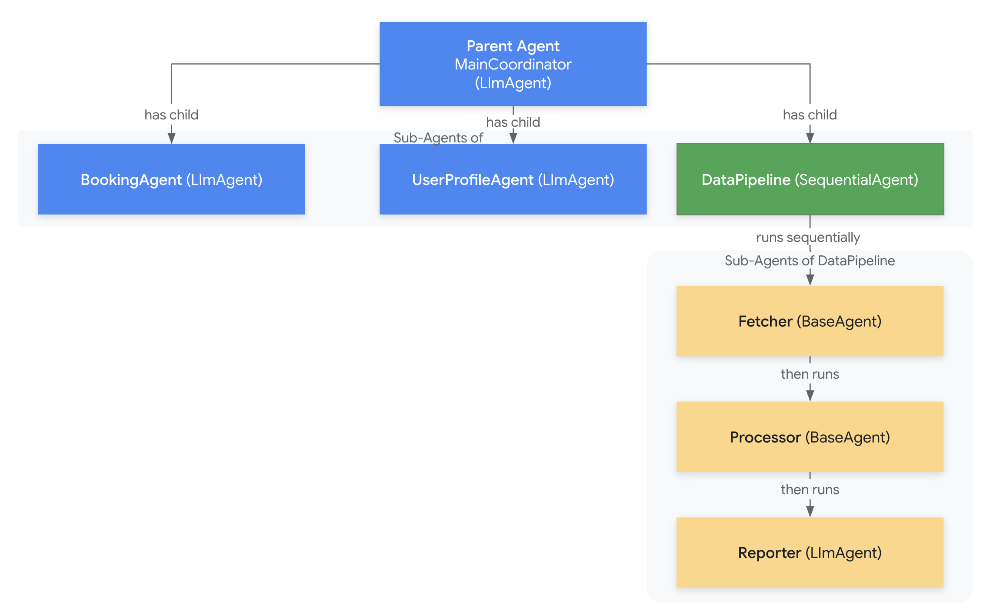

# Multi-Agent

As agentic applications grow in complexity, structuring them as a single,
monolithic agent can become challenging to develop, maintain, and reason about.
The Agent Development Kit (ADK) embraces a **Multi-Agent System**
approach, allowing you to build sophisticated applications by composing
multiple, distinct agent instances that work together.



## What is a Multi-Agent System in ADK?

In the context of ADK, a multi-agent system is an application built by
connecting two or more individual agent instances, derived from `BaseAgent`
(defined in `google.adk.agents.base_agent.py`). These systems often form a
hierarchy, where some agents act as containers or coordinators for others.

The constituent agents can be diverse:

* **`LlmAgent` instances (`google.adk.agents.llm_agent.py`):** Agents powered by large language models, capable of understanding instructions, using tools, and potentially delegating tasks.
* **Container Agents:** Specialized agents designed to manage the execution flow of their children:
  * `SequentialAgent` (`google.adk.agents.sequential_agent.py`): Executes children one after another.
  * `ParallelAgent` (`google.adk.agents.parallel_agent.py`): Executes children concurrently.
  * `LoopAgent` (`google.adk.agents.loop_agent.py`): Executes children repeatedly based on conditions.
* **Custom Agents:** Your own agents inheriting from `BaseAgent` with specialized, non-LLM logic.

```py
# Conceptual Example: A Multi-Agent Hierarchy
from google.adk.agents import LlmAgent, SequentialAgent, BaseAgent

# Define specialized agents (can be LlmAgent or custom BaseAgent)
class DataFetchingAgent(BaseAgent): ...
class DataProcessingAgent(BaseAgent): ...
class ReportingAgent(LlmAgent): ...
class BookingAgent(LlmAgent): ...
class UserProfileAgent(LlmAgent): ...

# Compose them using container agents and hierarchy
data_pipeline = SequentialAgent(
    name="DataPipeline",
    children=[
        DataFetchingAgent(name="Fetcher"),
        DataProcessingAgent(name="Processor"),
        ReportingAgent(name="Reporter", model="gemini-1.5-flash-latest")
    ]
)

root_agent = LlmAgent(
    name="MainCoordinator",
    model="gemini-1.5-flash-latest",
    instruction="Coordinate tasks related to data and user profiles.",
    allow_transfer=True, # Enable delegation
    children=[
        data_pipeline, # A SequentialAgent as a child
        BookingAgent(name="Booker"),
        UserProfileAgent(name="ProfileManager")
    ]
)

# root_agent now represents the entry point to a multi-agent system.
# Runner(agent=root_agent, ...)
```

## Why Build Multi-Agent Systems?

Structuring your application using multiple agents offers significant advantages:

1. **Modularity:** Decompose large, complex problems into smaller, self-contained units. Each agent has a specific focus, making the overall system easier to understand and build incrementally.

   * *Benefit:* Instead of one giant agent handling booking, weather, and user profiles, you have separate `BookingAgent`, `WeatherAgent`, and `ProfileAgent`.


2. **Specialization:** Design agents optimized for specific tasks or capabilities. An `LlmAgent` can excel at natural language understanding and delegation, while a custom `BaseAgent` might implement complex business logic or data transformations more efficiently.

   * *Benefit:* An `ImageAnalysisAgent` can contain specialized computer vision logic, separate from the conversational `ChatAgent`.


3. **Reusability:** Well-defined, specialized agents can often be reused across different parts of an application or even in entirely different applications.

   * *Benefit:* A generic `DatabaseQueryAgent` could be used by both a `SalesReportingAgent` and an `InventoryManagementAgent`.


4. **Maintainability:** Isolating functionality within individual agents makes debugging and updates significantly easier. Changes to one agent are less likely to have unintended side effects on others, provided the communication interfaces (like state keys or tool schemas) are stable.

   * *Benefit:* If the flight booking API changes, you only need to update the `FlightBookingAgent`, not the main coordinating agent.


5. **Structured Control Flow:** Utilize container agents (`SequentialAgent`, `ParallelAgent`, `LoopAgent`) to explicitly define complex workflows, orchestrating how and when different specialized agents are executed.

   * *Benefit:* Implement a checkout process as a `SequentialAgent` ensuring payment happens only after stock verification: `[VerifyStockAgent, ProcessPaymentAgent, ConfirmationAgent]`.

By leveraging these benefits, you can construct more robust, scalable, and manageable agentic applications with ADK compared to monolithic approaches. The framework provides the necessary primitives like agent hierarchy, container agents, and communication mechanisms (covered in later sections) to facilitate building these sophisticated systems.

# Core Concepts for Multi-Agent Architectures

Building effective multi-agent systems in ADK relies on understanding a few core concepts that define structure, communication, and context sharing between agents.

## Agent Hierarchy (`parent_agent`, `children`)

The foundation of structuring multi-agent systems in ADK is the parent-child relationship defined in `BaseAgent` (`google.adk.agents.base_agent.py`).

* **Establishing Relationships:** You create a hierarchy by assigning a list of child agent instances to the `children` attribute of a parent agent. The ADK framework automatically sets the `parent_agent` attribute on each child during the parent agent's initialization (`model_post_init`).

  * An agent can only have **one** parent. Attempting to add an agent instance that already has a parent will raise a `ValueError`.


* **Importance:** This hierarchical structure serves several purposes:

  * **Scope for Container Agents:** Container agents like `SequentialAgent`, `ParallelAgent`, and `LoopAgent` operate specifically on the agents listed in their `children`.
  * **Scope for LLM Transfer:** When an `LlmAgent` has `allow_transfer=True`, the potential agents it can transfer control to are typically determined by this hierarchy (its `parent_agent`, its `children`, and siblings – other children of its parent, unless `disallow_transfer_to_sibling=True`).
  * **Organizational Structure:** Provides a clear way to visualize and manage the relationships between different components of your application.


* **Code Snippet: Defining Hierarchy**

```py
from google.adk.agents import LlmAgent, BaseAgent

# Define individual agents
greeting_agent = LlmAgent(name="Greeter", model="gemini-1.5-flash-latest", ...)
task_agent_1 = BaseAgent(name="Task1", ...)
task_agent_2 = LlmAgent(name="Task2", model="gemini-1.5-flash-latest", ...)

# Create a parent/coordinator agent
coordinator_agent = LlmAgent(
    name="Coordinator",
    model="gemini-1.5-flash-latest",
    description="I coordinate greetings and tasks.",
    children=[ # Assign children here
        greeting_agent,
        task_agent_1,
        task_agent_2
    ]
)

# Now, the framework automatically sets:
# greeting_agent.parent_agent == coordinator_agent
# task_agent_1.parent_agent == coordinator_agent
# task_agent_2.parent_agent == coordinator_agent

# You can find agents within the hierarchy
# found_agent = coordinator_agent.find_agent("Task1")
# assert found_agent == task_agent_1
```

## Communication & Coordination Mechanisms

Agents in a multi-agent system often need to share information or trigger actions in one another. ADK supports several mechanisms:

1. **Shared State (`session.state`):**

   * **Mechanism:** Agents running within the same `InvocationContext` (and therefore sharing the same `session` object) can communicate passively by reading and writing to the `session.state` dictionary. Callbacks and tools access this via `context.state`.
   * **How it works:** One agent (or its tool/callback) writes a value (`context.state['data_key'] = processed_data`), and a subsequent agent (often in a `SequentialAgent` or `LoopAgent`) reads it (`data = context.state.get('data_key')`).
   * **Convenience:** The `output_key` property on `LlmAgent` automatically saves the agent's final response to a specified state key.
   * **Nature:** Asynchronous, passive communication. Agents don't directly signal each other; they rely on reading/writing to a shared blackboard.


2. **Direct Invocation (`AgentTool`):**

   * **Mechanism:** An `LlmAgent` can be configured to use another agent instance (any `BaseAgent`) as one of its `tools` by wrapping it with `AgentTool` (defined in `google.adk.tools.agent_tool.py`).
   * **How it works:** The parent `LlmAgent`'s model generates a function call targeting the `AgentTool`. The `AgentTool` then executes the child agent's `run_async` method within a temporary context, captures its final response, forwards state/artifact deltas, and returns the result to the parent LLM like any other tool.
   * **Nature:** Synchronous (within the parent's flow), explicit invocation. The parent agent directly calls the child agent as a sub-routine.


3. **LLM-Driven Delegation (`LlmAgent` Transfer):**

   * **Mechanism:** An `LlmAgent` with `allow_transfer=True` can decide, based on its instructions and the descriptions of nearby agents in the hierarchy, to transfer control to another agent.
   * **How it works:** The LLM generates a specific function call (e.g., `transfer_to_agent(agent_name='target_agent')`). The `AutoFlow` (`google.adk.flows.llm_flows.auto_flow.py`) intercepts this call and shifts the execution focus to the target agent within the same `InvocationContext`.
   * **Nature:** Dynamic, LLM-controlled delegation based on natural language understanding and agent descriptions.

The choice of communication mechanism depends on the desired coupling, control flow, and dynamism between agents.

## Invocation Context (`InvocationContext`)

* **Role:** The `InvocationContext` (defined in `google.adk.agents.invocation_context.py`) acts as the carrier of essential information throughout a single user request-response cycle (an "invocation"), even as control might pass between different agents.
* **Shared Information:** It holds references to crucial components like the `session` (including `session.state`), the `session_service`, `artifact_service`, `memory_service`, the `invocation_id`, and the initial `user_content`. All agents participating in the same invocation share the same `InvocationContext` instance (though the `agent` attribute within it changes as control transfers). This shared context is what enables communication via shared state.
* **`branch` Property:**
  * **Purpose:** Used to create distinct contextual paths, primarily for managing conversational history or context isolation, especially in concurrent scenarios.
  * **Format:** A dot-separated string representing the path through the agent hierarchy (e.g., `Coordinator.ParallelChild1`, `Coordinator.ParallelChild2`).
  * **Usage:** Notably, `ParallelAgent` automatically updates the `branch` for each child it runs (`new_branch = f'{parent_context.branch}.{child.name}'` if a branch exists, otherwise just `child.name`). Session/memory services *could* use this branch information to retrieve only relevant history for an agent, preventing concurrent children from seeing each other's intermediate conversation turns within that parallel execution block. `SequentialAgent` and `LoopAgent` typically do not modify the branch, inheriting it from their parent, meaning their children usually share the same conversational context path.

Understanding these core concepts is essential before diving into the specific container agents and interaction patterns used to build multi-agent systems.

# Composition Primitives: Container Agents

ADK provides specialized "container" agents, derived from `BaseAgent`, whose primary purpose is not to perform tasks themselves, but to orchestrate the execution of their child agents according to specific control flow patterns. These are essential building blocks for creating structured multi-agent workflows.

## SequentialAgent

* **Source File:** `google.adk.agents.sequential_agent.py`
* **Purpose:** To execute a series of child agents one after another, in a predefined order.
* **Execution Flow:** The `SequentialAgent` iterates through the list of agents provided in its `children` attribute. For each child, it calls the child's `run_async` method and yields all events generated by that child before moving on to the next child in the sequence.
* **Context & State Handling:**
  * The *same* `InvocationContext` instance (`ctx`) is passed to each child agent sequentially.
  * This means that any changes made to `ctx.session.state` by an earlier child agent (or its tools/callbacks) are immediately visible to subsequent child agents in the sequence. This is the primary mechanism for passing results or context between steps in the pipeline.
  * It does not modify the `InvocationContext.branch`.
* **Use Cases:**
  * Implementing multi-step data processing pipelines (e.g., Fetch \-\> Transform \-\> Analyze \-\> Report).
  * Chaining dependent tasks where the output of one agent is required as input for the next.
  * Defining fixed, ordered workflows.
* **Code Example:**

```py
from google.adk.agents import SequentialAgent, LlmAgent
from google.adk.agents.callback_context import CallbackContext
from google.genai import types

# Assume Agent_Step1, Agent_Step2, Agent_Step3 are defined LlmAgent instances
# Agent_Step1 might have output_key='step1_result'
# Agent_Step2 might read context.state['step1_result'] in its instruction or callbacks

pipeline_agent = SequentialAgent(
    name="ProcessingPipeline",
    children=[
        LlmAgent(name="Agent_Step1", model="gemini...", instruction="Fetch data.", output_key="step1_result"),
        LlmAgent(name="Agent_Step2", model="gemini...", instruction="Process data found in state key 'step1_result'.", output_key="step2_result"),
        LlmAgent(name="Agent_Step3", model="gemini...", instruction="Summarize result from state key 'step2_result'.")
    ]
)

# When pipeline_agent.run_async(ctx) is called:
# 1. Agent_Step1 runs. Its result might be saved to ctx.session.state['step1_result'].
# 2. Agent_Step2 runs. It can access ctx.session.state['step1_result']. Its result might be saved to ctx.session.state['step2_result'].
# 3. Agent_Step3 runs. It can access ctx.session.state['step2_result'].
```

## ParallelAgent

* **Source File:** `google.adk.agents.parallel_agent.py`
* **Purpose:** To execute multiple child agents concurrently.
* **Execution Flow:** The `ParallelAgent` uses `asyncio` to start all its child agents' `run_async` methods nearly simultaneously. It then merges the streams of events yielded by each child using the internal `_merge_agent_run` function. This function ensures that events are yielded as soon as any child produces one, effectively interleaving the output from the concurrent runs. The `ParallelAgent` only finishes once *all* child agents have completed their execution.
* **Context & State Handling:**
  * Before calling `run_async` on each child, `ParallelAgent` modifies the `InvocationContext`'s `branch` attribute by appending the child's name (e.g., `parent_branch.ChildName`). This provides a distinct contextual path for each concurrent execution, potentially useful for isolating conversational history if the underlying memory/session service supports branch-aware retrieval.
  * Despite the branched context path, all concurrently running children still receive a reference to the *same, shared* `session` object, including `session.state`. Therefore, they can all read the state as it was when the parallel execution started, and they can all *write* to the same state dictionary.
  * **Concurrency Note:** While `asyncio` manages concurrency, be cautious if multiple parallel children attempt to modify the *same* state key simultaneously without coordination, as this could lead to race conditions (though the asynchronous nature might often make direct conflicts less likely than in threaded scenarios). Reads are generally safe.
* **Use Cases:**
  * Running independent data gathering tasks simultaneously (e.g., fetching weather, news, and stock prices).
  * Performing parallel processing on different pieces of data.
  * Executing tasks where the order of completion doesn't matter, and overall latency can be reduced by running them concurrently.
* **Code Example:**

```py
from google.adk.agents import ParallelAgent, LlmAgent

# Assume WeatherAgent, NewsAgent, TrafficAgent are defined LlmAgent instances
# They might use output_key to save their results to different state keys.

information_gatherer = ParallelAgent(
    name="InfoGatherer",
    children=[
        LlmAgent(name="WeatherAgent", model="gemini...", instruction="Get weather for London.", output_key="weather_result"),
        LlmAgent(name="NewsAgent", model="gemini...", instruction="Get top headline.", output_key="news_result"),
        LlmAgent(name="TrafficAgent", model="gemini...", instruction="Get traffic status.", output_key="traffic_result")
    ]
)

# When information_gatherer.run_async(ctx) is called:
# 1. WeatherAgent, NewsAgent, TrafficAgent start concurrently.
# 2. Each receives a context with a modified branch (e.g., ctx.branch + ".WeatherAgent").
# 3. Events from the agents may be interleaved in the output stream.
# 4. All agents read/write to the *same* ctx.session.state.
# 5. After all three finish, the state might contain 'weather_result', 'news_result', 'traffic_result'.
```

## LoopAgent

* **Source File:** `google.adk.agents.loop_agent.py`
* **Purpose:** To execute a sequence of child agents repeatedly until a specific condition is met.
* **Execution Flow:** The `LoopAgent` runs its list of `children` sequentially, similar to `SequentialAgent`. After completing one full pass through all children, it checks its termination conditions. If conditions are not met, it starts another iteration, running the children sequentially again.
* **Termination Conditions:** The loop stops if either of the following occurs:
  1. `max_iterations` (Optional `int`): If set, the loop stops after completing the specified number of full iterations.
  2. `actions.escalate = True`: If any event yielded by *any* child agent during an iteration contains `actions.escalate = True` (defined in `google.adk.events.event_actions.py`), the `LoopAgent` immediately stops processing the current iteration and terminates after yielding that escalating event.
* **Context & State Handling:**
  * The *same* `InvocationContext` (`ctx`) is passed to the children in each iteration.
  * This means state changes made in one iteration (e.g., updating a counter in `ctx.session.state`) are persistent and visible in the next iteration.
  * It does not modify the `InvocationContext.branch`.
* **Live Mode:** Note that `_run_live_impl` is explicitly not implemented for `LoopAgent` in the provided code, raising a `NotImplementedError`.
* **Use Cases:**
  * Implementing retry logic for a sequence of tasks.
  * Polling for a status change until a desired state is reached (where a child agent checks the status and sets `escalate=True` when done).
  * Iterative refinement processes where agents progressively improve a result stored in the state over multiple cycles.
  * Building simple state machines where a child agent determines the next state and decides whether to continue (`escalate=False`) or exit the loop (`escalate=True`).
* **Code Example:**

```py
from google.adk.agents import LoopAgent, LlmAgent, BaseAgent
from google.adk.events.event_actions import EventActions
from google.adk.agents.invocation_context import InvocationContext
from google.adk.events import Event
from google.genai import types
from typing import AsyncGenerator
from typing_extensions import override

class CheckConditionAgent(BaseAgent):
    @override
    async def _run_async_impl(self, ctx: InvocationContext) -> AsyncGenerator[Event, None]:
        counter = ctx.session.state.get('loop_counter', 0)
        should_stop = counter >= 2 # Stop condition
        yield Event(
            author=self.name,
            content=types.Content(parts=[types.Part(text=f"Checking condition: Counter={counter}. Stop={should_stop}")]) ,
            actions=EventActions(escalate=should_stop) # Escalate if counter >= 2
        )

class IncrementCounterAgent(BaseAgent):
     @override
     async def _run_async_impl(self, ctx: InvocationContext) -> AsyncGenerator[Event, None]:
        counter = ctx.session.state.get('loop_counter', 0) + 1
        ctx.session.state['loop_counter'] = counter # Update state
        yield Event(
            author=self.name,
            content=types.Content(parts=[types.Part(text=f"Incremented counter to {counter}")])
            # State delta is implicitly handled by context mutation
        )

# Loop up to 5 times, but CheckConditionAgent will escalate earlier
iterative_agent = LoopAgent(
    name="IterativeProcessor",
    max_iterations=5,
    children=[
        IncrementCounterAgent(name="Incr"),
        CheckConditionAgent(name="Check")
    ]
)

# When iterative_agent.run_async(ctx) is called (assuming state starts empty):
# Iteration 1: Incr (counter=1), Check (counter=1, escalate=False)
# Iteration 2: Incr (counter=2), Check (counter=2, escalate=False) -> Note: Error in condition logic above, should be >= 2
# Iteration 3: Incr (counter=3), Check (counter=3, escalate=True) -> Loop terminates here.
# Corrected condition logic:
# Iteration 1: Incr (counter=1), Check (counter=1, escalate=False)
# Iteration 2: Incr (counter=2), Check (counter=2, escalate=True) -> Loop terminates here.
```

These container agents provide powerful ways to structure the flow of execution between multiple specialized agents within your ADK application.

# Interaction Mechanisms in Detail

Once you have multiple agents defined, you need mechanisms for them to communicate, coordinate, or delegate tasks. ADK provides several ways for agents to interact, primarily revolving around LLM capabilities, explicit tool usage, and shared session state.

## LLM-Driven Delegation (Agent Transfer)

This mechanism leverages the language understanding capabilities of an LLM to dynamically route tasks between agents based on their descriptions and the conversational context.

* **Applies To:** Primarily `LlmAgent` instances where the `allow_transfer` attribute is set to `True` (which is the default).
* **Mechanism:**
  1. The currently active `LlmAgent` receives input (user message or tool results).
  2. Its underlying flow (typically `AutoFlow`, defined in `google.adk.flows.llm_flows.auto_flow.py`) constructs a prompt for the LLM. This prompt includes the agent's instructions, conversation history, and crucially, the *descriptions* of other "nearby" agents it can potentially transfer to.
  3. **Agent Discovery:** Nearby agents typically include the agent's `parent_agent`, its `children`, and its siblings (other children of the parent), unless `disallow_transfer_to_sibling=True` is set on the parent.
  4. **LLM Decision:** The LLM analyzes the user's request and the descriptions of the available agents. If it determines another agent is better suited to handle the request, it generates a specific function call, typically `transfer_to_agent(agent_name='target_agent_name')`.
  5. **Framework Handling:** The `AutoFlow` (or similar logic) detects this specific function call. Instead of executing it like a normal tool, it modifies the `InvocationContext` by setting the `agent` attribute to the target agent instance (found using `root_agent.find_agent(target_agent_name)`) and continues the execution loop, effectively transferring control. The same `InvocationContext` (with updated `agent`) is used, preserving the session state and invocation ID.
* **Characteristics:** Dynamic, flexible, relies on LLM interpretation, suitable for natural language routing. Control transfer is managed by the framework based on the LLM's output.
* **Requirement:** Clear, concise, and *distinct* `description` fields for all participating agents are **essential** for the LLM to make accurate routing decisions. The agent's `instruction` should also guide it on *when* to consider transferring.
* **Code Example (Conceptual):**

```py
from google.adk.agents import LlmAgent

booking_agent = LlmAgent(
    name="FlightBooker",
    model="gemini...",
    description="Specializes in booking flights.",
    # ... other config ...
)

weather_agent = LlmAgent(
    name="WeatherReporter",
    model="gemini...",
    description="Provides weather forecasts.",
    # ... other config ...
)

coordinator = LlmAgent(
    name="Coordinator",
    model="gemini...",
    instruction="You are a helpful assistant. Delegate flight booking to FlightBooker and weather requests to WeatherReporter.",
    description="Main coordinator agent.",
    allow_transfer=True, # Enable transfer
    children=[booking_agent, weather_agent]
)

# --- Hypothetical Run ---
# User Query: "Book a flight to Paris and tell me the weather there."

# 1. Coordinator receives the query.
# 2. LLM (for Coordinator) analyzes query and agent descriptions.
# 3. LLM might decide to handle weather first, outputting:
#    FunctionCall(name='transfer_to_agent', args={'agent_name': 'WeatherReporter'})
# 4. Framework transfers control to WeatherReporter.
# 5. WeatherReporter runs, gets weather for Paris, responds. Control returns to Coordinator.
# 6. Coordinator's LLM gets the weather response, sees the remaining task.
# 7. LLM outputs:
#    FunctionCall(name='transfer_to_agent', args={'agent_name': 'FlightBooker'})
# 8. Framework transfers control to FlightBooker.
# 9. FlightBooker runs to handle the booking.
# ... (flow continues)
```

## Direct Invocation (`AgentTool`)

This mechanism allows an `LlmAgent` to treat another agent as a callable function or tool, providing a more explicit and controlled way to invoke sub-tasks.

* **Applies To:** An `LlmAgent` (parent) invoking any other `BaseAgent` instance (child/target).
* **Mechanism:**
  1. You wrap the target agent instance within `AgentTool` (defined in `google.adk.tools.agent_tool.py`).
  2. You include this `AgentTool` instance in the `tools` list of the parent `LlmAgent`.
  3. `AgentTool` automatically generates a function declaration for the target agent (using its `name`, `description`, and optionally its `input_schema`).
  4. **LLM Decision:** The parent `LlmAgent`'s LLM, seeing the `AgentTool` in its list of available tools, can decide to generate a function call targeting it, providing arguments based on the target agent's declaration (often just a 'request' string, or structured input if `input_schema` is used).
  5. **`AgentTool` Execution:** When the framework executes this function call, the `AgentTool.run_async` method is invoked. It:
     * Creates a temporary, isolated run context for the target agent (using `InMemorySessionService` and `InMemoryMemoryService` by default).
     * Copies the current state from the parent's `ToolContext` into the child's temporary session.
     * Runs the target agent using `runner.run_async` with the input derived from the LLM's arguments.
     * Extracts the final response (text or structured if `output_schema` is used) from the target agent's run.
     * Forwards any state deltas and saved artifacts from the child's run back to the parent's `ToolContext`, ensuring changes are reflected in the main session.
     * Returns the final response as the result of the tool call.
* **Characteristics:** Explicit, controlled invocation; behaves like a standard tool call from the parent LLM's perspective; encapsulates the child agent's execution; automatically handles state/artifact forwarding.
* **Requirement:** The target agent must be wrapped in `AgentTool` and included in the parent's `tools` list.
* **Code Example (Conceptual):**

```py
from google.adk.agents import LlmAgent, BaseAgent
from google.adk.tools import AgentTool
from pydantic import BaseModel

# Define a target agent (could be LlmAgent or BaseAgent)
class SummarizerAgent(LlmAgent):
    name: str = "TextSummarizer"
    model: str = "gemini..."
    instruction: str = "Summarize the input text."
    # Optional: Define input/output for structured interaction
    # class SummarizerInput(BaseModel): text_to_summarize: str
    # class SummarizerOutput(BaseModel): summary: str
    # input_schema = SummarizerInput
    # output_schema = SummarizerOutput

summarizer = SummarizerAgent()

# Create the AgentTool
summarizer_tool = AgentTool(agent=summarizer)

# Parent agent uses the AgentTool
orchestrator = LlmAgent(
    name="Orchestrator",
    model="gemini...",
    instruction="Fetch text and summarize it using the TextSummarizer tool.",
    tools=[summarizer_tool] # Add the AgentTool here
)

# --- Hypothetical Run ---
# User Query: "Summarize the latest news article."

# 1. Orchestrator fetches the article text (e.g., using another tool, not shown).
# 2. Orchestrator's LLM decides to summarize, outputting:
#    FunctionCall(name='TextSummarizer', args={'request': 'Long article text...'})
#    # Or if schema used: {'text_to_summarize': 'Long article text...'}
# 3. Framework calls summarizer_tool.run_async(...).
# 4. AgentTool runs the SummarizerAgent internally with the input text.
# 5. SummarizerAgent generates the summary.
# 6. AgentTool captures the summary, forwards state/artifacts (if any), returns summary.
# 7. Orchestrator's LLM receives the summary as the tool result.
# 8. Orchestrator presents the summary to the user.
```

## Shared State (`session.state` & `output_key`)

This is the most fundamental, passive way for agents to share information when they operate within the same session, particularly useful in sequential or looping workflows.

* **Applies To:** Any agents (`BaseAgent`, `LlmAgent`, container agents managing children) running within the same `InvocationContext`. Especially relevant for children of `SequentialAgent` and `LoopAgent`.
* **Mechanism:**
  1. **Writing:** An agent, tool, or callback modifies the state dictionary accessible via `context.state['my_key'] = my_value`. This mutation is tracked by the `State` object and recorded in the event's `actions.state_delta`.
  2. **Reading:** Another agent, tool, or callback running later *within the same invocation* (or subsequent iterations of a loop) accesses the same state dictionary via `context.state.get('my_key')` or `context.state['my_key']`.
  3. **`output_key` Convenience:** `LlmAgent` has an `output_key` property. If set to a string (e.g., `"agent_result"`), the agent's final text response (or structured output if `output_schema` is defined and used) is automatically saved to `session.state["agent_result"]` after the agent finishes its run (`__maybe_save_output_to_state` in `llm_agent.py`).
* **Characteristics:** Asynchronous (agents don't wait for each other to read/write state beyond the workflow's control flow); passive (agents poll the state rather than being directly signaled); requires careful management of state keys to avoid collisions or stale data.
* **Requirement:** Agents must be running within the same invocation (sharing the same `session` instance via the `InvocationContext`).
* **Code Example (Conceptual \- Sequential):**

```py
from google.adk.agents import SequentialAgent, LlmAgent

agent_fetch = LlmAgent(
    name="Fetcher",
    model="gemini...",
    instruction="Fetch the user ID and store it.",
    output_key="user_id_from_fetcher" # Save final response to this state key
)

agent_process = LlmAgent(
    name="Processor",
    model="gemini...",
    # Instruction accesses state written by the previous agent
    instruction="Retrieve the user ID from state key 'user_id_from_fetcher' and process it."
)

pipeline = SequentialAgent(
    name="UserProcessingPipeline",
    children=[agent_fetch, agent_process]
)

# --- Hypothetical Run ---
# User Query: "Process my data."

# 1. pipeline starts.
# 2. agent_fetch runs, determines user ID is 'user123', responds 'user123'.
# 3. Framework saves 'user123' into ctx.session.state['user_id_from_fetcher'] because output_key is set.
# 4. agent_process runs. Its LLM prompt includes its instruction.
# 5. When processing the instruction, the agent reads ctx.session.state['user_id_from_fetcher'] ('user123').
# 6. agent_process uses 'user123' to perform its task.
```

These three mechanisms provide a range of options, from dynamic LLM-based routing to explicit tool-like invocation and simple state sharing, allowing you to build multi-agent systems with varying degrees of coupling and control.

# Common Multi-Agent Patterns

By combining the container agents (`SequentialAgent`, `ParallelAgent`, `LoopAgent`) and interaction mechanisms (LLM Transfer, `AgentTool`, Shared State), you can implement various established patterns for multi-agent collaboration within the ADK. Here are some common designs:

1. ## Coordinator/Dispatcher Pattern:


   * **Structure:** A central `LlmAgent` (the Coordinator) sits at a higher level in the hierarchy, with several specialized child agents (e.g., `BookingAgent`, `InfoAgent`, `CalculationAgent`).
   * **Mechanism:** The Coordinator typically has `allow_transfer=True` and/or uses `AgentTool` wrappers for its children. It receives the primary user request. Based on its instructions and the user's intent, its LLM either:
     * Uses `transfer_to_agent` to delegate the entire task to the appropriate child specialist.
     * Calls a child agent as a tool via `AgentTool` to get specific information or perform a sub-task, potentially combining results from multiple tools before responding.
   * **Communication:** Primarily via LLM Transfer or `AgentTool` invocation/results. Shared state might be used for passing broader context if needed.
   * **Use Case:** Handling diverse user requests by routing them to the correct specialized agent. Acts as a central conversational entry point.
   * **Conceptual Code:**

```py
from google.adk.agents import LlmAgent
from google.adk.tools import AgentTool

# Define specialist agents
flight_agent = LlmAgent(name="FlightSpecialist", description="Handles flight bookings.", ...)
hotel_agent = LlmAgent(name="HotelSpecialist", description="Handles hotel reservations.", ...)

# Coordinator uses AgentTools or LLM Transfer
travel_coordinator = LlmAgent(
    name="TravelCoordinator",
    model="gemini...",
    instruction="Coordinate travel plans. Use FlightSpecialist for flights and HotelSpecialist for hotels.",
    # Option 1: Use AgentTools
    tools=[AgentTool(agent=flight_agent), AgentTool(agent=hotel_agent)],
    # Option 2: Use LLM Transfer (ensure allow_transfer=True, descriptions are good)
    # children=[flight_agent, hotel_agent],
    # allow_transfer=True,
    ...
)
```

2. ## Sequential Pipeline Pattern:


   * **Structure:** A `SequentialAgent` contains a list of child agents that execute in a fixed order.
   * **Mechanism:** Each agent performs one step of a larger process.
   * **Communication:** Primarily relies on shared `session.state`. An earlier agent performs its task and saves the result to a specific state key (often using `output_key`). The next agent in the sequence reads that state key to get its input.
   * **Use Case:** Implementing well-defined, multi-step workflows where the output of one step is the direct input for the next (e.g., data validation \-\> processing \-\> storage \-\> notification).
   * **Conceptual Code:**

```py
from google.adk.agents import SequentialAgent, LlmAgent

validate_agent = LlmAgent(name="Validator", instruction="Validate input data.", output_key="validated_data", ...)
process_agent = LlmAgent(name="Processor", instruction="Process data from state key 'validated_data'.", output_key="processed_result", ...)
notify_agent = LlmAgent(name="Notifier", instruction="Notify user about result in state key 'processed_result'.", ...)

data_pipeline = SequentialAgent(
    name="DataProcessingPipeline",
    children=[validate_agent, process_agent, notify_agent]
)
```

3. ## Parallel Fan-Out/Gather Pattern:


   * **Structure:** Often involves a `ParallelAgent` executing multiple child agents concurrently. This `ParallelAgent` might itself be a child within a larger `SequentialAgent`.
   * **Mechanism:**
     * **Fan-Out:** The `ParallelAgent` starts several child agents simultaneously to perform independent tasks (e.g., querying different APIs, performing calculations on different data subsets).
     * **Gather:** Children typically write their individual results to distinct keys in the shared `session.state`. A subsequent agent (often the next step in an outer `SequentialAgent`) reads these multiple state keys to aggregate, synthesize, or compare the results before presenting a final response.
   * **Communication:** Children write to shared state independently. A later agent reads multiple state keys.
   * **Use Case:** Speeding up tasks that can be done independently. Gathering information from multiple sources before making a decision or presenting a summary.
   * **Conceptual Code:**

```py
from google.adk.agents import SequentialAgent, ParallelAgent, LlmAgent

weather_agent = LlmAgent(name="Weather", instruction="Get weather.", output_key="weather_info", ...)
news_agent = LlmAgent(name="News", instruction="Get news.", output_key="news_info", ...)
stock_agent = LlmAgent(name="Stocks", instruction="Get stock price.", output_key="stock_info", ...)

parallel_gatherer = ParallelAgent(
    name="GatherInfo",
    children=[weather_agent, news_agent, stock_agent]
)

summary_agent = LlmAgent(
    name="Summarizer",
    instruction="Summarize the weather, news, and stock info found in state keys 'weather_info', 'news_info', 'stock_info'.",
    ...
)

# Wrap in a SequentialAgent to ensure summarization happens *after* gathering
overall_workflow = SequentialAgent(
    name="DailyBriefing",
    children=[parallel_gatherer, summary_agent]
)
```

4. ## Hierarchical Task Decomposition:


   * **Structure:** A multi-level tree of agents. A high-level agent receives a complex goal.
   * **Mechanism:** The high-level agent (often an `LlmAgent`) breaks the goal into smaller sub-tasks. It then delegates these sub-tasks to its child agents using either LLM Transfer or `AgentTool`. These child agents might, in turn, decompose their assigned sub-task further and delegate to their own children, continuing down the hierarchy until tasks become simple enough for a specialist agent to execute directly (e.g., making a single API call or performing a calculation). Results are typically passed back up the hierarchy.
   * **Communication:** Primarily LLM Transfer or `AgentTool` calls down the hierarchy; results are returned back up via tool responses or potentially state updates.
   * **Use Case:** Solving complex problems that require breaking them down into manageable steps, mirroring human problem-solving approaches. Planning and execution agents often follow this pattern.
   * **Conceptual Code:**

```py
from google.adk.agents import LlmAgent
from google.adk.tools import AgentTool

# Low-level tool agents
search_api_agent = LlmAgent(name="SearchAPI", description="Performs web search.", ...)
calculator_agent = LlmAgent(name="Calculator", description="Performs calculations.", ...)

# Mid-level research agent
research_agent = LlmAgent(
    name="Researcher",
    description="Researches a topic using search and calculation.",
    tools=[AgentTool(agent=search_api_agent), AgentTool(agent=calculator_agent)],
    ...
)

# High-level planner agent
planner_agent = LlmAgent(
    name="Planner",
    model="gemini...",
    instruction="Plan how to answer the user's complex question. Delegate research tasks to the Researcher agent.",
    tools=[AgentTool(agent=research_agent)],
    # Or use LLM Transfer: children=[research_agent], allow_transfer=True
    ...
)
# User interacts with planner_agent
```

These patterns provide starting points for structuring your multi-agent systems. You can mix and match them as needed to create the most effective architecture for your specific application.

# Best Practices for Multi-Agent Design

Building robust and maintainable multi-agent systems requires thoughtful design. Consider these best practices when architecting your application using ADK:

1. **Adhere to the Single Responsibility Principle:** Design each agent (`LlmAgent`, `BaseAgent`) to have a single, well-defined purpose or capability. Avoid creating monolithic agents that try to do too many unrelated things. This improves modularity, reusability, and testability.
2. **Write Clear and Distinct Descriptions (for LLM Transfer):** If using LLM-driven delegation (`allow_transfer=True`), the `description` field of each potential target agent is critical. Make descriptions:
   * **Concise:** Get straight to the agent's core capability.
   * **Accurate:** Reflect what the agent actually does.
   * **Distinct:** Clearly differentiate the agent's function from its siblings and parent to help the LLM make the correct routing choice. Poor or ambiguous descriptions are a common source of transfer errors.
3. **Prefer Explicit Communication Where Appropriate:** While LLM transfer offers dynamic routing, it relies on the LLM's interpretation. For critical or well-defined sub-tasks, consider using the more explicit `AgentTool` mechanism. This treats the sub-agent like a predictable function call, reducing reliance on LLM interpretation for core workflow steps. Use shared state (`session.state`) for passing data passively, especially in sequential pipelines.
4. **Manage Shared State Carefully:**
   * **Avoid Pollution:** Be mindful that `session.state` is shared among agents within an invocation (and across iterations in `LoopAgent`). Avoid using overly generic state keys that might collide between unrelated agents.
   * **Use Clear Key Names:** Adopt a consistent naming convention for state keys (e.g., `agentName_outputValue`, `temp_calculationResult`).
   * **Lifecycle Management:** If state data is only needed temporarily between two sequential agents, consider if it needs to be explicitly cleared afterwards to prevent clutter, although this is often not strictly necessary. The `output_key` feature provides a standardized way to pass results.
   * **Concurrency:** Be cautious when multiple children of a `ParallelAgent` write to the same state key without coordination. If atomicity or specific ordering is required for updates, parallel execution might not be the best fit for that specific state modification.
5. **Plan the Agent Hierarchy:** Think about the logical relationships between your agents. Who coordinates whom? Which agents represent sub-tasks? This hierarchy influences LLM transfer scope and helps organize your project. Limit the scope of LLM transfer using `allow_transfer=False` or `disallow_transfer_to_sibling=True` on agents where dynamic delegation is undesirable or unnecessary.
6. **Start Simple, Iterate:** Multi-agent systems can become complex quickly. Begin with a simpler structure and gradually add more agents or complex interactions as needed. Test interactions thoroughly at each stage.
7. **Consider Error Handling:** How should the system behave if a child agent fails?
   * **`SequentialAgent`:** The sequence typically stops if a child raises an unhandled exception.
   * **`ParallelAgent`:** The failure of one child doesn't necessarily stop others, but the overall `ParallelAgent` run might be considered failed or incomplete.
   * **`LoopAgent`:** Failure might stop the current iteration or the entire loop.
   * Consider using callbacks (e.g., `after_agent_callback` on children or containers) or `try...except` blocks within custom agent logic to handle failures gracefully, potentially logging errors, updating state, or attempting recovery.
8. **Test Agent Interactions:** Don't just test individual agents in isolation. Create test cases that specifically verify the interactions between agents, whether through container agents, LLM transfer, `AgentTool`, or shared state, to ensure the overall system behaves as expected.
