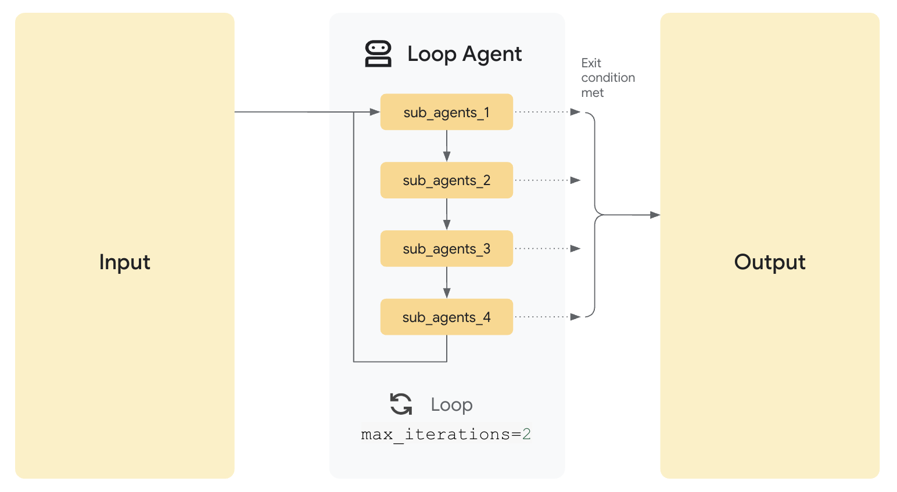

# Non-LLM Agents

This section introduces *Non-LLM Agents*, specialized agents that control the execution flow of other ("child") agents.  Unlike agents that use Large Language Models (LLMs) for decision-making, Non-LLM Agents focus solely on *orchestration* – determining *when* and *in what order* child agents run.  They do *not* use an LLM for this orchestration logic.

The Agent Development Kit (ADK) provides three core Non-LLM agent types, each implementing a distinct execution pattern:

* **`SequentialAgent`**: Executes child agents one after another, in sequence.
* **`LoopAgent`**:  Repeatedly executes a child agent or sequence.
* **`ParallelAgent`**: Executes multiple child agents concurrently.

**Key Distinction:**  These agents manage the execution – the workflow and order.  The child agents themselves may or may not utilize LLMs; the Non-LLM Agent is concerned only with their execution, not their internal logic.  LLM-based agents, in contrast, use language models for reasoning and decision-making.

The following sections detail each Non-LLM Agent type.

## Create a `SequentialAgent`


Let's examine a simple example of how to create and use a `SequentialAgent`:

```py

from google.adk.agents.sequential_agent import SequentialAgent
from google.adk.agents.llm_agent import LlmAgent
from google.genai import types
from google.adk.sessions import InMemorySessionService
from google.adk.runners import Runner


APP_NAME = "sequential_app"
USER_ID = "12345"
SESSION_ID = "123344"
AGENT_NAME = "sequential_agent"
GEMINI_2_FLASH = "gemini-2.0-flash-001"


agent_a = LlmAgent(
        name="AgentA",
        model=GEMINI_2_FLASH,
        instruction="You are Agent A. Respond with 'Agent A: Starting...'",
		output_key = "agent_a"
    )

agent_b = LlmAgent(
        name="AgentB",
        model=GEMINI_2_FLASH,
        instruction="You are Agent B. Respond with 'Agent B: Starting...'",
    )

# Create the SequentialAgent
sequential_agent = SequentialAgent(
        name="SequentialAgent", children=[agent_a, agent_b]
    )

# Session and Runner
session_service = InMemorySessionService()
session = session_service.create_session(app_name=APP_NAME, user_id=USER_ID, session_id=SESSION_ID)
runner = Runner(agent=sequential_agent, app_name=APP_NAME, session_service=session_service)


# Agent Interaction
def call_agent(query):
  content = types.Content(role='user', parts=[types.Part(text=query)])
  events = runner.run(user_id=USER_ID, session_id=SESSION_ID, new_message=content)

  for event in events:
      if event.is_final_response():
          final_response = event.content.parts[0].text
          print("Agent Response: ", final_response)

call_agent("execute")


```


This code does the following:

1. **Imports:**  Imports the necessary classes: `SequentialAgent` and `LlmAgent`.
2. **Creates Child Agents:**  Creates two `LlmAgent` instances, `agent_a` and `agent_b`. Each is configured with a name, a model (`GEMINI_2_FLASH`), and a specific instruction.  These are the agents that will be orchestrated.
3. **Creates the `SequentialAgent`:** Creates a `SequentialAgent` named  `sequential_agent.` The crucial part is the `children` parameter: it's a list containing `agent_a` and `agent_b`. This list *defines the execution order*: `agent_a` will run *before* `agent_b`.

### When to use `SequentialAgent`

The `SequentialAgent` is ideal for situations where: A routing agent is essential for workflows with a fixed, strict order. This applies when tasks have dependencies, requiring sequential execution where each step's output feeds the next. These workflows are characterized by their step-by-step, linear nature, allowing for clear decomposition into distinct, sequential actions, removing the need for dynamic LLM orchestration.

### How it works

When the `SequentialAgent`'s `run_async()` method is called, it performs the following actions:

1. **Iteration:** It iterates through the `children` list in the order they were provided.
2. **Child Agent Execution:** For each child agent in the list, it calls the child agent's `run_async()` method.
3. **No LLM Involvement (for Orchestration):** The `SequentialAgent` itself *does not* use an LLM to decide the execution order. The order is entirely determined by the `children` list.

### Example: Code Development Pipeline

Consider a simplified code development pipeline:

* **Code Writer Agent:**  An `LlmAgent` that generates initial code based on a specification.
* **Code Reviewer Agent:**  An `LlmAgent` that reviews the generated code for errors, style issues, and adherence to best practices.  It receives the output of the Code Writer Agent.
* **Code Refactorer Agent:** An `LlmAgent` that takes the reviewed code (and the reviewer's comments) and refactors it to improve quality and address issues.

A `SequentialAgent` is perfect for this:

```
SequentialAgent(children=[CodeWriterAgent, CodeReviewerAgent, CodeRefactorerAgent])
```

This ensures the code is written, *then* reviewed, and *finally* refactored, in a strict, dependable order. The output of each stage automatically flows to the next. This example demonstrates how SequentialAgent can be used to create a pipeline of tasks, ensuring a well-defined order of operations.

## Create a `LoopAgent`

The `LoopAgent` is a Non-LLM agent designed for workflows that require iterative execution of child agents. It repeatedly runs a sequence of agents until a termination condition is met.



Here's a basic example of creating a `LoopAgent`:

```py
from google.adk.agents.loop_agent import LoopAgent
from google.adk.agents.llm_agent import LlmAgent
from google.genai import types
from google.adk.sessions import InMemorySessionService
from google.adk.runners import Runner


APP_NAME = "loop_app"
USER_ID = "12345"
SESSION_ID = "123344"
AGENT_NAME = "loop_agent"
GEMINI_2_FLASH = "gemini-2.0-flash-001"


agent_a = LlmAgent(
        name="AgentA",
        model=GEMINI_2_FLASH,
        instruction="You are Agent A. Respond with 'Agent A: Starting...'",
    )

agent_b = LlmAgent(
        name="AgentB",
        model=GEMINI_2_FLASH,
        instruction="You are Agent B. Respond with 'Agent B: Starting...'",
    )

# Create the LoopAgent
loop_agent = LoopAgent(
    name="LoopAgent", children=[agent_a, agent_b], max_iterations=2
)


# Session and Runner
session_service = InMemorySessionService()
session = session_service.create_session(app_name=APP_NAME, user_id=USER_ID, session_id=SESSION_ID)
runner = Runner(agent=loop_agent, app_name=APP_NAME, session_service=session_service)


# Agent Interaction
def call_agent(query):
  content = types.Content(role='user', parts=[types.Part(text=query)])
  events = runner.run(user_id=USER_ID, session_id=SESSION_ID, new_message=content)

  for event in events:
      if event.is_final_response():
          final_response = event.content.parts[0].text
          print("Agent Response: ", final_response)

call_agent("execute")

```

This code performs the following steps:

1. **Imports:** Imports the `LoopAgent` and `LlmAgent` classes.
2. **Creates Child Agents:** Defines two `LlmAgent` instances, `agent_a` and `agent_b`, each with a name, model, and instruction.
3. **Creates the `LoopAgent`:** Instantiates a `LoopAgent` named "LoopAgent."  It takes two key arguments:
   * `children`: A list specifying the agents to be executed in each loop iteration (`agent_a` and `agent_b`).  The order within this list matters.
   * `max_iterations`: An optional integer specifying the maximum number of times the loop should run. *This is a crucial safety mechanism to prevent infinite loops.* If omitted, the loop will run indefinitely until another termination condition is met.

### When to use `LoopAgent`

Use the `LoopAgent` when your workflow involves: For tasks requiring iterative refinement, continuous monitoring, cyclical processes, or simulated negotiation, a `LoopAgent` enables efficient control and management. Iterative refinement, like document revision, benefits from structured loops. Similarly, continuous monitoring and cyclical processes, such as daily reports, rely on consistent, repeated actions.

Furthermore, simulated negotiation requires managed back-and-forth interactions. Finally, a `LoopAgent` allows for controlled iteration, where a fixed number of cycles can be enforced without complicating individual agent logic.

### How it Works

When the `LoopAgent`'s `run_async()` method is called:

1. **Initialization:** The loop begins.
2. **Child Agent Execution (Per Iteration):**  It iterates through the `children` list *in order*. For *each* child agent, it calls the child agent's `run_async()` method.
3. **Termination Check:**
   * **`max_iterations`:** If `max_iterations` is set, the loop will terminate after that many iterations.
   * **No `max_iterations`:** If `max_iterations` is *not* set, the loop will continue *indefinitely* unless another termination mechanism is implemented (see below).
4. **Loop Continuation/Termination:** The loop either continues to the next iteration or terminates based on the termination check or until a child agent escalates.

### Loop termination

*Crucially*, the `LoopAgent` itself does *not* inherently decide when to stop looping (unless `max_iterations` is used). You *must* implement a termination mechanism to prevent infinite loops.  Common strategies include:

* **`max_iterations` Parameter:**  The simplest approach; set a maximum number of iterations.
* **Conditional Logic within Child Agents:** Design one or more child agents to evaluate a condition (e.g., "Is the document quality good enough?", "Has a consensus been reached?").  If the condition is met, the child agent can signal termination (e.g., by raising a custom event, setting a flag in a shared context, or returning a specific value).

### Example: Iterative Document Improvement

Imagine a scenario where you want to iteratively improve a document:

* **Writer Agent:** An `LlmAgent` that generates an initial draft.
* **Critic Agent:** An `LlmAgent` that critiques the draft, identifying areas for improvement.
* **Reviser Agent:**  An `LlmAgent` that revises the draft based on the critic's feedback.
* **Quality Assessor Agent:** An `LLMAgent` that assesses the quality of the document and determines if more iterations are required.

```
LoopAgent(children=[WriterAgent, CriticAgent, ReviserAgent, QualityAssesorAgent], max_iterations=5)
```

In this setup, the `LoopAgent` would manage the iterative process.  The `QualityAssesorAgent` could be designed to return a "STOP" signal when the document reaches a satisfactory quality level, preventing further iterations. Alternatively, the `max_iterations` parameter could be used to limit the process to a fixed number of cycles, or external logic could be implemented to make stop decisions. The loop would run at most five times, ensuring the iterative refinement doesn't continue indefinitely.

##  Create a `ParallelAgent`


The `ParallelAgent` is a Non-LLM agent that executes its child agents *concurrently*. This dramatically speeds up workflows where tasks can be performed independently.

Here's a basic example of how to create a `ParallelAgent`:

```py
from google.adk.agents.parallel_agent import ParallelAgent
from google.adk.agents.llm_agent import LlmAgent
from google.genai import types
from google.adk.sessions import InMemorySessionService
from google.adk.runners import Runner


APP_NAME = "parallel_app"
USER_ID = "12345"
SESSION_ID = "123344"
AGENT_NAME = "parallel_agent"
GEMINI_2_FLASH = "gemini-2.0-flash-001"


agent_a = LlmAgent(
        name="AgentA",
        model=GEMINI_2_FLASH,
        instruction="You are Agent A. Respond with 'Agent A: Starting...'",
    )

agent_b = LlmAgent(
        name="AgentB",
        model=GEMINI_2_FLASH,
        instruction="You are Agent B. Respond with 'Agent B: Starting...'",
    )

# Create the ParallelAgent
parallel_agent = ParallelAgent(
    name="ParallelAgent", children=[agent_a, agent_b]
)


# Session and Runner
session_service = InMemorySessionService()
session = session_service.create_session(app_name=APP_NAME, user_id=USER_ID, session_id=SESSION_ID)
runner = Runner(agent=parallel_agent, app_name=APP_NAME, session_service=session_service)


# Agent Interaction
def call_agent(query):
  content = types.Content(role='user', parts=[types.Part(text=query)])
  events = runner.run(user_id=USER_ID, session_id=SESSION_ID, new_message=content)

  for event in events:
      if event.is_final_response():
          final_response = event.content.parts[0].text
          print("Agent Response: ", final_response)

call_agent("execute")
```

This code does the following:

1. **Imports:** Imports the `ParallelAgent` and `LlmAgent` classes.
2. **Creates Child Agents:** Defines two `LlmAgent` instances (`agent_a` and `agent_b`), each configured with a name, model, and instruction.
3. **Creates the `ParallelAgent`:** Creates a `ParallelAgent` named "ParallelAgent."  The `children` parameter is a list containing `agent_a` and `agent_b`.  This specifies which agents will run concurrently.

### When to use `ParallelAgent`

Use `ParallelAgent` when: For scenarios prioritizing speed and involving independent, resource-intensive tasks, a `ParallelAgent` facilitates efficient parallel execution. When child agents operate without dependencies, their tasks can be performed concurrently, significantly reducing overall processing time. This approach is particularly beneficial for operations like multi-source data retrieval or heavy computations, where parallelization yields substantial performance gains. Importantly, this strategy assumes no inherent need for shared state or direct information exchange between the concurrently executing agents.

### How it works

When the `ParallelAgent`'s `run_async()` method is called:

1. **Concurrent Execution:** It initiates the `run()` method of *each* child agent in the `children` list *concurrently*.  This means the agents start running at (approximately) the same time.
2. **Independent Branches:**  Each child agent operates in its own execution branch.  There is *no* automatic sharing of conversation history or state between these branches during execution.
3. **Result Collection:** The `ParallelAgent` manages the parallel execution and, typically, provides a way to access the results from each child agent after they have completed (e.g., through a list of results or events). The order of results may not be deterministic.
4. **No LLM Involved (For Orchestration)** As with other non-LLM agents, the agent itself is not using an LLM to manage the parallel execution.

### Independent Execution and State Management

It's *crucial* to understand that child agents within a `ParallelAgent` run independently.  If you *need* communication or data sharing between these agents, you must implement it explicitly.  Possible approaches include:

* **Shared `InvocationContext`:** You could pass a shared `InvocationContext` object to each child agent.  This object could act as a shared data store.  However, you'd need to manage concurrent access to this shared context carefully (e.g., using locks) to avoid race conditions.
* **External State Management:**  Use an external database, message queue, or other mechanism to manage shared state and facilitate communication between agents.
* **Post-Processing:** Collect results from each branch, and then implement logic to coordinate data afterwards.

### Expanded Example: Parallel Web Research

Imagine researching multiple topics simultaneously:

1. **Researcher Agent 1:**  An `LlmAgent` that researches "renewable energy sources."
2. **Researcher Agent 2:**  An `LlmAgent` that researches "electric vehicle technology."
3. **Researcher Agent 3:**  An `LlmAgent` that researches "carbon capture methods."

```
ParallelAgent(children=[ResearcherAgent1, ResearcherAgent2, ResearcherAgent3])
```

These research tasks are independent.  Using a `ParallelAgent` allows them to run concurrently, potentially reducing the total research time significantly compared to running them sequentially. The results from each agent would be collected separately after they finish.

## Key Attributes

* **Model Attribute (Not Applicable):** SequentialAgent, LoopAgent, ParallelAgent, and CustomAgent themselves do not use a model for orchestration. You should **not** set the model attribute directly on these orchestration agents. Define the model only for the LLM-based child Agent instances within them.
* **Attribute (Not Applicable):** The instruction attribute is also not relevant for orchestration agents. Define instructions for the LLM-based child agents they contain.
* **Attribute (Required for Orchestration, Optional for Custom Logic):** The children attribute is crucial for defining the agents to be orchestrated by SequentialAgent, LoopAgent, and ParallelAgent. It is also commonly used in CustomAgent when it acts as an orchestrator, but might be optional if the CustomAgent implements a flow that doesn't involve child agents in the same way.
* **Nesting Orchestration Agents:** Nesting is fully supported and extends to CustomAgent. You can include CustomAgent instances within SequentialAgent, LoopAgent, ParallelAgent, and even within other CustomAgent instances to build arbitrarily complex agent hierarchies.
