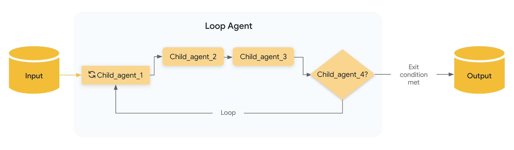

# Loop agents

## The `LoopAgent`

The `LoopAgent` is a workflow agent that executes its sub-agents in a loop (i.e. iteratively). It **_repeatedly runs_ a sequence of agents** for a specified number of iterations or until a termination condition is met.

Use the `LoopAgent` when your workflow involves repetition or iterative refinement, such as like revising code.

### Example

* You want to build an agent that can generate images of food, but sometimes when you want to generate a specific number of items (e.g. 5 bananas), it generates a different number of those items in the image (e.g. an image of 7 bananas). You have two tools: `generate_image`, `count_food_items`. Because you want to keep generating images until it either correctly generates the specified number of items, or after a certain number of iterations, you should build your agent using a `LoopAgent`.

As with other [workflow agents](index.md), the `LoopAgent` is not powered by an LLM, and is thus deterministic in how it executes. That being said, workflow agents are only concerned only with their execution (i.e. in a loop), and not their internal logic; the tools or sub-agents of a workflow agent may or may not utilize LLMs.

### How it Works

When the `LoopAgent`'s `run_async()` method is called, it performs the following actions:

1. **Sub-Agent Execution:**  It iterates through the `sub_agents` list _in order_. For _each_ sub-agent, it calls the agent's `run_async()` method.
2. **Termination Check:**

    _Crucially_, the `LoopAgent` itself does _not_ inherently decide when to stop looping. You _must_ implement a termination mechanism to prevent infinite loops.  Common strategies include:

    * **`max_iterations`**: Set a maximum number of iterations in the `LoopAgent`. **The loop will terminate after that many iterations**.
    * **Escalation from sub-agent**: Design one or more sub-agents to evaluate a condition (e.g., "Is the document quality good enough?", "Has a consensus been reached?").  If the condition is met, the sub-agent can signal termination (e.g., by raising a custom event, setting a flag in a shared context, or returning a specific value).



### Full Example: Iterative Document Improvement

Imagine a scenario where you want to iteratively improve a document:

* **Writer Agent:** An `LlmAgent` that generates or refines a draft on a topic.
* **Critic Agent:** An `LlmAgent` that critiques the draft, identifying areas for improvement.

    ```py
    LoopAgent(sub_agents=[WriterAgent, CriticAgent], max_iterations=5)
    ```

In this setup, the `LoopAgent` would manage the iterative process.  The `CriticAgent` could be **designed to return a "STOP" signal when the document reaches a satisfactory quality level**, preventing further iterations. Alternatively, the `max_iterations` parameter could be used to limit the process to a fixed number of cycles, or external logic could be implemented to make stop decisions. The **loop would run at most five times**, ensuring the iterative refinement doesn't continue indefinitely.

???+ "Full Code"

    ```py
    --8<-- "examples/python/snippets/agents/workflow-agents/loop_agent_doc_improv_agent.py:init"
    ```
