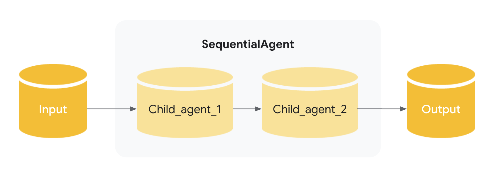

# Sequential agents

## The `SequentialAgent`

The `SequentialAgent` is a [workflow agent](index.md) that executes its sub-agents in the order they are specified in the list.

Use the `SequentialAgent` when you want the execution to occur in a fixed, strict order.

### Example

* You want to build an agent that can summarize any webpage, using two tools: `get_page_contents` and `summarize_page`. Because the agent must always call `get_page_contents` before calling `summarize_page` (you can't summarize from nothing!), you should build your agent using a `SequentialAgent`.

As with other [workflow agents](index.md), the `SequentialAgent` is not powered by an LLM, and is thus deterministic in how it executes. That being said, workflow agents are concerned only with their execution (i.e. in sequence), and not their internal logic; the tools or sub-agents of a workflow agent may or may not utilize LLMs.

### How it works

When the `SequentialAgent`'s `run_async()` method is called, it performs the following actions:

1. **Iteration:** It iterates through the `sub_agents` list in the order they were provided.
2. **Sub-Agent Execution:** For each sub-agent in the list, it calls the sub-agent's `run_async()` method.

{: width="600"}

### Full Example: Code Development Pipeline

Consider a simplified code development pipeline:

* **Code Writer Agent:**  An `LlmAgent` that generates initial code based on a specification.
* **Code Reviewer Agent:**  An `LlmAgent` that reviews the generated code for errors, style issues, and adherence to best practices.  It receives the output of the Code Writer Agent.
* **Code Refactorer Agent:** An `LlmAgent` that takes the reviewed code (and the reviewer's comments) and refactors it to improve quality and address issues.

A `SequentialAgent` is perfect for this:

```py
SequentialAgent(sub_agents=[CodeWriterAgent, CodeReviewerAgent, CodeRefactorerAgent])
```

This ensures the code is written, *then* reviewed, and *finally* refactored, in a strict, dependable order. **The output from each sub-agent is passed to the next by storing them in state via [`output_key`](../llm-agents.md)**.

???+ "Code"

    ```py
    --8<-- "examples/python/snippets/agents/workflow-agents/sequential_agent_code_development_agent.py:init"
    ```
