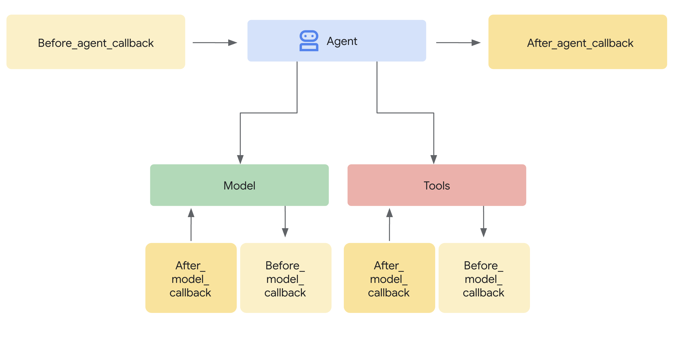

# Callbacks: Observe, Customize, and Control Agent Behavior

## Introduction: What are Callbacks and Why Use Them?

Callbacks are a cornerstone feature of ADK, providing a powerful mechanism to hook into an agent's execution process. They allow you to observe, customize, and even control the agent's behavior at specific, predefined points without modifying the core ADK framework code.

**What are they?** In essence, callbacks are standard Python functions that you define. You then associate these functions with an agent when you create it. The ADK framework automatically calls your functions at key stages in the agent's lifecycle, such as:

* Before or after the agent's main processing logic runs.  
* Before sending a request to, or after receiving a response from, the Large Language Model (LLM).  
* Before executing a tool (like a Python function or another agent) or after it finishes.



**Why use them?** Callbacks unlock significant flexibility and enable advanced agent capabilities:

* **Observe & Debug:** Log detailed information at critical steps for monitoring and troubleshooting.  
* **Customize & Control:** Modify data flowing through the agent (like LLM requests or tool results) or even bypass certain steps entirely based on your logic.  
* **Implement Guardrails:** Enforce safety rules, validate inputs/outputs, or prevent disallowed operations.  
* **Manage State:** Read or dynamically update the agent's session state during execution.  
* **Integrate & Enhance:** Trigger external actions (API calls, notifications) or add features like caching.

**How are they added?** You register callbacks by passing your defined Python functions as arguments to the agent's constructor (`__init__`) when you create an instance of `Agent` or `LlmAgent`.

```py
# agents/llm_agent.py (Illustrative Snippet)
from google.adk.agents import LlmAgent, LlmRequest, LlmResponse, CallbackContext
from typing import Optional

# --- Define your callback function ---
def my_before_model_logic(
    callback_context: CallbackContext, llm_request: LlmRequest
) -> Optional[LlmResponse]:
    print(f"Callback running before model call for agent: {callback_context.agent_name}")
    # ... your custom logic here ...
    return None # Allow the model call to proceed

# --- Register it during Agent creation ---
my_agent = LlmAgent(
    name="MyCallbackAgent",
    model="gemini-2.0-flash-exp", # Or your desired model
    instruction="Be helpful.",
    # Other agent parameters...
    before_model_callback=my_before_model_logic # Pass the function here
)

print(f"Agent '{my_agent.name}' created with a before_model_callback.")
```

## The Callback Mechanism: Interception and Control

When the ADK framework encounters a point where a callback can run (e.g., just before calling the LLM), it checks if you provided a corresponding callback function for that agent. If you did, the framework executes your function.

**Context is Key:** Your callback function isn't called in isolation. The framework provides special **context objects** (`CallbackContext` or `ToolContext`) as arguments. These objects contain vital information about the current state of the agent's execution, including the invocation details, session state, and potentially references to services like artifacts or memory. You use these context objects to understand the situation and interact with the framework. (See the dedicated "Context Objects" section for full details).

**Controlling the Flow (The Core Mechanism):** The most powerful aspect of callbacks lies in how their **return value** influences the agent's subsequent actions. This is how you intercept and control the execution flow:

1. **`return None` (Allow Default Behavior):**  

    * This is the standard way to signal that your callback has finished its work (e.g., logging, inspection, minor modifications to *mutable* input arguments like `llm_request`) and that the ADK agent should **proceed with its normal operation**.  
    * For `before_*` callbacks (`before_agent`, `before_model`, `before_tool`), returning `None` means the next step in the sequence (running the agent logic, calling the LLM, executing the tool) will occur.  
    * For `after_*` callbacks (`after_agent`, `after_model`, `after_tool`), returning `None` means the result just produced by the preceding step (the agent's output, the LLM's response, the tool's result) will be used as is.

2. **`return <Specific Object>` (Override Default Behavior):**  

    * Returning a *specific type of object* (instead of `None`) is how you **override** the ADK agent's default behavior. The framework will use the object you return and *skip* the step that would normally follow or *replace* the result that was just generated.  
    * **`before_agent_callback` → `types.Content`**: Skips the agent's main execution logic (`_run_async_impl` / `_run_live_impl`). The returned `Content` object is immediately treated as the agent's final output for this turn. Useful for handling simple requests directly or enforcing access control.  
    * **`before_model_callback` → `LlmResponse`**: Skips the call to the external Large Language Model. The returned `LlmResponse` object is processed as if it were the actual response from the LLM. Ideal for implementing input guardrails, prompt validation, or serving cached responses.  
    * **`before_tool_callback` → `dict`**: Skips the execution of the actual tool function (or sub-agent). The returned `dict` is used as the result of the tool call, which is then typically passed back to the LLM. Perfect for validating tool arguments, applying policy restrictions, or returning mocked/cached tool results.  
    * **`after_agent_callback` → `types.Content`**: *Replaces* the `Content` that the agent's run logic just produced.  
    * **`after_model_callback` → `LlmResponse`**: *Replaces* the `LlmResponse` received from the LLM. Useful for sanitizing outputs, adding standard disclaimers, or modifying the LLM's response structure.  
    * **`after_tool_callback` → `dict`**: *Replaces* the `dict` result returned by the tool. Allows for post-processing or standardization of tool outputs before they are sent back to the LLM.

**Conceptual Code Example (Guardrail):**

This example demonstrates the common pattern for a guardrail using `before_model_callback`.

```py
# agents/llm_agent.py (Illustrative Snippet)
from google.adk.agents import CallbackContext, LlmRequest, LlmResponse
from google.genai import types # For types.Content
from typing import Optional

# Example for before_model_callback
def block_forbidden_input(
    callback_context: CallbackContext, llm_request: LlmRequest
) -> Optional[LlmResponse]:
    """
    Checks the last user message for a forbidden phrase.
    If found, returns a predefined LlmResponse to block the LLM call.
    Otherwise, returns None to allow the call.
    """
    agent_name = callback_context.agent_name
    last_user_message_text = ""

    # Safely get the last user message text
    if llm_request.contents:
        # Find the last content object with role 'user'
        user_contents = [c for c in llm_request.contents if c.role == 'user']
        if user_contents:
            last_content = user_contents[-1]
            if last_content.parts and last_content.parts[0].text:
                last_user_message_text = last_content.parts[0].text

    print(f"[Callback - {agent_name}] Checking input: '{last_user_message_text[:50]}...'")

    # --- Guardrail Logic ---
    if "highly restricted topic" in last_user_message_text.lower():
        print(f"[Callback - {agent_name}] Forbidden topic detected! Blocking LLM call.")

        # Create the response object to return *instead* of calling the LLM
        blocked_response = LlmResponse(
            content=types.Content(
                role="model", # Mimic a model response role
                parts=[types.Part(text="I am unable to discuss that topic.")]
            )
            # Optionally include error codes/messages if relevant
            # error_code="POLICY_VIOLATION",
            # error_message="Request blocked due to content policy."
        )
        # Update state to track violations (optional)
        callback_context.state['policy_violations'] = callback_context.state.get('policy_violations', 0) + 1

        return blocked_response # <-- OVERRIDE: Skip LLM call, use this response.

    # --- No blocking condition met ---
    else:
        print(f"[Callback - {agent_name}] Input OK. Allowing LLM call.")
        # Optionally modify llm_request here if needed before proceeding
        # e.g., llm_request.config.temperature = 0.2

        return None # <-- ALLOW: Proceed with the default behavior (call LLM).

# Agent definition using the callback
guardrail_agent = LlmAgent(
    name="GuardrailAgent",
    model="gemini-2.0-flash-exp",
    instruction="Answer user questions.",
    before_model_callback=block_forbidden_input
)
```

By understanding this mechanism of returning `None` versus returning specific objects, you can precisely control the agent's execution path, making callbacks an essential tool for building sophisticated and reliable agents with ADK.
