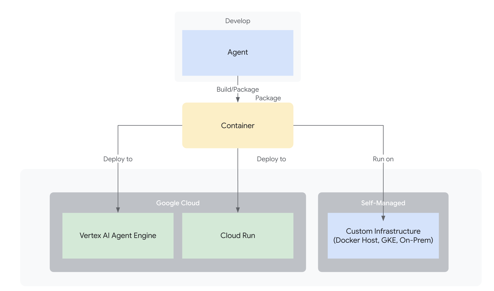

# Deploying Your Agent

Once you've built and tested your agent using ADK,
the next step is to deploy it so it can be accessed, queried, and used in
production or integrated with other applications. Deployment moves your agent
from your local development machine to a scalable and reliable environment.

## Deployment Options

Your ADK agent can be deployed to a range of different environments based
on your needs for production readiness or custom flexibility:

### Agent Engine in Vertex AI

[Agent Engine](agent-engine.md) is a fully managed auto-scaling service on Google Cloud
specifically designed for deploying, managing, and scaling AI agents built with
frameworks such as ADK.

Learn more about [deploying your agent to Vertex AI Agent Engine](agent-engine.md).

### Cloud Run

[Cloud Run](https://cloud.google.com/run) is a managed auto-scaling compute platform on
Google Cloud that enables you to run your agent as a container-based
application.

Learn more about [deploying your agent to to Cloud Run](cloud-run.md).
