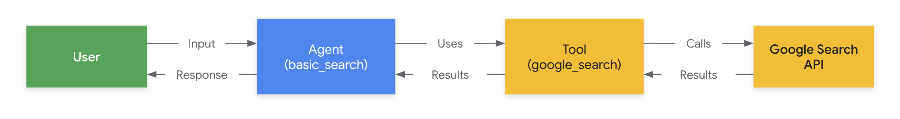

# Quickstart

This quickstart guides you through installing the Agent Development Kit (ADK),
setting up a basic agent with multiple tools, and running it locally either in the terminal or in the interactive, browser-based dev UI.

<!--  -->

This quickstart assumes a local IDE (VS Code, PyCharm, etc.) with Python 3.9+
and terminal access. This method runs the application entirely on your machine
and is recommended for internal development.

## 1. Setup Environment & Install ADK {#venv-install}

Create & Activate Virtual Environment (Recommended):

```bash
# Create
python -m venv .venv
# Activate (each new terminal)
# macOS/Linux: source .venv/bin/activate
# Windows CMD: .venv\Scripts\activate.bat
# Windows PowerShell: .venv\Scripts\Activate.ps1
```

Install ADK:

```bash
pip install google-adk
```

## 2. Create Agent Project {#create-agent-project}

### Project structure

You will need to create the following project structure:

```console
parent_folder/
    multi_tool_agent/
        __init__.py
        agent.py
        .env
```

Create the folder `multi_tool_agent`:

```bash
mkdir multi_tool_agent/
```

### `__init__.py`

Now create an `__init__.py` file in the folder:

```shell
echo "from . import agent" > multi_tool_agent/__init__.py
```

Your `__init__.py` should now look like this:

```python title="multi_tool_agent/__init__.py"
--8<-- "examples/python/snippets/get-started/multi_tool_agent/__init__.py"
```

### `agent.py`

Create an `agent.py` file in the same folder:

```shell
touch multi_tool_agent/agent.py
```

Copy and paste the following code into `agent.py`:

```python title="multi_tool_agent/agent.py"
--8<-- "examples/python/snippets/get-started/multi_tool_agent/agent.py"
```

### `.env`

Create a `.env` file in the same folder:

```shell
touch multi_tool_agent/.env
```

You can just copy and paste the following code for now, as more instructions are describe in the next section on [Setup the model](#setup-the-model).

```python title="multi_tool_agent/.env"
--8<-- "examples/python/snippets/get-started/multi_tool_agent/.env"
```


## 3. Setup the model {#setup-the-model}

Your agent's ability to understand user requests and generate responses is
powered by a Large Language Model (LLM). Your agent needs to make secure calls
to this external LLM service, which requires authentication credentials. Without
valid authentication, the LLM service will deny the agent's requests, and the
agent will be unable to function.

=== "Gemini - Google AI Studio"
    1. Get an API key from [Google AI Studio](https://aistudio.google.com/apikey).
    2. Open the **`.env`** file located inside (`multi_tool_agent/`) and copy-paste the following code.
        ```env title="multi_tool_agent/.env"
        GOOGLE_GENAI_USE_VERTEXAI=FALSE
        GOOGLE_API_KEY=PASTE_YOUR_ACTUAL_API_KEY_HERE
        ```
    3. Replace `GOOGLE_API_KEY` with your actual `API KEY`.

=== "Gemini - Google Cloud Vertex AI"
    1. You need an existing [Google Cloud](https://cloud.google.com/?e=48754805&hl=en) account and a project.
        * Set up a [Google Cloud project](https://cloud.google.com/vertex-ai/generative-ai/docs/start/quickstarts/quickstart-multimodal#setup-gcp)
        * Set up the [gcloud CLI](https://cloud.google.com/vertex-ai/generative-ai/docs/start/quickstarts/quickstart-multimodal#setup-local)
        * Authenticate to Google Cloud, from the terminal by running `gcloud auth login`.
        * [Enable the Vertex AI API](https://console.cloud.google.com/flows/enableapi?apiid=aiplatform.googleapis.com).
    2. Open the **`.env`** file located inside (`multi_tool_agent/`). Copy-paste the following code and update the project ID and location.
        ```env title="multi_tool_agent/.env"
        GOOGLE_GENAI_USE_VERTEXAI=TRUE
        GOOGLE_CLOUD_PROJECT=YOUR_PROJECT_ID
        GOOGLE_CLOUD_LOCATION=LOCATION
        ```

## 4. Run Your Agent {#run-your-agent}

Using the terminal, navigate to the parent directory of your agent project
(e.g. using `cd ..`):

```console
parent_folder/      <-- navigate to this directory
    multi_tool_agent/
        __init__.py
        agent.py
        .env
```

There are multiple ways to interact with your agent:

=== "Dev UI (adk web)"
    Run the following command to launch the **dev UI**.

    ```shell
    adk web
    ```

    **Step 1:** Open the URL provided (usually `http://localhost:8000` or `http://127.0.0.1:8000`) directly in your browser.
    
    **Step 2.** In the top-left corner of the UI, you can select your agent in the dropdown. Select "multi_tool_agent".

    !!!note "Troubleshooting"
        
        If you do not see "multi_tool_agent" in the dropdown menu, make sure you are running `adk web` in the **parent folder** of your agent folder (i.e. the parent folder of multi_tool_agent).

    **Step 3.** Now you can chat with your agent using the textbox:

    

    **Step 4.** You can also inspect individual function calls, responses and model responses by clicking on the actions:

    

    **Step 5.** You can also enable your microphone and talk to your agent:

    
    
    !!!note "Model support"
    
        Currently only `gemini-2.0-flash-exp` supports talking to your agent via audio/video, and can be used either with your API key from Google AI Studio or via [Vertex AI](https://cloud.google.com/vertex-ai/generative-ai/docs/multimodal-live-api).

=== "Terminal (adk run)"

    Run the following command, to chat with your Google Search agent.

    ```
    adk run multi_tool_agent
    ```

    

    To exit, use Cmd/Ctrl+C.

=== "API Server (adk api_server)"

    `adk api_server` enables you to create a local FastAPI server in a single command, enabling you to test local cURL requests before you deploy your agent.

    

    To learn how to use `adk api_server`, see the [documentation on local testing](local-testing.md).

### 📝 Example prompts to try

* What is the weather in New York?
* What is the time in New York?
* What is the weather in Paris?
* What is the time in Paris?

## 🎉 Congratulations!

You've successfully created and interacted with your first agent using ADK!

---

## 🛣️ Next steps

* **Go to the tutorial**: Learn how to add memory, session, state to your agent: [tutorial](tutorial.md).
* **Delve into advanced configuration:** Explore the [setup](installation.md) section for deeper dives into project structure, configuration, and other interfaces.
* **Understand Core Concepts:** Learn about [agents concepts](../agents/index.md).
