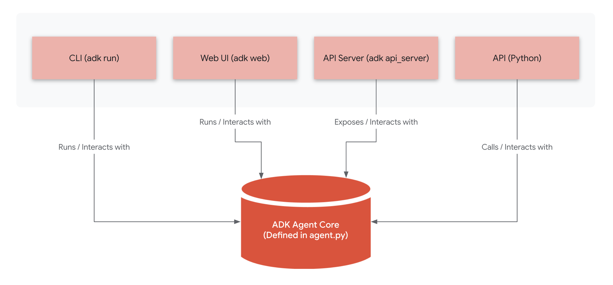

# Running your Agent



This page outlines the different methods for interacting with your ADK agents offering different levels of control and integration.

ADK offers four primary ways to interact with your agents:

| Interaction Method | What it is                                                                                                                                               | When to Use |
| :---- |:---------------------------------------------------------------------------------------------------------------------------------------------------------| :---- |
| Command-Line Interface (CLI) | Use terminal commands to interact directly with your agent.                                                                                              | Quick tasks, scripting, automation, developers comfortable with terminal commands. |
| ADK dev UI | Interact with your agent through a user-friendly web browser.                                                                                            | Visual interaction, monitoring agent behavior, users less familiar with the command line. |
| API Server | Run your agent as a REST API, allowing other applications to communicate with it.                                                                        | Integration with other applications, building services that use the agent, remote access to the agent. |
| Programmatic Interface | Integrate ADK directly into your applications (Python, Java, etc.) or notebooks (Jupyter, Colab). This provides full control over agent execution. | Deep integration within applications, custom workflows, notebooks, fine-grained control over agent execution. |

**Note:**  The way you *define* your agent (the core logic within `agent.py`) is the *same* regardless of how you choose to interact with it. The difference lies in how you *initiate* and *manage* the interaction.

### Project Structure (for CLI, dev UI and API Server)

To build an agent for use with the CLI, dev UI  or API commands, you need to organize your code within a specific folder structure

**Note:**  This folder structure is required when using the adk command-line tools (adk cli, adk web, adk api_server). If you are using ADK directly within a Jupyter Notebook or integrating it into an existing Python project, you do not need to follow this structure. You can create and interact with Agent objects directly in your code.

* **Create a Directory:** Create a directory for your agent, named after the agent (e.g., `my_search_agent`).

* **Required Files:**  Within this folder, you *must* include the following files:

  * `agent.py`: Inside the agent directory, create a file named `agent.py`. This file will contain your agent's definition (using the `Agent` class).  You *must* define a variable named `root_agent` within this file; this serves as the entry point for the ADK.
  * `__init__.py`:  This is a standard Python module file. At a minimum, it must contain the line `from . import agent` to import the necessary class.  It's also where you can import and make available other modules within your agent's folder.


  *Why is this necessary?*  This file makes your agent directory a Python package.  The ADK CLI relies on Python's module discovery mechanisms.  By including this line, you make your agent's class accessible when the CLI imports your agent's package.


* **Optional Files:** You are encouraged to add these files for better organization and documentation:

  * `requirements.txt`:  Lists the Python packages required by your agent.  This makes it easy to install dependencies.
  * `README.md`:  A Markdown file describing your agent, how to set it up, and how to use it.

**Example Structure:**

```
my_search_agent/
    __init__.py
    agent.py
    requirements.txt  (Optional)
    README.md        (Optional)
```

### 1\)  CLI (`adk run`)

1. **Navigate:** Open your terminal and use `cd` to navigate to the directory *containing* your agent folder (e.g., the directory containing `my_search_agent`).
2. **Run:** Execute the following command:

```
adk run my_search_agent  # Replace with your agent's folder name
```

   This will start the agent, and you can interact with it directly in the terminal.

### 2) Dev UI (`adk web`)

1. **Navigate:**  Open your terminal and `cd` to the directory containing your agent folder. Note you should be in the parent directory of the agent folder, not in the agent folder itself.
2. **Run:** Execute:

```
adk web
```

   This will start a local web server and open a new tab in your browser, providing a visual interface for interacting with your agent.

### 3\) API Server (`adk api_server`)

1. **Navigate:** Open your terminal and `cd` to the directory containing your agent folder.
2. **Run:** Execute:

```
adk api_server my_search_agent # Replace with your agent's folder name
```


   This will start a local API server (using Flask) on port 8000\. You can then interact with your agent via REST API calls.

1. Start a new session:

```
curl -X POST "http://127.0.0.1:8000/apps/{app_123}/users/{user_123}/sessions/{session_123}"
```

2. Send a message to a session:

```
curl -X POST "http://127.0.0.1:8000/agent/run" \
  -H "Content-Type: application/json" \
  -d '{"session_id": "{session_123}", "app_name": "{app_123}", "user_id": "{user_123}", "new_message": {"role": "user", "parts": [{"text": "What can you do?"}]}}'
```

3. Retrieve a session:

```
curl -X GET "http://127.0.0.1:8000/apps/{app_123}/users/{user_123}/sessions/{session_123}"
```

4. Delete a session:

```
curl -X DELETE "http://127.0.0.1:8000/apps/{app_123}/users/{user_123}/sessions/{session_123}"
```


### 4\) Programmatic Interface (Apps and Notebooks)

The Programmatic Interface allows you to integrate ADK directly into your Python applications or interactive notebooks (like Jupyter and Colab). Unlike the CLI, dev UI, and API server, you *don't* need the specific project structure as described above. Instead you’ll be using a Session and Runner. You can define and interact with your agent within the same file or notebook cell.

Here's a breakdown of the steps and a complete code example:

1. **Define Your Agent:**  Create an `Agent` object, just like you would for the CLI or dev UI.  You can do this directly in your application code or notebook cell.

2. **Create a Session :** Think of **Sessions** as the "memory" of your agent. They allow your agent to remember the ongoing conversation. Just like in a real conversation, the agent needs to track what's been said before. `InMemorySessionService` manages this history of interactions, so your agent has context.

```py
from agents import Agent
from agents.sessions import InMemorySessionService

# Step 1: Define your agent:
root_agent = Agent(name="my_agent",
                   model="gemini-2.0-flash",
 		      instruction="Answer questions.")

# Step 2: Initiate Session
session_service = InMemorySessionService()

#Step 3: Create a new session.
session = session_service.create_session(app_name="my_app", user_id="user1")
```

Note: Data stored in-memory is fast to access but **disappears when your session ends or disconnects.** For example, if you restart your Colab runtime or re-initialize `session_service`, you will lose the conversation history. For real-world applications, you'd use more persistent storages (like databases), but for learning, in-memory is perfect\!

3. **Create a Runner:**


The **Runner** is the **core component** in the ADK responsible for **executing an agent** in response to a user query. It **orchestrates the agent's processing flow** by managing an **event loop** and interacting with other components in the agent. The Runner also utilizes various **services** for session management, and memory. It **processes generated events** and returns a **stream of events**. The Runner provides different execution methods such as `run`, `run_async`, and `run_live`.

```py
from agents.runners import Runner

runner = Runner(agent=root_agent, session_service=session_service, app_name="my_app")
```

In this example, we're passing in:

* `agent=root_agent`:  **Crucially**, we tell the `Runner` to use our `root_agent` object – the agent we defined in Step 2\!
* `app_name`, `session_service`: These link the runner to our session management, ensuring everything is connected and tracked within our application.

**Important Note:**  For every interaction with your agent (every time you ask it a question), you'll use **the same `runner` object** and a **specific `session` ID**. The `runner` knows *how* to run the agent, and the `session` tells it *which conversation* to continue.

4. **Run the Agent:**  Use the `runner.run()` method to send a message to the agent and process its response.

```py
from google.genai import types

query = "What is the capital of France?" # question to agent.
content = types.Content(role='user', parts=[types.Part(text=query)])
events = runner.run(session=session, new_message=content)

for event in events:
    if event.is_final_response():
        final_response = event.content.parts[0].text
        print("Agent Response:", final_response)
```

Let’s explore what’s happening here:

* `content = types.Content(role='user', parts=[types.Part(text=query)]):` This line constructs a Content object, which represents a message within a conversation with the agent.
  * The `role='user'` parameter specifies that this \`Content\` originates from the end-user.
  * The `parts` parameter is a list containing one or more \`Part\` objects. In this case, it contains a single \`Part\` with the user's query embedded as text.
* `events = runner.run(...)`:  **This sends the content object to the agent\!**  The `runner` takes our message and the `session` and tells the agent to process the query. The agent does its magic (using its tools and model), and the `runner` gives us back a list of `events`.
* `for event in events:`: We look through the `events` to find the agent's final answer (`event.is_final_response()`).
* `print("Agent Response: ", final_response)`:  We simply print the agent's final answer to the screen.

**Complete Example:**

```py
from agents import Agent
from agents.runners import Runner
from agents import types
from agents.memory.local import InMemorySessionService, InMemoryArtifactService

# 1. Define Your Agent
root_agent = Agent(name="my_agent", instruction="Answer questions.")

# 2. Create a Session
session_service = InMemorySessionService()
artifact_service = InMemoryArtifactService()
session = session_service.create_session(app_name="my_app", user_id="user1")

# 3. Create a Runner
runner = Runner(agent=root_agent, artifact_service=artifact_service, session_service=session_service, app_name="my_app")

# 4. Run the Agent
query = "What is the capital of France?"
content = types.Content(role='user', parts=[types.Part(text=query)])
events = runner.run(session=session, new_message=content)

for event in events:
    if event.is_final_response():
        final_response = event.content.parts[0].text
        print("Agent Response:", final_response)

```

* **Full Tutorial:** For a complete, step-by-step guide to using the Programmatic Interface, including code examples and advanced techniques, see the quickstart on building a Weather Agent. **\[placeholder-link\]**

You should now have a solid understanding of how to install ADK, configure your LLM, and run your agents using different interaction methods.

## Next steps

* Learn how to define tools for your Agent: **\[placeholder-link\]**
* Read to build your first Multi-agent? Follow the tutorial here. **\[placeholder-link\]**
