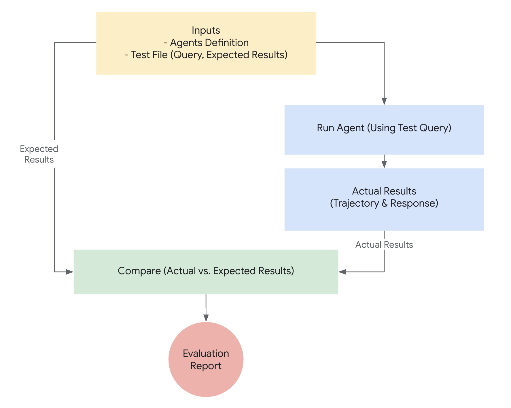

## Why to Evaluate Agents

In traditional software development, unit tests and integration tests provide
confidence that code functions as expected and remains stable through changes.
These tests provide a clear "pass/fail" signal, guiding further development.
However, LLM agents introduce a level of variability that makes traditional
testing approaches insufficient.



Due to the probabilistic nature of models, deterministic "pass/fail" assertions
are often unsuitable for evaluating agent performance. Instead, we need
qualitative evaluations of both the final output and the agent's trajectory \-
the sequence of steps taken to reach the solution. This involves assessing the
quality of the agent's decisions, its reasoning process, and the final result.

This may seem like a lot of extra work to set up, but the investment of
automating evaluations pays off quickly. If you intend to progress beyond
prototype, this is a highly recommended best practice.

## Preparing for Agent Evaluations

Before automating agent evaluations, define clear objectives and success criteria:

* **Define Success:** What constitutes a successful outcome for your agent?
* **Identify Critical Tasks:** What are the essential tasks your agent must accomplish?
* **Choose Relevant Metrics:** What metrics will you track to measure performance?

These considerations will guide the creation of evaluation scenarios and enable effective monitoring of agent behavior in real-world deployments.

## What to Evaluate?

To bridge the gap between a proof-of-concept and a production-ready AI agent, a robust and automated evaluation framework is essential. Unlike evaluating generative models, where the focus is primarily on the final output, agent evaluation requires a deeper understanding of the decision-making process. Agent evaluation can be broken down into two components:

1. **Evaluating Trajectory and Tool Use:** Analyzing the steps an agent takes to reach a solution, including its choice of tools, strategies, and the efficiency of its approach.
2. **Evaluating the Final Response:** Assessing the quality, relevance, and correctness of the agent's final output.

The trajectory is just a list of steps the agent took before it returned to the user. We can compare that against the list of steps we expect the agent to have taken.

### Evaluating trajectory and tool use

Before responding to a user, an agent typically performs a series of actions, which we refer to as a 'trajectory.' It might compare the user input with session history to disambiguate a term, or lookup a policy document, search a knowledge base or invoke an API to save a ticket. We call this a ‘trajectory’ of actions. Evaluating an agent's performance requires comparing its actual trajectory to an expected, or ideal, one. This comparison can reveal errors and inefficiencies in the agent's process. The expected trajectory represents the ground truth \-- the list of steps we anticipate the agent should take.

For example:

```py
// Trajectory evaluation will compareexpected_steps = ["determine_intent", "use_tool", "review_results", "report_generation"]
actual_steps = ["determine_intent", "use_tool", "review_results", "report_generation"]
```

Several ground-truth-based trajectory evaluations exist:

1. **Exact match:** Requires a perfect match to the ideal trajectory.
2. **In-order match:** Requires the correct actions in the correct order, allows for extra actions.
3. **Any-order match:** Requires the correct actions in any order, allows for extra actions.
4. **Precision:** Measures the relevance/correctness of predicted actions.
5. **Recall:** Measures how many essential actions are captured in the prediction.
6. **Single-tool use:** Checks for the inclusion of a specific action.

Choosing the right evaluation metric depends on the specific requirements and goals of your agent. For instance, in high-stakes scenarios, an exact match might be crucial, while in more flexible situations, an in-order or any-order match might suffice.

### Evaluating the final response

## How Evaluation works with the ADK

The ADK provides multiple ways to evaluate an agent's performance using predefined test files and criteria. First you will need a **test file**. Each **test file** contains a list of queries, expected tool trajectories, and reference responses. Test files can be organized into folders. Optionally, a folder can also include a `test_config.json` file that specifies the evaluation criteria.

### Example Test File

A test file contains a session with queries, expected tool use, and reference responses.  You can give the file any name for example `evaluation.test.json`.The framework only checks for the `.test.json` suffix, and the preceding part of the filename is not constrained. Here is a test file with a few examples:

```py
[
  {
    "query": "hi",
    "expected_tool_use": [],
    "reference": "Hello! What can I do for you?\n"
  },
  {
    "query": "roll a die for me",
    "expected_tool_use": [
      {
        "tool_name": "roll_die",
        "tool_input": {
          "sides": 6
        }
      }
    ]
  },
  {
    "query": "what's the time now?",
    "expected_tool_use": [],
    "reference": "I'm sorry, I cannot access real-time information, including the current time. My capabilities are limited to rolling dice and checking prime numbers.\n"
  }
]
```

### Evaluation Criteria

The evaluation criteria in `test_config.json` define how the agent's performance will be measured:

* **`tool_trajectory_avg_score`**: Evaluate the tool trajectories.
* **`response_match_score`**: Evaluate the responses.

If no evaluation criteria are provided, a default configuration will be applied.

### Example Evaluation Criteria (test\_config.json)

Here is an example of a `test_config.json` file specifying custom evaluation criteria:

```
{
  "criteria": {
    "tool_trajectory_avg_score": 1.0,
    "response_match_score": 0.8
  }
}
```

* **`tool_trajectory_avg_score`**: Set to 1.0, meaning perfect tool trajectory usage is expected.
* **`response_match_score`**: Set to 0.8, allowing for a small margin of error in the agent's responses.


## How to run Evaluation with the ADK

### 1\. adk web \- Run Evaluations via the Web UI

You can evaluate agents interactively using our web-based UI.

#### Steps to run evaluation via the web ui:

1. Start the web server by running: `bash adk web`
2. In the web interface:
   * Select an agent.
   * Click **"Save session as test file"** to save a session as a test file.
   * Click **"Run test file"** to show a pop-up with test files in the agent's folder.

#### Test Files:

Test files are stored in the same folder as the agent. You can manually update or add test files as needed.

---

### 2\. pytest \- Run Tests Programmatically

You can also use **`pytest`** to run test files as part of your integration tests.

#### Example Command:

```
pytest tests/integrations/
```

#### Example Test Code:

Here is an example of a pytest test case that runs a single test file:

```
def test_with_single_test_file():
    """Test the agent's basic ability via a session file."""
    AgentEvaluator.evaluate(
        "tests.integration.fixture.home_automation_agent",
        "tests/integration/fixture/home_automation_agent/simple_test.test.json",
    )
```

This approach allows you to integrate agent evaluations into your CI/CD pipelines or larger test suites.
