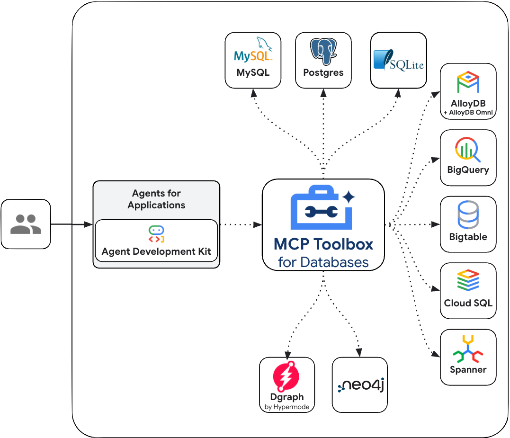

# Model Context Protocol (MCP)

## What is Model Context Protocol (MCP)?

The
[Model Context Protocol (MCP)](https://modelcontextprotocol.io/introduction) is
an open standard designed to standardize how Large Language Models (LLMs) like
Gemini and Claude communicate with external applications, data sources, and
tools. Think of it as a universal connection mechanism that simplifies how LLMs
obtain context, execute actions, and interact with various systems.

## How does MCP work?

MCP follows a client-server architecture, defining how data (resources),
interactive templates (prompts), and actionable functions (tools) are
exposed by an MCP server and consumed by an MCP client (which could be
an LLM host application or an AI agent).

## MCP Tools in ADK

ADK helps you both use and consume MCP tools in your agents, whether you're
trying to build a tool to call an MCP service, or exposing an MCP server for
other developers or agents to interact with your tools.

Refer to the [MCP Tools documentation](../tools/mcp-tools.md) for code samples
and design patterns that help you use ADK together with MCP servers, including:

- **Using Existing MCP Servers within ADK**: An ADK agent can act as an MCP
  client and use tools provided by external MCP servers.
- **Exposing ADK Tools via an MCP Server**: How to build an MCP server that
  wraps ADK tools, making them accessible to any MCP client.

## MCP Toolbox for Databases

[MCP Toolbox for Databases](https://github.com/googleapis/genai-toolbox) is an
open source MCP server that helps you build Gen AI tools so that your agents can
access data in your database. Google’s Agent Development Kit (ADK) has built in
support for The MCP Toolbox for Databases.

Refer to the
[MCP Toolbox for Databases](../tools/google-cloud-tools.md#toolbox-tools-for-databases)
documentation on how you can use ADK together with the MCP Toolbox for
Databases. For getting started with the MCP Toolbox for Databases, a blog post [Tutorial : MCP Toolbox for Databases - Exposing Big Query Datasets](https://medium.com/google-cloud/tutorial-mcp-toolbox-for-databases-exposing-big-query-datasets-9321f0064f4e) and Codelab [MCP Toolbox for Databases:Making BigQuery datasets available to MCP clients](https://codelabs.developers.google.com/mcp-toolbox-bigquery-dataset?hl=en#0) are also available.

## ADK Agent and FastMCP server
[FastMCP](https://github.com/jlowin/fastmcp) handles all the complex MCP protocol details and server management, so you can focus on building great tools. It's designed to be high-level and Pythonic; in most cases, decorating a function is all you need.

Refer to the
[MCP Tools documentation](../tools/mcp-tools.md#example-3-fastmcp-server)
documentation on how you can use ADK together with the FastMCP server running on Cloud Run.
