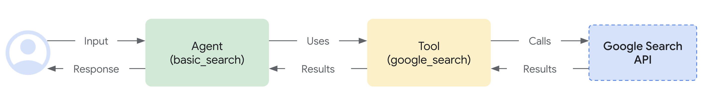

# Custom Audio Streaming app {#custom-streaming}

This article overviews the server and client code for a custom asynchronous web app built with ADK Streaming and [FastAPI](https://fastapi.tiangolo.com/), enabling real-time, bidirectional audio and text communication.

**Note:** This guide assumes you have experience of JavaScript and Python `asyncio` programming.

## Supported models for voice/video streaming {#supported-models}

In order to use voice/video streaming in ADK, you will need to use Gemini models that support the Live API. You can find the **model ID(s)** that supports the Gemini Live API in the documentation:

- [Google AI Studio: Gemini Live API](https://ai.google.dev/gemini-api/docs/models#live-api)
- [Vertex AI: Gemini Live API](https://cloud.google.com/vertex-ai/generative-ai/docs/live-api)

## 1. Install ADK {#1.-setup-installation}

Create & Activate Virtual Environment (Recommended):

```bash
# Create
python -m venv .venv
# Activate (each new terminal)
# macOS/Linux: source .venv/bin/activate
# Windows CMD: .venv\Scripts\activate.bat
# Windows PowerShell: .venv\Scripts\Activate.ps1
```

Install ADK:

```bash
pip install google-adk
```

Set `SSL_CERT_FILE` variable with the following command (This is required when the client connects to the server with `wss://` connection).

```shell
export SSL_CERT_FILE=$(python -m certifi)
```

Download the sample code:

```bash
git clone --no-checkout https://github.com/google/adk-docs.git
cd adk-docs
git sparse-checkout init --cone
git sparse-checkout set examples/python/snippets/streaming/adk-streaming
git checkout main
cd examples/python/snippets/streaming/adk-streaming/app
```

This sample code has the following files and folders:

```console
adk-streaming/
└── app/ # the web app folder
    ├── .env # Gemini API key / Google Cloud Project ID
    ├── main.py # FastAPI web app
    ├── static/ # Static content folder
    |   ├── js # JavaScript files folder (includes app.js)
    |   └── index.html # The web client page
    └── google_search_agent/ # Agent folder
        ├── __init__.py # Python package
        └── agent.py # Agent definition
```

## 2\. Set up the platform {#2.-set-up-the-platform}

To run the sample app, choose a platform from either Google AI Studio or Google Cloud Vertex AI:

=== "Gemini - Google AI Studio"
    1. Get an API key from [Google AI Studio](https://aistudio.google.com/apikey).
    2. Open the **`.env`** file located inside (`app/`) and copy-paste the following code.

        ```env title=".env"
        GOOGLE_GENAI_USE_VERTEXAI=FALSE
        GOOGLE_API_KEY=PASTE_YOUR_ACTUAL_API_KEY_HERE
        ```

    3. Replace `PASTE_YOUR_ACTUAL_API_KEY_HERE` with your actual `API KEY`.

=== "Gemini - Google Cloud Vertex AI"
    1. You need an existing
       [Google Cloud](https://cloud.google.com/?e=48754805&hl=en) account and a
       project.
        * Set up a
          [Google Cloud project](https://cloud.google.com/vertex-ai/generative-ai/docs/start/quickstarts/quickstart-multimodal#setup-gcp)
        * Set up the
          [gcloud CLI](https://cloud.google.com/vertex-ai/generative-ai/docs/start/quickstarts/quickstart-multimodal#setup-local)
        * Authenticate to Google Cloud, from the terminal by running
          `gcloud auth login`.
        * [Enable the Vertex AI API](https://console.cloud.google.com/flows/enableapi?apiid=aiplatform.googleapis.com).
    2. Open the **`.env`** file located inside (`app/`). Copy-paste
       the following code and update the project ID and location.

        ```env title=".env"
        GOOGLE_GENAI_USE_VERTEXAI=TRUE
        GOOGLE_CLOUD_PROJECT=PASTE_YOUR_ACTUAL_PROJECT_ID
        GOOGLE_CLOUD_LOCATION=us-central1
        ```


### agent.py

The agent definition code `agent.py` in the `google_search_agent` folder is where the agent's logic is written:


```py
from google.adk.agents import Agent
from google.adk.tools import google_search  # Import the tool

root_agent = Agent(
   # A unique name for the agent.
   name="google_search_agent",
   # The Large Language Model (LLM) that agent will use.
   model="gemini-2.0-flash-exp",
   # model="gemini-2.0-flash-live-001",  # New streaming model version as of Feb 2025
   # A short description of the agent's purpose.
   description="Agent to answer questions using Google Search.",
   # Instructions to set the agent's behavior.
   instruction="Answer the question using the Google Search tool.",
   # Add google_search tool to perform grounding with Google search.
   tools=[google_search],
)
```

**Note:**  To enable both text and audio/video input, the model must support the generateContent (for text) and bidiGenerateContent methods. Verify these capabilities by referring to the [List Models Documentation](https://ai.google.dev/api/models#method:-models.list). This quickstart utilizes the gemini-2.0-flash-exp model for demonstration purposes.

Notice how easily you integrated [grounding with Google Search](https://ai.google.dev/gemini-api/docs/grounding?lang=python#configure-search) capabilities.  The `Agent` class and the `google_search` tool handle the complex interactions with the LLM and grounding with the search API, allowing you to focus on the agent's *purpose* and *behavior*.



## 3\. Interact with Your Streaming app {#3.-interact-with-your-streaming-app}

1\. **Navigate to the Correct Directory:**

   To run your agent effectively, make sure you are in the **app folder (`adk-streaming/app`)**

2\. **Start the Fast API**: Run the following command to start CLI interface with

```console
uvicorn main:app --reload
```

3\. **Access the app with the text mode:** Once the app starts, the terminal will display a local URL (e.g., [http://localhost:8000](http://localhost:8000)). Click this link to open the UI in your browser.

Now you should see the UI like this:


Try asking a question `What time is it now?`. The agent will use Google Search to respond to your queries. You would notice that the UI shows the agent's response as streaming text. You can also send messages to the agent at any time, even while the agent is still responding. This demonstrates the bidirectional communication capability of ADK Streaming.

4\. **Access the app with the audio mode:** Now click the `Start Audio` button. The app reconnects with the server in an audio mode, and the UI will show the following dialog for the first time:


Click `Allow while visiting the site`, then you will see the microphone icon will be shown at the top of the browser:


Now you can talk to the agent with voice. Ask questions like `What time is it now?` with voice and you will hear the agent responding in voice too. As Streaming for ADK supports [multiple languages](https://ai.google.dev/gemini-api/docs/live#supported-languages), it can also respond to question in the supported languages.

5\. **Check console logs**

If you are using the Chrome browser, use the right click and select `Inspect` to open the DevTools. On the `Console`, you can see the incoming and outgoing audio data such as `[CLIENT TO AGENT]` and `[AGENT TO CLIENT]`, representing the audio data streaming in and out between the browser and the server.

At the same time, in the app server console, you should see something like this:

```
INFO:     ('127.0.0.1', 50068) - "WebSocket /ws/70070018?is_audio=true" [accepted]
Client #70070018 connected, audio mode: true
INFO:     connection open
INFO:     127.0.0.1:50061 - "GET /static/js/pcm-player-processor.js HTTP/1.1" 200 OK
INFO:     127.0.0.1:50060 - "GET /static/js/pcm-recorder-processor.js HTTP/1.1" 200 OK
[AGENT TO CLIENT]: audio/pcm: 9600 bytes.
INFO:     127.0.0.1:50082 - "GET /favicon.ico HTTP/1.1" 404 Not Found
[AGENT TO CLIENT]: audio/pcm: 11520 bytes.
[AGENT TO CLIENT]: audio/pcm: 11520 bytes.
```

These console logs are important in case you develop your own streaming application. In many cases, the communication failure between the browser and server becomes a major cause for the streaming application bugs.

## 4. Server code overview {#4.-server-side-code-overview}

This server app enables real-time, streaming interaction with ADK agent via WebSockets. Clients send text/audio to the ADK agent and receive streamed text/audio responses.

Core functions:
1.  Initialize/manage ADK agent sessions.
2.  Handle client WebSocket connections.
3.  Relay client messages to the ADK agent.
4.  Stream ADK agent responses (text/audio) to clients.

### ADK Streaming Setup

```py
import os
import json
import asyncio
import base64

from pathlib import Path
from dotenv import load_dotenv

from google.genai.types import (
    Part,
    Content,
    Blob,
)

from google.adk.runners import Runner
from google.adk.agents import LiveRequestQueue
from google.adk.agents.run_config import RunConfig
from google.adk.sessions.in_memory_session_service import InMemorySessionService

from fastapi import FastAPI, WebSocket
from fastapi.staticfiles import StaticFiles
from fastapi.responses import FileResponse

from google_search_agent.agent import root_agent
```

*   **Imports:** Includes standard Python libraries, `dotenv` for environment variables, Google ADK, and FastAPI.
*   **`load_dotenv()`:** Loads environment variables.
*   **`APP_NAME`**: Application identifier for ADK.
*   **`session_service = InMemorySessionService()`**: Initializes an in-memory ADK session service, suitable for single-instance or development use. Production might use a persistent store.

### `start_agent_session(session_id, is_audio=False)`

```py

def start_agent_session(session_id, is_audio=False):
    """Starts an agent session"""

    # Create a Session
    session = session_service.create_session(
        app_name=APP_NAME,
        user_id=session_id,
        session_id=session_id,
    )

    # Create a Runner
    runner = Runner(
        app_name=APP_NAME,
        agent=root_agent,
        session_service=session_service,
    )

    # Set response modality
    modality = "AUDIO" if is_audio else "TEXT"
    run_config = RunConfig(response_modalities=[modality])

    # Create a LiveRequestQueue for this session
    live_request_queue = LiveRequestQueue()

    # Start agent session
    live_events = runner.run_live(
        session=session,
        live_request_queue=live_request_queue,
        run_config=run_config,
    )
    return live_events, live_request_queue
```

This function initializes an ADK agent live session.

| Parameter    | Type    | Description                                             |
|--------------|---------|---------------------------------------------------------|
| `session_id` | `str`   | Unique client session identifier.                       |
| `is_audio`   | `bool`  | `True` for audio responses, `False` for text (default). |

**Key Steps:**
1.  **Create Session:** Establishes an ADK session.
2.  **Create Runner:** Instantiates the ADK runner for the `root_agent`.
3.  **Set Response Modality:** Configures agent response as "AUDIO" or "TEXT".
4.  **Create LiveRequestQueue:** Creates a queue for client inputs to the agent.
5.  **Start Agent Session:** `runner.run_live(...)` starts the agent, returning:
    *   `live_events`: Asynchronous iterable for agent events (text, audio, completion).
    *   `live_request_queue`: Queue to send data to the agent.

**Returns:** `(live_events, live_request_queue)`.

### `agent_to_client_messaging(websocket, live_events)`

```py

async def agent_to_client_messaging(websocket, live_events):
    """Agent to client communication"""
    while True:
        async for event in live_events:

            # If the turn complete or interrupted, send it
            if event.turn_complete or event.interrupted:
                message = {
                    "turn_complete": event.turn_complete,
                    "interrupted": event.interrupted,
                }
                await websocket.send_text(json.dumps(message))
                print(f"[AGENT TO CLIENT]: {message}")
                continue

            # Read the Content and its first Part
            part: Part = (
                event.content and event.content.parts and event.content.parts[0]
            )
            if not part:
                continue

            # If it's audio, send Base64 encoded audio data
            is_audio = part.inline_data and part.inline_data.mime_type.startswith("audio/pcm")
            if is_audio:
                audio_data = part.inline_data and part.inline_data.data
                if audio_data:
                    message = {
                        "mime_type": "audio/pcm",
                        "data": base64.b64encode(audio_data).decode("ascii")
                    }
                    await websocket.send_text(json.dumps(message))
                    print(f"[AGENT TO CLIENT]: audio/pcm: {len(audio_data)} bytes.")
                    continue

            # If it's text and a parial text, send it
            if part.text and event.partial:
                message = {
                    "mime_type": "text/plain",
                    "data": part.text
                }
                await websocket.send_text(json.dumps(message))
                print(f"[AGENT TO CLIENT]: text/plain: {message}")
```

This asynchronous function streams ADK agent events to the WebSocket client.

**Logic:**
1.  Iterates through `live_events` from the agent.
2.  **Turn Completion/Interruption:** Sends status flags to the client.
3.  **Content Processing:**
    *   Extracts the first `Part` from event content.
    *   **Audio Data:** If audio (PCM), Base64 encodes and sends it as JSON: `{ "mime_type": "audio/pcm", "data": "<base64_audio>" }`.
    *   **Text Data:** If partial text, sends it as JSON: `{ "mime_type": "text/plain", "data": "<partial_text>" }`.
4.  Logs messages.

### `client_to_agent_messaging(websocket, live_request_queue)`

```py

async def client_to_agent_messaging(websocket, live_request_queue):
    """Client to agent communication"""
    while True:
        # Decode JSON message
        message_json = await websocket.receive_text()
        message = json.loads(message_json)
        mime_type = message["mime_type"]
        data = message["data"]

        # Send the message to the agent
        if mime_type == "text/plain":
            # Send a text message
            content = Content(role="user", parts=[Part.from_text(text=data)])
            live_request_queue.send_content(content=content)
            print(f"[CLIENT TO AGENT]: {data}")
        elif mime_type == "audio/pcm":
            # Send an audio data
            decoded_data = base64.b64decode(data)
            live_request_queue.send_realtime(Blob(data=decoded_data, mime_type=mime_type))
        else:
            raise ValueError(f"Mime type not supported: {mime_type}")
```

This asynchronous function relays messages from the WebSocket client to the ADK agent.

**Logic:**
1.  Receives and parses JSON messages from the WebSocket, expecting: `{ "mime_type": "text/plain" | "audio/pcm", "data": "<data>" }`.
2.  **Text Input:** For "text/plain", sends `Content` to agent via `live_request_queue.send_content()`.
3.  **Audio Input:** For "audio/pcm", decodes Base64 data, wraps in `Blob`, and sends via `live_request_queue.send_realtime()`.
4.  Raises `ValueError` for unsupported MIME types.
5.  Logs messages.

### FastAPI Web Application

```py

app = FastAPI()

STATIC_DIR = Path("static")
app.mount("/static", StaticFiles(directory=STATIC_DIR), name="static")


@app.get("/")
async def root():
    """Serves the index.html"""
    return FileResponse(os.path.join(STATIC_DIR, "index.html"))


@app.websocket("/ws/{session_id}")
async def websocket_endpoint(websocket: WebSocket, session_id: int, is_audio: str):
    """Client websocket endpoint"""

    # Wait for client connection
    await websocket.accept()
    print(f"Client #{session_id} connected, audio mode: {is_audio}")

    # Start agent session
    session_id = str(session_id)
    live_events, live_request_queue = start_agent_session(session_id, is_audio == "true")

    # Start tasks
    agent_to_client_task = asyncio.create_task(
        agent_to_client_messaging(websocket, live_events)
    )
    client_to_agent_task = asyncio.create_task(
        client_to_agent_messaging(websocket, live_request_queue)
    )
    await asyncio.gather(agent_to_client_task, client_to_agent_task)

    # Disconnected
    print(f"Client #{session_id} disconnected")
```

*   **`app = FastAPI()`**: Initializes the application.
*   **Static Files:** Serves files from the `static` directory under `/static`.
*   **`@app.get("/")` (Root Endpoint):** Serves `index.html`.
*   **`@app.websocket("/ws/{session_id}")` (WebSocket Endpoint):**
    *   **Path Parameters:** `session_id` (int) and `is_audio` (str: "true"/"false").
    *   **Connection Handling:**
        1.  Accepts WebSocket connection.
        2.  Calls `start_agent_session()` using `session_id` and `is_audio`.
        3.  **Concurrent Messaging Tasks:** Creates and runs `agent_to_client_messaging` and `client_to_agent_messaging` concurrently using `asyncio.gather`. These tasks handle bidirectional message flow.
        4.  Logs client connection and disconnection.

### How It Works (Overall Flow)

1.  Client connects to `ws://<server>/ws/<session_id>?is_audio=<true_or_false>`.
2.  Server's `websocket_endpoint` accepts, starts ADK session (`start_agent_session`).
3.  Two `asyncio` tasks manage communication:
    *   `client_to_agent_messaging`: Client WebSocket messages -> ADK `live_request_queue`.
    *   `agent_to_client_messaging`: ADK `live_events` -> Client WebSocket.
4.  Bidirectional streaming continues until disconnection or error.

## 5. Client code overview {#5.-client-side-code-overview}

The JavaScript `app.js` (in `app/static/js`) manages client-side interaction with the ADK Streaming WebSocket backend. It handles sending text/audio and receiving/displaying streamed responses.

Key functionalities:
1.  Manage WebSocket connection.
2.  Handle text input.
3.  Capture microphone audio (Web Audio API, AudioWorklets).
4.  Send text/audio to backend.
5.  Receive and render text/audio agent responses.
6.  Manage UI.

### Prerequisites

*   **HTML Structure:** Requires specific element IDs (e.g., `messageForm`, `message`, `messages`, `sendButton`, `startAudioButton`).
*   **Backend Server:** The Python FastAPI server must be running.
*   **Audio Worklet Files:** `audio-player.js` and `audio-recorder.js` for audio processing.

### WebSocket Handling

```JavaScript

// Connect the server with a WebSocket connection
const sessionId = Math.random().toString().substring(10);
const ws_url =
  "ws://" + window.location.host + "/ws/" + sessionId;
let websocket = null;
let is_audio = false;

// Get DOM elements
const messageForm = document.getElementById("messageForm");
const messageInput = document.getElementById("message");
const messagesDiv = document.getElementById("messages");
let currentMessageId = null;

// WebSocket handlers
function connectWebsocket() {
  // Connect websocket
  websocket = new WebSocket(ws_url + "?is_audio=" + is_audio);

  // Handle connection open
  websocket.onopen = function () {
    // Connection opened messages
    console.log("WebSocket connection opened.");
    document.getElementById("messages").textContent = "Connection opened";

    // Enable the Send button
    document.getElementById("sendButton").disabled = false;
    addSubmitHandler();
  };

  // Handle incoming messages
  websocket.onmessage = function (event) {
    // Parse the incoming message
    const message_from_server = JSON.parse(event.data);
    console.log("[AGENT TO CLIENT] ", message_from_server);

    // Check if the turn is complete
    // if turn complete, add new message
    if (
      message_from_server.turn_complete &&
      message_from_server.turn_complete == true
    ) {
      currentMessageId = null;
      return;
    }

    // If it's audio, play it
    if (message_from_server.mime_type == "audio/pcm" && audioPlayerNode) {
      audioPlayerNode.port.postMessage(base64ToArray(message_from_server.data));
    }

    // If it's a text, print it
    if (message_from_server.mime_type == "text/plain") {
      // add a new message for a new turn
      if (currentMessageId == null) {
        currentMessageId = Math.random().toString(36).substring(7);
        const message = document.createElement("p");
        message.id = currentMessageId;
        // Append the message element to the messagesDiv
        messagesDiv.appendChild(message);
      }

      // Add message text to the existing message element
      const message = document.getElementById(currentMessageId);
      message.textContent += message_from_server.data;

      // Scroll down to the bottom of the messagesDiv
      messagesDiv.scrollTop = messagesDiv.scrollHeight;
    }
  };

  // Handle connection close
  websocket.onclose = function () {
    console.log("WebSocket connection closed.");
    document.getElementById("sendButton").disabled = true;
    document.getElementById("messages").textContent = "Connection closed";
    setTimeout(function () {
      console.log("Reconnecting...");
      connectWebsocket();
    }, 5000);
  };

  websocket.onerror = function (e) {
    console.log("WebSocket error: ", e);
  };
}
connectWebsocket();

// Add submit handler to the form
function addSubmitHandler() {
  messageForm.onsubmit = function (e) {
    e.preventDefault();
    const message = messageInput.value;
    if (message) {
      const p = document.createElement("p");
      p.textContent = "> " + message;
      messagesDiv.appendChild(p);
      messageInput.value = "";
      sendMessage({
        mime_type: "text/plain",
        data: message,
      });
      console.log("[CLIENT TO AGENT] " + message);
    }
    return false;
  };
}

// Send a message to the server as a JSON string
function sendMessage(message) {
  if (websocket && websocket.readyState == WebSocket.OPEN) {
    const messageJson = JSON.stringify(message);
    websocket.send(messageJson);
  }
}

// Decode Base64 data to Array
function base64ToArray(base64) {
  const binaryString = window.atob(base64);
  const len = binaryString.length;
  const bytes = new Uint8Array(len);
  for (let i = 0; i < len; i++) {
    bytes[i] = binaryString.charCodeAt(i);
  }
  return bytes.buffer;
}
```

*   **Connection Setup:** Generates `sessionId`, constructs `ws_url`. `is_audio` flag (initially `false`) appends `?is_audio=true` to URL when active. `connectWebsocket()` initializes the connection.
*   **`websocket.onopen`**: Enables send button, updates UI, calls `addSubmitHandler()`.
*   **`websocket.onmessage`**: Parses incoming JSON from server.
    *   **Turn Completion:** Resets `currentMessageId` if agent turn is complete.
    *   **Audio Data (`audio/pcm`):** Decodes Base64 audio (`base64ToArray()`) and sends to `audioPlayerNode` for playback.
    *   **Text Data (`text/plain`):** If new turn (`currentMessageId` is null), creates new `<p>`. Appends received text to the current message paragraph for streaming effect. Scrolls `messagesDiv`.
*   **`websocket.onclose`**: Disables send button, updates UI, attempts auto-reconnection after 5s.
*   **`websocket.onerror`**: Logs errors.
*   **Initial Connection:** `connectWebsocket()` is called on script load.

#### DOM Interaction & Message Submission

*   **Element Retrieval:** Fetches required DOM elements.
*   **`addSubmitHandler()`**: Attached to `messageForm`'s submit. Prevents default submission, gets text from `messageInput`, displays user message, clears input, and calls `sendMessage()` with `{ mime_type: "text/plain", data: messageText }`.
*   **`sendMessage(messagePayload)`**: Sends JSON stringified `messagePayload` if WebSocket is open.

### Audio Handling

```JavaScript

let audioPlayerNode;
let audioPlayerContext;
let audioRecorderNode;
let audioRecorderContext;
let micStream;

// Import the audio worklets
import { startAudioPlayerWorklet } from "./audio-player.js";
import { startAudioRecorderWorklet } from "./audio-recorder.js";

// Start audio
function startAudio() {
  // Start audio output
  startAudioPlayerWorklet().then(([node, ctx]) => {
    audioPlayerNode = node;
    audioPlayerContext = ctx;
  });
  // Start audio input
  startAudioRecorderWorklet(audioRecorderHandler).then(
    ([node, ctx, stream]) => {
      audioRecorderNode = node;
      audioRecorderContext = ctx;
      micStream = stream;
    }
  );
}

// Start the audio only when the user clicked the button
// (due to the gesture requirement for the Web Audio API)
const startAudioButton = document.getElementById("startAudioButton");
startAudioButton.addEventListener("click", () => {
  startAudioButton.disabled = true;
  startAudio();
  is_audio = true;
  connectWebsocket(); // reconnect with the audio mode
});

// Audio recorder handler
function audioRecorderHandler(pcmData) {
  // Send the pcm data as base64
  sendMessage({
    mime_type: "audio/pcm",
    data: arrayBufferToBase64(pcmData),
  });
  console.log("[CLIENT TO AGENT] sent %s bytes", pcmData.byteLength);
}

// Encode an array buffer with Base64
function arrayBufferToBase64(buffer) {
  let binary = "";
  const bytes = new Uint8Array(buffer);
  const len = bytes.byteLength;
  for (let i = 0; i < len; i++) {
    binary += String.fromCharCode(bytes[i]);
  }
  return window.btoa(binary);
}
```

*   **Audio Worklets:** Uses `AudioWorkletNode` via `audio-player.js` (for playback) and `audio-recorder.js` (for capture).
*   **State Variables:** Store AudioContexts and WorkletNodes (e.g., `audioPlayerNode`).
*   **`startAudio()`**: Initializes player and recorder worklets. Passes `audioRecorderHandler` as callback to recorder.
*   **"Start Audio" Button (`startAudioButton`):**
    *   Requires user gesture for Web Audio API.
    *   On click: disables button, calls `startAudio()`, sets `is_audio = true`, then calls `connectWebsocket()` to reconnect in audio mode (URL includes `?is_audio=true`).
*   **`audioRecorderHandler(pcmData)`**: Callback from recorder worklet with PCM audio chunks. Encodes `pcmData` to Base64 (`arrayBufferToBase64()`) and sends to server via `sendMessage()` with `mime_type: "audio/pcm"`.
*   **Helper Functions:** `base64ToArray()` (server audio -> client player) and `arrayBufferToBase64()` (client mic audio -> server).

### How It Works (Client-Side Flow)

1.  **Page Load:** Establishes WebSocket in text mode.
2.  **Text Interaction:** User types/submits text; sent to server. Server text responses displayed, streamed.
3.  **Switching to Audio Mode:** "Start Audio" button click initializes audio worklets, sets `is_audio=true`, and reconnects WebSocket in audio mode.
4.  **Audio Interaction:** Recorder sends mic audio (Base64 PCM) to server. Server audio/text responses handled by `websocket.onmessage` for playback/display.
5.  **Connection Management:** Auto-reconnect on WebSocket close.


## Summary

This article overviews the server and client code for a custom asynchronous web app built with ADK Streaming and FastAPI, enabling real-time, bidirectional voice and text communication.

The Python FastAPI server code initializes ADK agent sessions, configured for text or audio responses. It uses a WebSocket endpoint to handle client connections. Asynchronous tasks manage bidirectional messaging: forwarding client text or Base64-encoded PCM audio to the ADK agent, and streaming text or Base64-encoded PCM audio responses from the agent back to the client.

The client-side JavaScript code manages a WebSocket connection, which can be re-established to switch between text and audio modes. It sends user input (text or microphone audio captured via Web Audio API and AudioWorklets) to the server. Incoming messages from the server are processed: text is displayed (streamed), and Base64-encoded PCM audio is decoded and played using an AudioWorklet.

### Next steps for production

When you will use the Streaming for ADK in production apps, you may want to consinder the following points:

*   **Deploy Multiple Instances:** Run several instances of your FastAPI application instead of a single one.
*   **Implement Load Balancing:** Place a load balancer in front of your application instances to distribute incoming WebSocket connections.
    *   **Configure for WebSockets:** Ensure the load balancer supports long-lived WebSocket connections and consider "sticky sessions" (session affinity) to route a client to the same backend instance, *or* design for stateless instances (see next point).
*   **Externalize Session State:** Replace the `InMemorySessionService` for ADK with a distributed, persistent session store. This allows any server instance to handle any user's session, enabling true statelessness at the application server level and improving fault tolerance.
*   **Implement Health Checks:** Set up robust health checks for your WebSocket server instances so the load balancer can automatically remove unhealthy instances from rotation.
*   **Utilize Orchestration:** Consider using an orchestration platform like Kubernetes for automated deployment, scaling, self-healing, and management of your WebSocket server instances.
