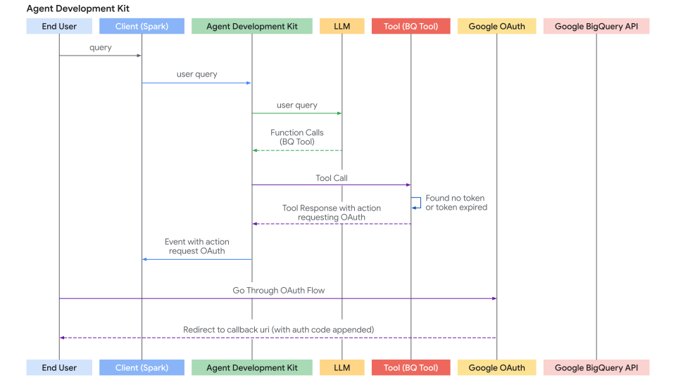
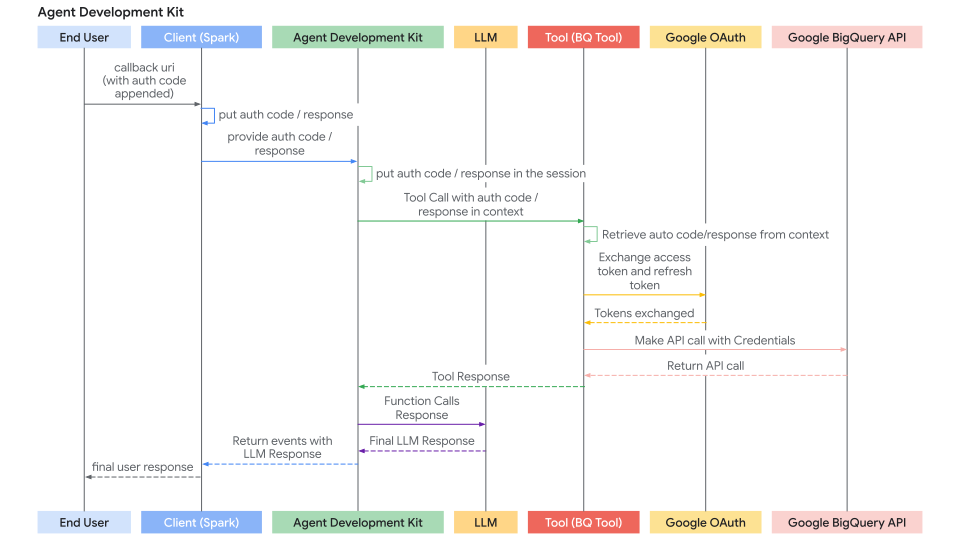

# Authenticating with Tools

## Core Concepts

Many tools need to access protected resources (like user data in Google Calendar, Salesforce records, etc.) and require authentication. ADK provides a system to handle various authentication methods securely.

The key components involved are:

1. **`AuthScheme`**: Defines *how* an API expects authentication credentials (e.g., as an API Key in a header, an OAuth 2.0 Bearer token). ADK supports the same types of authentication schemes as OpenAPI 3.0. To know more about what each type of credential is, refer to [OpenAPI doc: Authentication](https://swagger.io/docs/specification/v3_0/authentication/). ADK uses specific classes like `APIKey`, `HTTPBearer`, `OAuth2`, `OpenIdConnectWithConfig`.  
2. **`AuthCredential`**: Holds the *initial* information needed to *start* the authentication process (e.g., your application's OAuth Client ID/Secret, an API key value). It includes an `auth_type` (like `API_KEY`, `OAUTH2`, `SERVICE_ACCOUNT`) specifying the credential type.

The general flow involves providing these details when configuring a tool. ADK then attempts to automatically exchange the initial credential for a usable one (like an access token) before the tool makes an API call. For flows requiring user interaction (like OAuth consent), a specific interactive process involving the Agent Client application is triggered.

## Supported Initial Credential Types

* **API\_KEY:** For simple key/value authentication. Usually requires no exchange.  
* **HTTP:** Can represent Basic Auth (not recommended/supported for exchange) or already obtained Bearer tokens. If it's a Bearer token, no exchange is needed.  
* **OAUTH2:** For standard OAuth 2.0 flows. Requires configuration (client ID, secret, scopes) and often triggers the interactive flow for user consent.  
* **OPEN\_ID\_CONNECT:** For authentication based on OpenID Connect. Similar to OAuth2, often requires configuration and user interaction.  
* **SERVICE\_ACCOUNT:** For Google Cloud Service Account credentials (JSON key or Application Default Credentials). Typically exchanged for a Bearer token.

## Configuring Authentication on Tools

You set up authentication when defining your tool:

* **RestApiTool / OpenAPIToolset**: Pass `auth_scheme` and `auth_credential` during initialization

* **GoogleApiToolSet Tools**: ADK has built-in 1st party tools like Google Calendar, BigQuery etc,. Use the toolset's specific method.

* **APIHubToolset / ApplicationIntegrationToolset**: Pass `auth_scheme` and `auth_credential`during initialization, if the API managed in API Hub / provided by Application Integration requires authentication.

!!! tip "WARNING" 
    Storing sensitive credentials like access tokens and especially refresh tokens directly in the session state might pose security risks depending on your session storage backend (`SessionService`) and overall application security posture.

    *   **`InMemorySessionService`:** Suitable for testing and development, but data is lost when the process ends. Less risk as it's transient.
    *   **Database/Persistent Storage:** **Strongly consider encrypting** the token data before storing it in the database using a robust encryption library (like `cryptography`) and managing encryption keys securely (e.g., using a key management service).
    *   **Secure Secret Stores:** For production environments, storing sensitive credentials in a dedicated secret manager (like Google Cloud Secret Manager or HashiCorp Vault) is the **most recommended approach**. Your tool could potentially store only short-lived access tokens or secure references (not the refresh token itself) in the session state, fetching the necessary secrets from the secure store when needed.

---

## Journey 1: Building Agentic Applications with Authenticated Tools

This section focuses on using pre-existing tools (like those from `RestApiTool/ OpenAPIToolset`, `APIHubToolset`, `GoogleApiToolSet`, or custom `FunctionTools`) that require authentication within your agentic application. Your main responsibility is configuring the tools and handling the client-side part of interactive authentication flows (if required by the tool).



### 1. Configuring Tools with Authentication

When adding an authenticated tool to your agent, you need to provide its required `AuthScheme` and your application's initial `AuthCredential`.

**A. Using OpenAPI-based Toolsets (`OpenAPIToolset`, `APIHubToolset`, etc.)**

Pass the scheme and credential during toolset initialization. The toolset applies them to all generated tools. Here are few ways to create tools with authentication in ADK.

=== "API Key"

      Create a tool requiring an API Key.

      ```py
      from google.adk.tools.openapi_tool.auth.auth_helpers import token_to_scheme_credential
      from google.adk.tools.apihub_tool.apihub_toolset import APIHubToolset
      auth_scheme, auth_credential = token_to_scheme_credential(
         "apikey", "query", "apikey", YOUR_API_KEY_STRING
      )
      sample_api_toolset = APIHubToolset(
         name="sample-api-requiring-api-key",
         description="A tool using an API protected by API Key",
         apihub_resource_name="...",
         auth_scheme=auth_scheme,
         auth_credential=auth_credential,
      )
      ```

=== "OAuth2"

      Create a tool requiring OAuth2.

      ```py
      from google.adk.tools.openapi_tool.openapi_spec_parser.openapi_toolset import OpenAPIToolset
      from fastapi.openapi.models import OAuth2
      from fastapi.openapi.models import OAuthFlowAuthorizationCode
      from fastapi.openapi.models import OAuthFlows
      from google.adk.auth import AuthCredential
      from google.adk.auth import AuthCredentialTypes
      from google.adk.auth import OAuth2Auth

      auth_scheme = OAuth2(
         flows=OAuthFlows(
            authorizationCode=OAuthFlowAuthorizationCode(
                  authorizationUrl="https://accounts.google.com/o/oauth2/auth",
                  tokenUrl="https://oauth2.googleapis.com/token",
                  scopes={
                     "https://www.googleapis.com/auth/calendar": "calendar scope"
                  },
            )
         )
      )
      auth_credential = AuthCredential(
         auth_type=AuthCredentialTypes.OAUTH2,
         oauth2=OAuth2Auth(
            client_id=YOUR_OAUTH_CLIENT_ID, 
            client_secret=YOUR_OAUTH_CLIENT_SECRET
         ),
      )

      calendar_api_toolset = OpenAPIToolset(
         spec_str=google_calendar_openapi_spec_str, # Fill this with an openapi spec
         spec_str_type='yaml',
         auth_scheme=auth_scheme,
         auth_credential=auth_credential,
      )
      ```

=== "Service Account"

      Create a tool requiring Service Account.

      ```py
      from google.adk.tools.openapi_tool.auth.auth_helpers import service_account_dict_to_scheme_credential
      from google.adk.tools.openapi_tool.openapi_spec_parser.openapi_toolset import OpenAPIToolset

      service_account_cred = json.loads(service_account_json_str)auth_scheme, auth_credential = service_account_dict_to_scheme_credential(
         config=service_account_cred,
         scopes=["https://www.googleapis.com/auth/cloud-platform"],
      )
      sample_toolset = OpenAPIToolset(
         spec_str=sa_openapi_spec_str, # Fill this with an openapi spec
         spec_str_type='json',
         auth_scheme=auth_scheme,
         auth_credential=auth_credential,
      )
      ```

=== "OpenID connect"

      Create a tool requiring OpenID connect.

      ```py
      from google.adk.auth.auth_schemes import OpenIdConnectWithConfig
      from google.adk.auth.auth_credential import AuthCredential, AuthCredentialTypes, OAuth2Auth
      from google.adk.tools.openapi_tool.openapi_spec_parser.openapi_toolset import OpenAPIToolset

      auth_scheme = OpenIdConnectWithConfig(
         authorization_endpoint=OAUTH2_AUTH_ENDPOINT_URL,
         token_endpoint=OAUTH2_TOKEN_ENDPOINT_URL,
         scopes=['openid', 'YOUR_OAUTH_SCOPES"]
      )
      auth_credential = AuthCredential(
      auth_type=AuthCredentialTypes.OPEN_ID_CONNECT,
      oauth2=OAuth2Auth(
         client_id="...",
         client_secret="...",
      )
      )

      userinfo_toolset = OpenAPIToolset(
         spec_str=content, # Fill in an actual spec
         spec_str_type='yaml',
         auth_scheme=auth_scheme,
         auth_credential=auth_credential,
      )
      ```

**B. Using Google API Toolsets (e.g., `calendar_tool_set`)**

These toolsets often have dedicated configuration methods.

Tip: For how to create a Google OAuth Client ID & Secret, see this guide: [Get your Google API Client ID](https://developers.google.com/identity/gsi/web/guides/get-google-api-clientid#get_your_google_api_client_id)

```py
# Example: Configuring Google Calendar Tools
from google.adk.tools.google_api_tool import calendar_tool_set

client_id = "YOUR_GOOGLE_OAUTH_CLIENT_ID.apps.googleusercontent.com"
client_secret = "YOUR_GOOGLE_OAUTH_CLIENT_SECRET"

calendar_tools = calendar_tool_set.get_tools()
for tool in calendar_tools:
    # Use the specific configure method for this tool type
    tool.configure_auth(client_id=client_id, client_secret=client_secret)

# agent = LlmAgent(..., tools=calendar_tools)
```

### 2. Handling the Interactive OAuth/OIDC Flow (Client-Side)

If a tool requires user login/consent (typically OAuth 2.0 or OIDC), the ADK framework pauses execution and signals your **Agent Client** application (the code calling `runner.run_async`, like your UI backend, CLI app, or Spark job) to handle the user interaction.

Here's the step-by-step process for your client application:

**Step 1: Run Agent & Detect Auth Request**

* Initiate the agent interaction using `runner.run_async`.  
* Iterate through the yielded events.  
* Look for a specific event where the agent calls the special function `adk_request_credential`. This event signals that user interaction is needed. Use helper functions to identify this event and extract necessary information.

```py

# runner = Runner(...)
# session = session_service.create_session(...)
# content = types.Content(...) # User's initial query

print("\nRunning agent...")
events_async = runner.run_async(
    session_id=session.id, user_id='user', new_message=content
)

auth_request_event_id, auth_config = None, None

async for event in events_async:
    # Use helper to check for the specific auth request event
    if is_pending_auth_event(event):
        print("--> Authentication required by agent.")
        # Store the ID needed to respond later
        auth_request_event_id = get_function_call_id(event)
        # Get the AuthConfig containing the auth_uri etc.
        auth_config = get_function_call_auth_config(event)
        break # Stop processing events for now, need user interaction

if not auth_request_event_id:
    print("\nAuth not required or agent finished.")
    # return # Or handle final response if received

```

*Helper functions `helpers.py`:*

```py
from google.adk.events import Event
from google.adk.auth import AuthConfig # Import necessary type

def is_pending_auth_event(event: Event) -> bool:
  # Checks if the event is the special auth request function call
  return (
      event.content and event.content.parts and event.content.parts[0]
      and event.content.parts[0].function_call
      and event.content.parts[0].function_call.name == 'adk_request_credential'
      # Check if it's marked as long running (optional but good practice)
      and event.long_running_tool_ids
      and event.content.parts[0].function_call.id in event.long_running_tool_ids
  )

def get_function_call_id(event: Event) -> str:
  # Extracts the ID of the function call (works for any call, including auth)
  if ( event and event.content and event.content.parts and event.content.parts[0]
      and event.content.parts[0].function_call and event.content.parts[0].function_call.id ):
    return event.content.parts[0].function_call.id
  raise ValueError(f'Cannot get function call id from event {event}')

def get_function_call_auth_config(event: Event) -> AuthConfig:
    # Extracts the AuthConfig object from the arguments of the auth request event
    auth_config_dict = None
    try:
        auth_config_dict = event.content.parts[0].function_call.args.get('auth_config')
        if auth_config_dict and isinstance(auth_config_dict, dict):
            # Reconstruct the AuthConfig object
            return AuthConfig.model_validate(auth_config_dict)
        else:
            raise ValueError("auth_config missing or not a dict in event args")
    except (AttributeError, IndexError, KeyError, TypeError, ValueError) as e:
        raise ValueError(f'Cannot get auth config from event {event}') from e

```

**Step 2: Redirect User for Authorization**

* Get the authorization URL (`auth_uri`) from the `auth_config` extracted in the previous step.  
* **Crucially, append your application's**  redirect\_uri as a query parameter to this `auth_uri`. This `redirect_uri` must be pre-registered with your OAuth provider (e.g., [Google Cloud Console](https://developers.google.com/identity/protocols/oauth2/web-server#creatingcred), [Okta admin panel](https://developer.okta.com/docs/guides/sign-into-web-app-redirect/spring-boot/main/#create-an-app-integration-in-the-admin-console)).  
* Direct the user to this complete URL (e.g., open it in their browser).

```py
# (Continuing after detecting auth needed)

if auth_request_event_id and auth_config:
    # Get the base authorization URL from the AuthConfig
    base_auth_uri = auth_config.exchanged_auth_credential.oauth2.auth_uri

    if base_auth_uri:
        redirect_uri = 'http://localhost:8000/callback' # MUST match your OAuth client config
        # Append redirect_uri (use urlencode in production)
        auth_request_uri = base_auth_uri + f'&redirect_uri={redirect_uri}'

        print("\n--- User Action Required ---")
        print(f'1. Please open this URL in your browser:\n   {auth_request_uri}\n')
        print(f'2. Log in and grant the requested permissions.')
        print(f'3. After authorization, you will be redirected to: {redirect_uri}')
        print(f'   Copy the FULL URL from your browser\'s address bar (it includes a `code=...`).')
        # Next step: Get this callback URL from the user (or your web server handler)
    else:
         print("ERROR: Auth URI not found in auth_config.")
         # Handle error

```



**Step 3. Handle the Redirect Callback (Client):**

* Your application must have a mechanism (e.g., a web server route at the `redirect_uri`) to receive the user after they authorize the application with the provider.  
* The provider redirects the user to your `redirect_uri` and appends an `authorization_code` (and potentially `state`, `scope`) as query parameters to the URL.  
* Capture the **full callback URL** from this incoming request.  
* (This step happens outside the main agent execution loop, in your web server or equivalent callback handler.)

**Step 4. Send Authentication Result Back to ADK (Client):**

* Once you have the full callback URL (containing the authorization code), retrieve the `auth_request_event_id` and the `AuthConfig` object saved in Client Step 1\.  
* **Update the**  Set the captured callback URL into the `exchanged_auth_credential.oauth2.auth_response_uri` field. Also ensure `exchanged_auth_credential.oauth2.redirect_uri` contains the redirect URI you used.  
* **Construct a**  Create a `types.Content` object containing a `types.Part` with a `types.FunctionResponse`.  
      * Set `name` to `"adk_request_credential"`. (Note: This is a special name for ADK to proceed with authentication. Do not use other names.)  
      * Set `id` to the `auth_request_event_id` you saved.  
      * Set `response` to the *serialized* (e.g., `.model_dump()`) updated `AuthConfig` object.  
* Call `runner.run_async` **again** for the same session, passing this `FunctionResponse` content as the `new_message`.

```py
# (Continuing after user interaction)

    # Simulate getting the callback URL (e.g., from user paste or web handler)
    auth_response_uri = await get_user_input(
        f'Paste the full callback URL here:\n> '
    )
    auth_response_uri = auth_response_uri.strip() # Clean input

    if not auth_response_uri:
        print("Callback URL not provided. Aborting.")
        return

    # Update the received AuthConfig with the callback details
    auth_config.exchanged_auth_credential.oauth2.auth_response_uri = auth_response_uri
    # Also include the redirect_uri used, as the token exchange might need it
    auth_config.exchanged_auth_credential.oauth2.redirect_uri = redirect_uri

    # Construct the FunctionResponse Content object
    auth_content = types.Content(
        role='user', # Role can be 'user' when sending a FunctionResponse
        parts=[
            types.Part(
                function_response=types.FunctionResponse(
                    id=auth_request_event_id,       # Link to the original request
                    name='adk_request_credential', # Special framework function name
                    response=auth_config.model_dump() # Send back the *updated* AuthConfig
                )
            )
        ],
    )

    # --- Resume Execution ---
    print("\nSubmitting authentication details back to the agent...")
    events_async_after_auth = runner.run_async(
        session_id=session.id,
        user_id='user',
        new_message=auth_content, # Send the FunctionResponse back
    )

    # --- Process Final Agent Output ---
    print("\n--- Agent Response after Authentication ---")
    async for event in events_async_after_auth:
        # Process events normally, expecting the tool call to succeed now
        print(event) # Print the full event for inspection

```

**Step 5: ADK Handles Token Exchange & Tool Retry and gets Tool result**

* ADK receives the `FunctionResponse` for `adk_request_credential`.  
* It uses the information in the updated `AuthConfig` (including the callback URL containing the code) to perform the OAuth **token exchange** with the provider's token endpoint, obtaining the access token (and possibly refresh token).  
* ADK internally makes these tokens available (often via `tool_context.get_auth_response()` or by updating session state).  
* ADK **automatically retries** the original tool call (the one that initially failed due to missing auth).  
* This time, the tool finds the valid tokens and successfully executes the authenticated API call.  
* The agent receives the actual result from the tool and generates its final response to the user.

---

## Journey 2: Building Custom Tools (`FunctionTool`) Requiring Authentication

This section focuses on implementing the authentication logic *inside* your custom Python function when creating a new ADK Tool. We will implement a `FunctionTool` as an example.

### Prerequisites

Your function signature *must* include [`tool_context: ToolContext`](../tools/index.md#tool-context). ADK automatically injects this object, providing access to state and auth mechanisms.

```py
from google.adk.tools import FunctionTool, ToolContext
from typing import Dict

def my_authenticated_tool_function(param1: str, ..., tool_context: ToolContext) -> dict:
    # ... your logic ...
    pass

my_tool = FunctionTool(func=my_authenticated_tool_function)

```

### Authentication Logic within the Tool Function

Implement the following steps inside your function:

**Step 1: Check for Cached & Valid Credentials:**

Inside your tool function, first check if valid credentials (e.g., access/refresh tokens) are already stored from a previous run in this session. Credentials for the current sessions should be stored in `tool_context.invocation_context.session.state` (a dictionary of state) Check existence of existing credentials by checking `tool_context.invocation_context.session.state.get(credential_name, None)`.

```py
# Inside your tool function
TOKEN_CACHE_KEY = "my_tool_tokens" # Choose a unique key
SCOPES = ["scope1", "scope2"] # Define required scopes

creds = None
cached_token_info = tool_context.state.get(TOKEN_CACHE_KEY)
if cached_token_info:
    try:
        creds = Credentials.from_authorized_user_info(cached_token_info, SCOPES)
        if not creds.valid and creds.expired and creds.refresh_token:
            creds.refresh(Request())
            tool_context.state[TOKEN_CACHE_KEY] = json.loads(creds.to_json()) # Update cache
        elif not creds.valid:
            creds = None # Invalid, needs re-auth
            tool_context.state.pop(TOKEN_CACHE_KEY, None)
    except Exception as e:
        print(f"Error loading/refreshing cached creds: {e}")
        creds = None
        tool_context.state.pop(TOKEN_CACHE_KEY, None)

if creds and creds.valid:
    # Skip to Step 5: Make Authenticated API Call
    pass
else:
    # Proceed to Step 2...
    pass

```

**Step 2: Check for Auth Response from Client**

* If Step 1 didn't yield valid credentials, check if the client just completed the interactive flow by calling `auth_response_config = tool_context.get_auth_response()`.  
* This returns the updated `AuthConfig` object sent back by the client (containing the callback URL in `auth_response_uri`).

```py
# Use auth_scheme and auth_credential configured in the tool.
# exchanged_credential: AuthCredential|None

exchanged_credential = tool_context.get_auth_response(AuthConfig(
  auth_scheme=auth_scheme,
  raw_auth_credential=auth_credential,
))
# If exchanged_credential is not None, then there is already an exchanged credetial from the auth response. Use it instea, and skip to step 5
```

**Step 3: Initiate Authentication Request**

If no valid credentials (Step 1.) and no auth response (Step 2.) are found, the tool needs to start the OAuth flow. Define the AuthScheme and initial AuthCredential and call `tool_context.request_credential()`. Return a status indicating authorization is needed.

```py
# Use auth_scheme and auth_credential configured in the tool.

  tool_context.request_credential(AuthConfig(
    auth_scheme=auth_scheme,
    raw_auth_credential=auth_credential,
  ))
  return {'pending': true, 'message': 'Awaiting user authentication.'}

# By setting request_credential, ADK detects a pending authentication event. It pauses execution and ask end user to login.
```

**Step 4: Exchange Authorization Code for Tokens**

ADK automatically generates oauth authorization URL and presents it to your Agent Client application. Once a user completes the login flow following the authorization URL, ADK extracts the authentication callback url from Agent Client applications, automatically parses the auth code, and generates auth token. At the next Tool call, `tool_context.get_auth_response` in step 2 will contain a valid credential to use in subsequent API calls.

**Step 5: Cache Obtained Credentials**

After successfully obtaining the token from ADK (Step 2\) or if the token is still valid (Step 1), **immediately store** the new `Credentials` object in `tool_context.state` (serialized, e.g., as JSON) using your cache key.

```py
# Inside your tool function, after obtaining 'creds' (either refreshed or newly exchanged)
# Cache the new/refreshed tokens
tool_context.state[TOKEN_CACHE_KEY] = json.loads(creds.to_json())
print(f"DEBUG: Cached/updated tokens under key: {TOKEN_CACHE_KEY}")
# Proceed to Step 6 (Make API Call)

```

**Step 6: Make Authenticated API Call**

* Once you have a valid `Credentials` object (`creds` from Step 1 or Step 4), use it to make the actual call to the protected API using the appropriate client library (e.g., `googleapiclient`, `requests`). Pass the `credentials=creds` argument.  
* Include error handling, especially for `HttpError` 401/403, which might mean the token expired or was revoked between calls. If you get such an error, consider clearing the cached token (`tool_context.state.pop(...)`) and potentially returning the `auth_required` status again to force re-authentication.

```py
# Inside your tool function, using the valid 'creds' object
# Ensure creds is valid before proceeding
if not creds or not creds.valid:
   return {"status": "error", "error_message": "Cannot proceed without valid credentials."}

try:
   service = build("calendar", "v3", credentials=creds) # Example
   api_result = service.events().list(...).execute()
   # Proceed to Step 7
except Exception as e:
   # Handle API errors (e.g., check for 401/403, maybe clear cache and re-request auth)
   print(f"ERROR: API call failed: {e}")
   return {"status": "error", "error_message": f"API call failed: {e}"}
```

**Step 7: Return Tool Result**

* After a successful API call, process the result into a dictionary format that is useful for the LLM.  
* **Crucially, include a**  along with the data.

```py
# Inside your tool function, after successful API call
    processed_result = [...] # Process api_result for the LLM
    return {"status": "success", "data": processed_result}

```

??? "Full Code"

    === "Tools and Agent"

         ```py title="tools_and_agent.py"
         --8<-- "examples/python/snippets/tools/auth/agent_cli.py"
         ```
    === "Agent CLI"

         ```py title="agent_cli.py"
         --8<-- "examples/python/snippets/tools/auth/agent_cli.py"
         ```
    === "Helper"

         ```py title="helpers.py"
         --8<-- "examples/python/snippets/tools/auth/helpers.py"
         ```
    === "Spec"

         ```yaml
         openapi: 3.0.1
         info:
         title: Okta User Info API
         version: 1.0.0
         description: |-
            API to retrieve user profile information based on a valid Okta OIDC Access Token.
            Authentication is handled via OpenID Connect with Okta.
         contact:
            name: API Support
            email: support@example.com # Replace with actual contact if available
         servers:
         - url: <substitute with your server name>
            description: Production Environment
         paths:
         /okta-jwt-user-api:
            get:
               summary: Get Authenticated User Info
               description: |-
               Fetches profile details for the user
               operationId: getUserInfo
               tags:
               - User Profile
               security:
               - okta_oidc:
                     - openid
                     - email
                     - profile
               responses:
               '200':
                  description: Successfully retrieved user information.
                  content:
                     application/json:
                     schema:
                        type: object
                        properties:
                           sub:
                           type: string
                           description: Subject identifier for the user.
                           example: "abcdefg"
                           name:
                           type: string
                           description: Full name of the user.
                           example: "Example LastName"
                           locale:
                           type: string
                           description: User's locale, e.g., en-US or en_US.
                           example: "en_US"
                           email:
                           type: string
                           format: email
                           description: User's primary email address.
                           example: "username@example.com"
                           preferred_username:
                           type: string
                           description: Preferred username of the user (often the email).
                           example: "username@example.com"
                           given_name:
                           type: string
                           description: Given name (first name) of the user.
                           example: "Example"
                           family_name:
                           type: string
                           description: Family name (last name) of the user.
                           example: "LastName"
                           zoneinfo:
                           type: string
                           description: User's timezone, e.g., America/Los_Angeles.
                           example: "America/Los_Angeles"
                           updated_at:
                           type: integer
                           format: int64 # Using int64 for Unix timestamp
                           description: Timestamp when the user's profile was last updated (Unix epoch time).
                           example: 1743617719
                           email_verified:
                           type: boolean
                           description: Indicates if the user's email address has been verified.
                           example: true
                        required:
                           - sub
                           - name
                           - locale
                           - email
                           - preferred_username
                           - given_name
                           - family_name
                           - zoneinfo
                           - updated_at
                           - email_verified
               '401':
                  description: Unauthorized. The provided Bearer token is missing, invalid, or expired.
                  content:
                     application/json:
                     schema:
                        $ref: '#/components/schemas/Error'
               '403':
                  description: Forbidden. The provided token does not have the required scopes or permissions to access this resource.
                  content:
                     application/json:
                     schema:
                        $ref: '#/components/schemas/Error'
         components:
         securitySchemes:
            okta_oidc:
               type: openIdConnect
               description: Authentication via Okta using OpenID Connect. Requires a Bearer Access Token.
               openIdConnectUrl: https://your-endpoint.okta.com/.well-known/openid-configuration
         schemas:
            Error:
               type: object
               properties:
               code:
                  type: string
                  description: An error code.
               message:
                  type: string
                  description: A human-readable error message.
               required:
                  - code
                  - message
         ```
