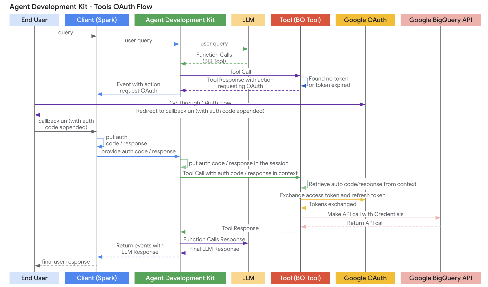

# Authenticating with Tools

## Concept

Many real-world tools (APIs) require authentication to verify the identity and
authorization of the caller. The ADK provides mechanisms to configure and
manage authentication credentials for your tools, particularly for tools
generated from OpenAPI specifications (RestApiTool). This allows agents to
securely interact with protected resources on behalf of the end-user or using
service credentials.

## Mechanism

Authentication in the ADK relies on two main components:

1. **AuthScheme:** Defines the type of authentication required by the target API
   (e.g., API Key in header, OAuth2 Bearer token). This typically mirrors the
   securitySchemes object defined in an OpenAPI specification. Supported types
   map to FastAPI/OpenAPI models like APIKey, HTTPBearer, OAuth2, OpenIdConnect.

2. **AuthCredential:** Holds the actual secrets, tokens, or configuration needed
   to authenticate initially. This object specifies the auth\_type (e.g.,
   API\_KEY, SERVICE\_ACCOUNT, OAUTH2) and contains the necessary data (e.g.,
   API key value, service account JSON details, OAuth client ID/secret).

## Workflow

1. **Configuration:** When defining a tool (especially RestApiTool or using OpenAPIToolset), you provide the relevant AuthScheme (what the API expects) and the initial AuthCredential (what the tool starts with).
2. **Credential Exchange (Optional but common):** Before the tool makes an API call, the ADK framework, often using ToolAuthHandler and AutoAuthCredentialExchanger, may need to exchange the initial credential for a usable one for the current request.
   * Example: A ServiceAccount credential (containing the JSON key) is exchanged for a short-lived OAuth 2.0 Bearer token using ServiceAccountCredentialExchanger. The resulting credential type becomes HTTP with a bearer scheme.
   * Example: An OAuth2 credential configured for Authorization Code flow might first trigger a request for user interaction via ToolContext.request\_credential. After user consent, the returned authorization code is then exchanged for an access token (Bearer token).
3. **Request Modification:** The usable credential (e.g., API key, Bearer token) is automatically formatted according to the AuthScheme and injected into the outgoing HTTP request by the RestApiTool (e.g., added as an Authorization: Bearer \<token\> header).
4. **API Call:** The RestApiTool makes the authenticated call to the target API.

## Supported Initial Credential Types

* API\_KEY: For simple key/value authentication. Usually requires no exchange.
* HTTP: Can represent Basic Auth (not recommended/supported for exchange) or already obtained Bearer tokens. If it's a Bearer token, no exchange is needed.
* OAUTH2: For standard OAuth 2.0 flows. Requires configuration (client ID, secret, scopes) and often triggers the interactive flow for user consent.
* OPEN\_ID\_CONNECT: For authentication based on OpenID Connect. Similar to OAuth2, often requires configuration and user interaction.
* SERVICE\_ACCOUNT: For Google Cloud Service Account credentials (JSON key or Application Default Credentials). Typically exchanged for a Bearer token.

## Credential Exchangers

* AutoAuthCredentialExchanger: Automatically selects the correct exchanger based on AuthCredential.auth\_type. Used by default.
* ServiceAccountCredentialExchanger: Handles exchanging SA keys/ADC for access tokens.
* OpenIdConnectCredentialExchanger: Handles OIDC flows.
* (OAuth2 exchangers would handle specific flows like Authorization Code, Client Credentials etc. \- OIDC exchanger currently handles the code part).
* NoExchangeCredentialExchanger: A no-op for types like API\_KEY or pre-obtained HTTP Bearer tokens.

## Interactive Flows (OAuth 2.0 / OpenID Connect)

When a tool requires user interaction (e.g., login and consent for OAuth):

1. The CredentialExchanger (e.g., `OpenIdConnectCredentialExchange`) determines interaction is needed.
2. It prepares the necessary information (like an authorization URL) and packages it into an Auth Config dictionary.
3. The tool calls tool\_context.request\_credential(auth\_config).
4. The ADK detects this specific action within the Event Actions.
5. It generates a special function call event containing the `auth_config` and the original `function_call_id` that triggered the auth request. This event is marked as long running.
6. The Runner sends this special event to the Agent Client (e.g., your application frontend, Spark).
7. The Agent Client receives the event, extracts the `auth_config` (e.g., the auth\_uri).
8. The Agent Client handles the user interaction (e.g., redirects the user to the auth\_uri, displays a login modal).
9. After the user completes the flow, the authentication provider redirects back to the Agent Client's predefined callback URL, usually including an authorization code or error information.
10. The Agent Client extracts the relevant information (e.g., the full callback URL containing the code) from the redirect.
11. The Agent Client resumes the agent run by calling `runner.run` again, this time passing the auth information back as a `function_response` part within the `new_message`. The name and id of this `function_response` must match the `af_request_euc` function call received earlier.
12. The ADK receives this function response.
13. The auth preprocessing logic within the framework extracts the auth response and makes it available via `tool_context.get_auth_response()`.
14. The framework retries the original tool call.
15. The CredentialExchanger now finds the auth response via `get_auth_response()` and uses it (e.g., the authorization code) to fetch the final access token.
16. The obtained access token (now usually an HTTP Bearer credential) is used for the API call. It might be cached by the ToolAuthHandler (e.g., in session state) for subsequent calls within the session.
