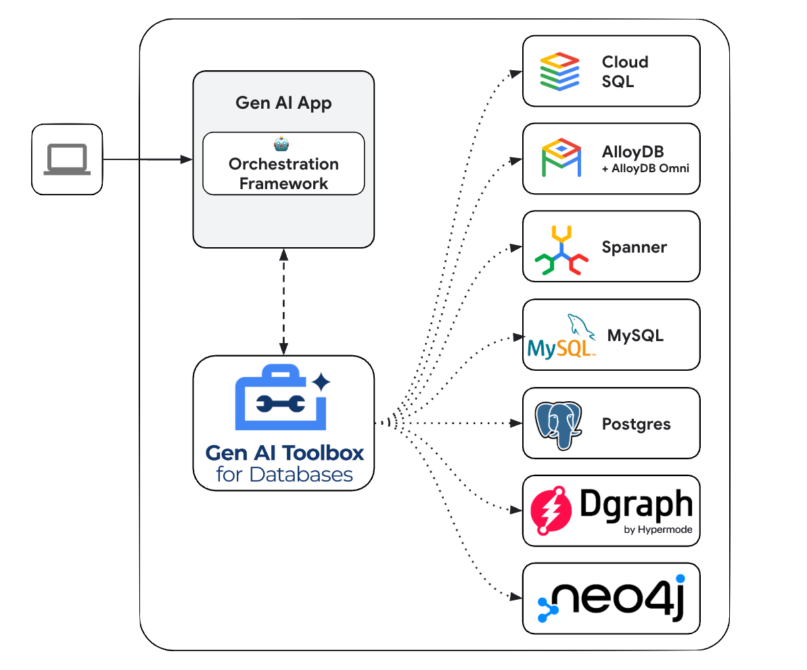

# Google Cloud Tools

## **Apigee API Hub as a tool**

Google’s Agent Development Kit (ADK) has built in support for Google Cloud Tools (APIgee APIHub Toolset). This section shows you how to authenticate and use an API from Apigee API Hub as a tool in the Agent Development Kit.

Seamlessly enable agents to securely access **any custom API managed in Apigee’s API Hub**, giving them governed access to existing capabilities in a few lines of code, saving significant effort re-building custom integrations.

### Prerequisites

1. Install the [Google Cloud CLI](https://cloud.google.com/sdk/docs/install?db=bigtable-docs#installation_instructions).

### Step 1: Create an OpenAPI Spec

If you have an [API Spec](https://swagger.io/specification/) already, validate it in the [Swagger Editor](https://editor.swagger.io/).

To create an API Spec for your API, you can use one of the following tools:

* [Swagger Editor](https://editor.swagger.io/).  
* A GenAI model like [Gemini](https://gemini.google.com/?db=bigtable-docs)  
* Visual Studio Code users can use [creating OpenAPI Spec with Gemini Cloud Code Assist](https://cloud.google.com/apigee/docs/api-platform/local-development/vscode/tutorial-gemini?db=bigtable-docs)

If you don't have an API or API Spec but would like to complete this guide, you can use one of the following public mock APIs:

* [Apigee Mock Target API](https://apidocs.apigee.com/docs/mock-target/1/overview?db=bigtable-docs)  
* [Swagger Petstore API for OpenAPI v3](https://petstore3.swagger.io/)

### Step 2: Publish this API Spec into API Hub

1. [Provision API Hub in Cloud Console](https://cloud.google.com/apigee/docs/apihub/provision?db=bigtable-docs)  
2. [Register an API](https://cloud.google.com/apigee/docs/apihub/quickstart-api?db=bigtable-docs)  
3. [Create an API Version](https://cloud.google.com/apigee/docs/apihub/quickstart-version?db=bigtable-docs)  
4. [Add the spec to that version](https://cloud.google.com/apigee/docs/apihub/manage-specifications?db=bigtable-docs#addwhencreateversion)

### Step 3: Setup your agent

Follow the [ADK quickstart](../get-started/quickstart.md) to setup the ADK and create an agent.

### Step 4: Create an API Hub Toolset and add it to your agent

1. Get your access token, or service account, so that APIHubToolset can fetch spec from API Hub API.

    ```shell
    gcloud auth print-access-token
    # Prints your access token like 'ya29....'
    ```

2. Create a tool with `APIHubToolset`.

    === "No authentication"

        If your API does not require authentication.

        ```py title="tools.py"
        from google.adk.tools.apihub_tool.apihub_toolset import APIHubToolset

        sample_toolset = APIHubToolset(
            name="apihub-sample-tool",
            description="Sample Tool",
            access_token="ya29..."  # Your access token to get the API specs from API Hub
            apihub_resource_name="projects/my-project-id/locations/us-west1/apis/my-api-id", # API Hub resource name
        )
        ```

        In production, we recommend that you use service accounts to get the API specs from API Hub.

        ```py title="tools.py"
        from google.adk.tools.apihub_tool.apihub_toolset import APIHubToolset

        sample_toolset = APIHubToolset(
            name="apihub-sample-tool",
            description="Sample Tool",
            # Use service account in production
            service_account_json=service_account_cred_json_str,
            apihub_resource_name="..."
        )
        ```


    === "Authentication required"

        If your API requires authentication, you must configure authentication for the tool. The following code sample demonstrates how to configure an API key.

        ```py title="tools.py"
        from google.adk.tools.openapi_tool.auth.auth_helpers import token_to_scheme_credential
        from google.adk.tools.apihub_tool.apihub_toolset import APIHubToolset

        # Assume your API requires API Key
        auth_scheme, auth_credential = token_to_scheme_credential(
            "apikey", "query", "apikey", apikey_credential_str
        )

        sample_toolset_with_auth = APIHubToolset(
            name="apihub-sample-tool",
            description="Sample Tool",
            access_token="ya29..."  # Copy your access token printed from above
            apihub_resource_name="projects/my-project-id/locations/us-west1/apis/my-api-id", # API Hub resource name
            auth_scheme=auth_scheme,
            auth_credential=auth_credential,
        )
        ```

        We support token based auth (API Key, Bearer token), service account, and OpenID Connect. We will soon add support for various OAuth2 flows.

3. Add `sample_toolset` to your agent's `tools`:

    ```py title="agent.py"
    from google.adk.agents.llm_agent import LlmAgent
    from .tools import sample_toolset

    # Finally, create your agent with the tools generated automatically.
    root_agent = LlmAgent(
        model='gemini-2.0-flash',
        name='enterprise_assistant',
        instruction='Help user integrate with multiple enterprise systems',
        tools=[
            *sample_toolset.get_tools(),
        ],
    ```

4. Start the Google ADK Web UI and try your agent.

    ```bash
    # make sure to run `adk web` from your project_root_folder
    adk web
    ```
    Then go to [http://localhost:8000](http://localhost:8000) to try your agent from the Web UI.

---

## **Connectors and application integrations Tool Set**

**Give your agents secure and governed access to enterprise applications using Integration Connector’s** 100+ pre-built connectors for systems like Salesforce, ServiceNow, JIRA, SAP, and more. Support for both on-prem and SaaS applications.

**Reuse or turn your existing Application Integration process automations into agentic workflows** directly in Agent Development Kit, without needing to specify guardrails and controls in agents separately again.

Google’s Agent Development Kit (ADK) has built in support for Application Integrations and Integration connectors Toolset. For more information see the documentation. 


#### Example usage (integration):

```py
tool = ApplicationIntegrationToolset(
    project="your-gcp-project-id",
    location="your-gcp-location",
    integration="your-integration-name",
    trigger="your-trigger-id"
)
```

#### Example usage (Connector):

```py
tool = ApplicationIntegrationToolset(
    project="your-gcp-project-id",
    location="your-gcp-location",
    Connection = “connection_name”
    entity_operations="operation_name"
)
```

---

## **GenAI Toolbox**

[Gen AI Toolbox for Databases](https://github.com/googleapis/genai-toolbox) is an open source server that makes it easier to build Gen AI tools for interacting with databases. Toolbox enables you to develop tools easier, faster, and more securely by handling the complexities such as connection pooling, authentication, and more.

Google’s Agent Development Kit (ADK) has built in support for Toolbox. For more information on [getting started](https://googleapis.github.io/genai-toolbox/getting-started) or configuring Toolbox, see the [documentation](https://googleapis.github.io/genai-toolbox/getting-started/introduction/). 


{: width="600"}


### Before you begin

#### Configure and deploy Toolbox server

Toolbox is a open source server that you deploy and manage yourself. For more instructions on deploying and configuring, see the official Toolbox documentation:

* [Installing the Server](https://googleapis.github.io/genai-toolbox/getting-started/introduction/#installing-the-server)  
* [Configuring Toolbox](https://googleapis.github.io/genai-toolbox/getting-started/configure/)

#### Install client SDK

ADK relies on the \``toolbox-langchain`\` python package to use Toolbox. Install the package before getting started:

```
pip install toolbox-langchain
```

### Loading Toolbox Tools

Once your Toolbox server is configured and up and running, you can load tools from your server using the ADK:

```py
from google.adk.tools import ToolboxTool

toolbox = ToolboxTool("https://127.0.0.1:5000")

root_agent = Agent(  
    ...,
    # Load all tools
    toolbox_tools.get_toolset(),
    # Load a specific set of tools
    toolbox_tools.get_toolset(toolset_name='my-toolset-name'),
    # Load single tool
    toolbox_tools.get_toolset(tool_name='my-tool-name'),
)
```

### Advanced Toolbox Features

Toolbox has a variety of features to make developing Gen AI tools for databases. For more information, read more about the following features: 

* [Authenticated Parameters](https://googleapis.github.io/genai-toolbox/resources/tools/#authenticated-parameters): bind tool inputs to values from OIDC tokens automatically, making it easy to run sensitive queries without potentially leaking data  
* [Authorized Invocations:](https://googleapis.github.io/genai-toolbox/resources/tools/#authorized-invocations)  restrict access to use a tool based on the users Auth token  
* [OpenTelemetry](https://googleapis.github.io/genai-toolbox/how-to/export_telemetry/): get metrics and tracing from Toolbox with OpenTelemetry