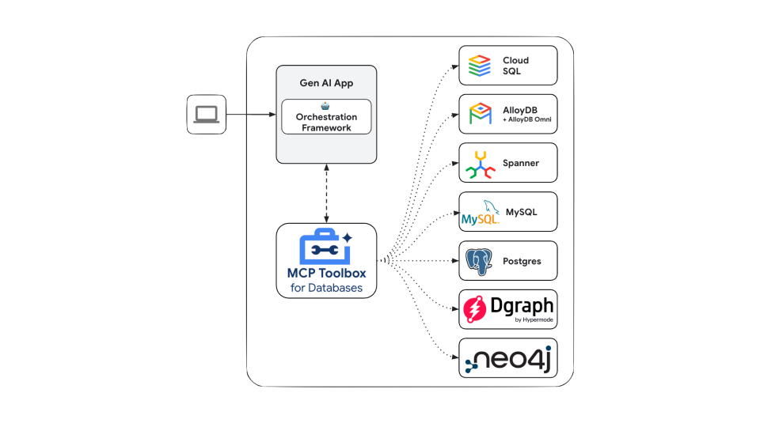

# Google Cloud Tools

Google Cloud tools make it easier to connect your agents to Google Cloud’s products and services. With just a few lines of code you can leverage these tools to connect your agents with:

* **millions of custom APIs** which developers host in Apigee,
* **100s** of **prebuilt connectors** to enterprise systems like salesforce, workday and SAP
* **Automation workflows** built using application integration  
* Databases like Spanner, AlloyDB, Postgres and more using the GenAI Toolbox for databases


## 1. Use an API from Apigee API Hub

**ApiHubToolset** lets you turn any documented API from Apigee API hub into a tool with a few lines of code. This section shows you the step by step instructions including setting up authentication for a secure connection to your APIs.

## Prerequisites

1. [Install ADK](../get-started/installation.md)  
2. Install the [Google Cloud CLI](https://cloud.google.com/sdk/docs/install?db=bigtable-docs#installation_instructions).  
3. [Apigee API hub](https://cloud.google.com/apigee/docs/apihub/what-is-api-hub) instance with documented (i.e. OpenAPI spec) APIs  
4. Set up your project structure and create required files

```console
project_root_folder
 |
 `-- my_agent
     |-- .env
     |-- __init__.py
     |-- agent.py
     `__ tool.py
```

### Create an API Hub Toolset and add it to your agent

Note: this tutorial includes an agent creation. If you already have an agent, you can only follow subset of these steps.

1. Get your access token, so that APIHubToolset can fetch spec from API Hub API. In your terminal run the following command

    ```shell
    gcloud auth print-access-token
    # Prints your access token like 'ya29....'
    ```

2. Ensure that the account used has the required permissions. You can use the pre-defined role `roles/apihub.viewer` or assign the following permissions:  
    1. **apihub.specs.get (required)**  
    2. apihub.apis.get (optional)  
    3. apihub.apis.list (optional)  
    4. apihub.versions.get (optional)  
    5. apihub.versions.list (optional)  
    6. apihub.specs.list (optional)

3. Create a tool with `APIHubToolset`. Add the below to `tools.py`

    If your API requires authentication, you must configure authentication for the tool. The following code sample demonstrates how to configure an API key. ADK supports token based auth (API Key, Bearer token), service account, and OpenID Connect. We will soon add support for various OAuth2 flows.

    ```py
    from google.adk.tools.openapi_tool.auth.auth_helpers import token_to_scheme_credential
    from google.adk.tools.apihub_tool.apihub_toolset import APIHubToolset

    # Provide authentication for your APIs. Not required if your APIs don't required authentication.
    auth_scheme, auth_credential = token_to_scheme_credential(
        "apikey", "query", "apikey", apikey_credential_str
    )

    sample_toolset_with_auth = APIHubToolset(
        name="apihub-sample-tool",
        description="Sample Tool",
        access_token="...",  # Copy your access token generated in step 1
        apihub_resource_name="...", # API Hub resource name
        auth_scheme=auth_scheme,
        auth_credential=auth_credential,
    )
    ```

    For production deployment we recommend using a service account instead of an access token. In the code snippet above, use `service_account_json=service_account_cred_json_str` and provide your security account credentials instead of the token.

    For apihub\_resource\_name, if you know the specific ID of the OpenAPI Spec being used for your API, use `` `projects/my-project-id/locations/us-west1/apis/my-api-id/versions/version-id/specs/spec-id` ``. If you would like the Toolset to automatically pull the first available spec from the API, use `` `projects/my-project-id/locations/us-west1/apis/my-api-id` ``

4. Create your agent file [Agent.py](http://Agent.py) and add the created tools to your agent definition:

    ```py
    from google.adk.agents.llm_agent import LlmAgent
    from .tools import sample_toolset

    root_agent = LlmAgent(
        model='gemini-2.0-flash-exp',
        name='enterprise_assistant',
        instruction='Help user, leverage the tools you have access to',
        tools=sample_toolset.get_tools(),)
    ```

5. Configure your  \`\_\_init\_\_.py\` to expose your agent

    ```py
    from . import agent
    ```

6. Start the Google ADK Web UI and try your agent.

    ```shell
    # make sure to run `adk web` from your project_root_folder
    adk web
    ```

   Then go to [http://localhost:8000](http://localhost:8000) to try your agent from the Web UI.

---

## 2. Connect to Enterprise Applications and Integration workflows

With **ApplicationIntegrationToolset** you can seamlessly give your agents a secure and governed to enterprise applications using Integration Connector’s 100+ pre-built connectors for systems like Salesforce, ServiceNow, JIRA, SAP, and more. Support for both on-prem and SaaS applications.  
In addition you can  turn your existing Application Integration process automations into agentic workflows by providing application integration workflows as tools to your ADK agents.

## Prerequisites

1. [Install ADK](../get-started/installation.md)  
2. An existing [Application Integration](https://cloud.google.com/application-integration/docs/overview) workflow or [Integrations Connector](https://cloud.google.com/integration-connectors/docs/overview) connection you want to use with your agent  
3. To use tool with default credentials: have Google Cloud CLI installed. See [installation guide](https://cloud.google.com/sdk/docs/install#installation_instructions)*.*
   *Run :*

    ```shell
    gcloud config set project 
    gcloud auth application-default login
    gcloud auth application-default set-quota-project <project-id>
    ```

4. Set up your project structure and create required files  

    ```console
    project_root_folder
    |-- .env
    `-- my_agent
        |-- __init__.py
        |-- agent.py
        `__ tools.py
    ```

When running the agent, make sure to run adk web in project\_root\_folder

### Connect your agent to enterprise applications using [Integration Connectors](https://cloud.google.com/integration-connectors/docs/overview)

1. To use a connector from Integration Connectors, you need to provision Application Integration in the same region as your connection, import and publish [Connection Tool](https://pantheon.corp.google.com/integrations/templates/connection-tool/locations/us-central1) from the template library.

2. Create a tool with `ApplicationInetgrationToolset`

    ```py
    from google.adk.tools.application_integration_tool.application_integration_toolset import ApplicationIntegrationToolset

    connector_tool = ApplicationIntegrationToolset(
        project="test-project", # TODO: replace with GCP project of the connection
        location="us-central1", #TODO: replace with location of the connection
        connection="test-connection", #TODO: replace with connection name
        entity_operations={"Entity_One": ["LIST","CREATE"], "Entity_Two": []},#empty list for actions means all operations on the entity are supported.
        actions=["action1"], #TODO: replace with actions
        service_account_credentials='{...}', # optional
        tool_name="tool_prefix2",
        tool_instructions="..."
    )
    ```

    Note: You can provide service account to be used instead of using default credentials  
    To find the list of supported entities and actions for a connection, use the connectors apis:  
    [listActions](https://cloud.google.com/integration-connectors/docs/reference/rest/v1/projects.locations.connections.connectionSchemaMetadata/listActions), [listEntityTypes](https://cloud.google.com/integration-connectors/docs/reference/rest/v1/projects.locations.connections.connectionSchemaMetadata/listEntityTypes)

3. Add the tool to your agent. Update your agent.py file

    ```py
    from google.adk.agents.llm_agent import LlmAgent
    from .tools import connector_tool

    root_agent = LlmAgent(
    model='gemini-2.0-flash-exp',
    name='connector_agent',
    instruction="Help user, leverage the tools you have access to",
    tools=connector_tool.get_tools(),
    ]
    )
    ```

4. Configure your  \`\_\_init\_\_.py\` to expose your agent

    ```py
    from . import agent
    ```

5. Start the Google ADK Web UI and try your agent.

    ```shell
    # make sure to run `adk web` from your project_root_folder
    adk web
    ```

   Then go to [http://localhost:8000](http://localhost:8000), and choose my\_agent agent (same as the agent folder name)

### Use existing [Application Integration](https://cloud.google.com/application-integration/docs/overview) workflow as a tool for your agent

1. Create a tool with `ApplicationInetgrationToolset`

    ```py
    integration_tool = ApplicationIntegrationToolset(
        project="test-project", # TODO: replace with GCP project of the connection
        location="us-central1", #TODO: replace with location of the connection
        integration="test-integration", #TODO: replace with integration name
        trigger="api_trigger/test_trigger",#TODO: replace with trigger id
        service_account_credentials='{...}', #optional
        tool_name="tool_prefix1",
        tool_instructions="..."
    )
    ```

    Note: You can provide service account to be used instead of using default credentials

2. Add the tool to your agent. Update your agent.py file

    ```py
    from google.adk.agents.llm_agent import LlmAgent
    from .tools import integration_tool, connector_tool

    root_agent = LlmAgent(
    model='gemini-2.0-flash-exp',
    name='integration_agent',
    instruction="Help user, leverage the tools you have access to",
    tools=integration_tool.get_tools(),
    ]
    )
    ```

3. Configure your  \`\_\_init\_\_.py\` to expose your agent

    ```py
    from . import agent
    ```

4. Start the Google ADK Web UI and try your agent.

    ```shell
    # make sure to run `adk web` from your project_root_folder
    adk web
    ```

    Then go to [http://localhost:8000](http://localhost:8000), and choose my\_agent agent (same as the agent folder name)

---

## 3. **Toolbox Tools for Databases**

[MCP Toolbox for Databases](https://github.com/googleapis/genai-toolbox) is an open source MCP server for databases. It was designed with enterprise-grade and production-quality in mind. It enables you to develop tools easier, faster, and more securely by handling the complexities such as connection pooling, authentication, and more.

Google’s Agent Development Kit (ADK) has built in support for Toolbox. For more information on [getting started](https://googleapis.github.io/genai-toolbox/getting-started) or [configuring](https://googleapis.github.io/genai-toolbox/getting-started/configure/) Toolbox, see the [documentation](https://googleapis.github.io/genai-toolbox/getting-started/introduction/).



## Before you begin

### Configure and deploy Toolbox server

Toolbox is an open source server that you deploy and manage yourself. For more instructions on deploying and configuring, see the official Toolbox documentation:

* [Installing the Server](https://googleapis.github.io/genai-toolbox/getting-started/introduction/#installing-the-server)  
* [Configuring Toolbox](https://googleapis.github.io/genai-toolbox/getting-started/configure/)

### Install client SDK

ADK relies on the \``toolbox-langchain`\` python package to use Toolbox. Install the package before getting started:

```shell
pip install toolbox-langchain langchain
```

## Loading Toolbox Tools

Once you’ve Toolbox server is configured and up and running, you can load tools from your server using the ADK:

```py
from google.adk.tools.toolbox_tool import ToolboxTool

toolbox = ToolboxTool("https://127.0.0.1:5000")

# Load a specific set of tools
tools = toolbox.get_toolset(toolset_name='my-toolset-name'),
# Load single tool
tools = toolbox.get_tool(tool_name='my-tool-name'),

root_agent = Agent(  
    ...,
    tools=tools # Provide the list of tools to the Agent

)
```

## Advanced Toolbox Features

Toolbox has a variety of features to make developing Gen AI tools for databases. For more information, read more about the following features::

* [Authenticated Parameters](https://googleapis.github.io/genai-toolbox/resources/tools/#authenticated-parameters): bind tool inputs to values from OIDC tokens automatically, making it easy to run sensitive queries without potentially leaking data  
* [Authorized Invocations:](https://googleapis.github.io/genai-toolbox/resources/tools/#authorized-invocations)  restrict access to use a tool based on the users Auth token  
* [OpenTelemetry](https://googleapis.github.io/genai-toolbox/how-to/export_telemetry/): get metrics and tracing from Toolbox with OpenTelemetry
