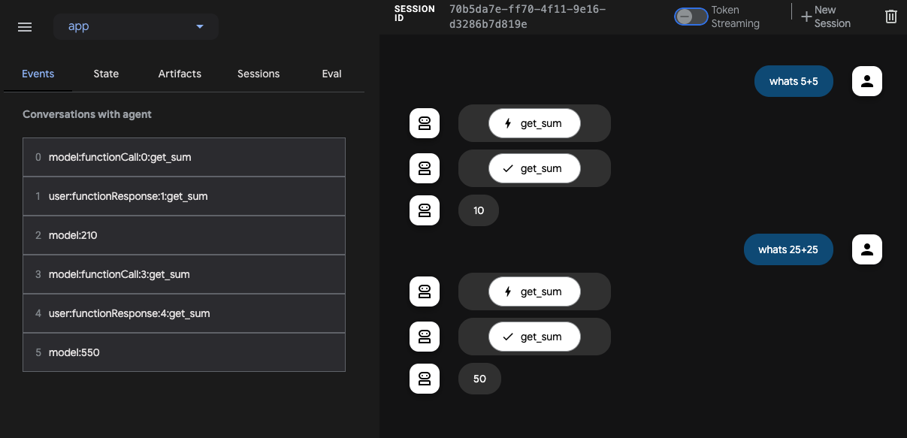

# Model Context Protocol Tools

 This guide walks you through two ways of integrating Model Context Protocol (MCP) with ADK.

## What is Model Context Protocol (MCP)?

The Model Context Protocol (MCP) is an open standard designed to standardize how Large Language Models (LLMs) like Gemini and Claude communicate with external applications, data sources, and tools. Think of it as a universal connection mechanism that simplifies how LLMs obtain context, execute actions, and interact with various systems.

MCP follows a client-server architecture, defining how **data** (resources), **interactive templates** (prompts), and **actionable functions** (tools) are exposed by an **MCP server** and consumed by an **MCP client** (which could be an LLM host application or an AI agent).

This guide covers two primary integration patterns:

1. **Using Existing MCP Servers within ADK:** An ADK agent acts as an MCP client, leveraging tools provided by external MCP servers.
2. **Exposing ADK Tools via an MCP Server:** Building an MCP server that wraps ADK tools, making them accessible to any MCP client.

## Prerequisites

Before you begin, ensure you have the following set up:

* **Set up ADK:** Follow the standard ADK \[setup\](https://google.github.io/adk-docs/get-started/quickstart/#venv-install) instructions in the quickstart.
* **Install/update Python:** MCP requires Python version of 3.9 or higher.
* **Setup Node.js and npx:** Many community MCP servers are distributed as Node.js packages and run using `npx`. Install Node.js (which includes npx) if you haven't already. For details, see [https://nodejs.org/en](https://nodejs.org/en).
* **Verify Installations:** Confirm `adk` and `npx` are in your PATH within the activated virtual environment:

```shell
# Both commands should print the path to the executables.
which adk
which npx
```

## 1. Using MCP servers with ADK agents (ADK as an MCP client) in `adk web`

This section shows two examples of using MCP servers with ADK agents. This is the **most common** integration pattern. Your ADK agent needs to use functionality provided by an existing service that exposes itself as an MCP Server.

### `MCPToolset` class

The examples use the `MCPToolset` class in ADK which acts as the bridge to the MCP server. Your ADK agent uses `MCPToolset` to:

1. **Connect:** Establish a connection to an MCP server process. This can be a local server communicating over standard input/output (`StdioServerParameters`) or a remote server using Server-Sent Events (`SseServerParams`).
2. **Discover:** Query the MCP server for its available tools (`list_tools` MCP method).
3. **Adapt:** Convert the MCP tool schemas into ADK-compatible `BaseTool` instances.
4. **Expose:** Present these adapted tools to the ADK `LlmAgent`.
5. **Proxy Calls:** When the `LlmAgent` decides to use one of these tools, `MCPToolset` forwards the call (`call_tool` MCP method) to the MCP server and returns the result.
6. **Manage Connection:** Handle the lifecycle of the connection to the MCP server process, often requiring explicit cleanup.

These examples assumes you interact with MCP Tools with `adk web`. If you are not using `adk web`, see "Using MCP Tools in your own Agent out of `adk web`" section below.

_Note: Using MCP tool requires a slightly different syntax to export the agent containing MCP Tools. A simpler interface for using MCP in ADK is currently in progress._

### Example 1: File System MCP Server

This example demonstrates connecting to a local MCP server that provides file system operations.

#### Step 1: Attach the MCP Server to your ADK agent via `MCPToolset`

Create `agent.py` in `./adk_agent_samples/mcp_agent/` and use the following code snippet to define a function that initializes the `MCPToolset`.

* **Important:** Replace `"/path/to/your/folder"` with the **absolute path** to an actual folder on your system.

```py
# ./adk_agent_samples/mcp_agent/agent.py
from google.adk.agents.llm_agent import LlmAgent
from google.adk.tools.mcp_tool.mcp_toolset import MCPToolset, StdioServerParameters


async def create_agent():
  """Gets tools from MCP Server."""
  tools, exit_stack = await MCPToolset.from_server(
      connection_params=StdioServerParameters(
          command='npx',
          args=["-y",    # Arguments for the command
            "@modelcontextprotocol/server-filesystem",
            # TODO: IMPORTANT! Change the path below to an ABSOLUTE path on your system.
            "/path/to/your/folder",
          ],
      )
  )

  agent = LlmAgent(
      model='gemini-2.0-flash',
      name='enterprise_assistant',
      instruction=(
          'Help user accessing their file systems'
      ),
      tools=tools,
  )
  return agent, exit_stack


root_agent = create_agent()
```

If there are multiple MCP Servers, create a common exit stack and apply it to all MCPToolsets

```python
# agent.py
from contextlib import AsyncExitStack
from google.adk.agents.llm_agent import LlmAgent
from google.adk.tools.mcp_tool.mcp_toolset import MCPToolset, StdioServerParameters, SseServerParams


async def create_agent():
  """Gets tools from MCP Server."""
  common_exit_stack = AsyncExitStack()

  local_tools, _ = await MCPToolset.from_server(
      connection_params=StdioServerParameters(
          command='npx',
          args=["-y",    # Arguments for the command
            "@modelcontextprotocol/server-filesystem",
            # TODO: IMPORTANT! Change the path below to an ABSOLUTE path on your system.
            "/path/to/your/folder",
          ],
      ),
      async_exit_stack=common_exit_stack
  )

  remote_tools, _ = await MCPToolset.from_server(
      connection_params=SseServerParams(
          # TODO: IMPORTANT! Change the path below to your remote MCP Server path
          url="https://your-mcp-server-url.com/sse"
      ),
      async_exit_stack=common_exit_stack
  )


  agent = LlmAgent(
      model='gemini-2.0-flash',
      name='enterprise_assistant',
      instruction=(
          'Help user accessing their file systems'
      ),
      tools=[
        *local_tools,
        *remote_tools,
      ],
  )
  return agent, common_exit_stack


root_agent = create_agent()

```

#### Step 2: Create an __init__ file

Create an `__init__.py` in the same folder as the `agent.py` above

```python
# ./adk_agent_samples/mcp_agent/__init__.py
from . import agent
```

#### Step 3: Observe the result

Run `adk web` from the adk_agent_samples directory (ensure your virtual environment is active):

```shell
cd ./adk_agent_samples
adk web
```

A successfully MCPTool interaction will yield a response by accessing your local file system, like below:


### Example 2: Google Maps MCP Server

This follows the same pattern but targets the Google Maps MCP server.

#### Step 1: Get API Key and Enable APIs

Follow the directions at [Use API keys](https://developers.google.com/maps/documentation/javascript/get-api-key#create-api-keys) to get a Google Maps API Key.

Enable Directions API and Routes API in your Google Cloud project. For instructions, see [Getting started with Google Maps Platform](https://developers.google.com/maps/get-started#enable-api-sdk) topic.

#### Step 2: Update create_agent

Modify `create_agent` in agent.py to connect to the Maps server, passing your API key via the env parameter of StdioServerParameters.

```py
# agent.py (modify get_tools_async and other parts as needed)

from google.adk.agents.llm_agent import LlmAgent
from google.adk.tools.mcp_tool.mcp_toolset import MCPToolset, StdioServerParameters


async def create_agent():
  """Gets tools from MCP Server."""

  tools, exit_stack = await MCPToolset.from_server(
      connection_params=StdioServerParameters(
          command='npx',
          args=["-y",
                "@modelcontextprotocol/server-google-maps",
          ],
          # Pass the API key as an environment variable to the npx process
          env={
              "GOOGLE_MAPS_API_KEY": google_maps_api_key
          }
      )
  )

  agent = LlmAgent(
      model='gemini-2.0-flash', # Adjust if needed
      name='maps_assistant',
      instruction='Help user with mapping and directions using available tools.',
      tools=tools,
  )
  return agent, exit_stack


root_agent = create_agent()
```


#### Step 3: Create an __init__ file

If you have already finished this from Example 1 above, skip this step.

Create an `__init__.py` in the same folder as the `agent.py` above

```python
# ./adk_agent_samples/mcp_agent/__init__.py
from . import agent
```

#### Step 4: Observe the Result

Run `adk web` from the adk_agent_samples directory (ensure your virtual environment is active):

```shell
cd ./adk_agent_samples
adk web
```

A successfully MCPTool interaction will yield a response with a route plan, like below:


### Example 3: FastMCP Server

This example demonstrates connecting to a remote FastMCP server that provides math operations(eg. addition).

#### Step 0: Deploy FastMCP Server to Cloud Run

```py
#server.py
from fastmcp import FastMCP
import asyncio

mcp = FastMCP("FastMCP Demo Server")

@mcp.tool()
def add(a: int, b: int) -> int:
    """Add two numbers"""
    return a + b

if __name__ == "__main__":
    asyncio.run(mcp.run_sse_async(host="0.0.0.0", port=8080))
```
Ensure your MCP server project has the following files in the root directory(eg. `./fastmcp-demo`):

*   `server.py`: Your main application code using FastMCP.

*   `requirements.txt`: Lists the Python dependencies.
    ```txt
    fastmcp
    asyncio
    ```

*   `Procfile`: Tells Cloud Run how to start your web server. 
    ```Procfile
    web: python server.py
    ```
    *(Note: This assumes your FastMCP instance is named `mcp` within your `server.py` file. Adjust `server:mcp` if your filename or instance name is different.)*

Execute Cloud Run Deployment command from your FastMCP server directory(eg. `./fastmcp-demo`):
```shell
    gcloud run deploy fastmcp-demo \
        --source . \
        --region YOUR_REGION \
        --allow-unauthenticated
```
#### Step 1: Attach the FastMCP Server to your ADK agent via `MCPToolset`

Create `agent.py` in `./adk_agent_samples/fastmcp_agent/` and use the following code snippet to define a function that initializes the `MCPToolset`.

* **Important:** Replace Cloud Run service url with the one you deployed in previous step.

```py
# ./adk_agent_samples/fastmcp_agent/agent.py

import os
from contextlib import AsyncExitStack

import google.auth
from google.adk.agents import Agent
from google.adk.tools.tool_context import ToolContext
from google.adk.tools.mcp_tool.mcp_toolset import MCPToolset, SseServerParams

_, project_id = google.auth.default()
os.environ.setdefault("GOOGLE_CLOUD_PROJECT", project_id)
os.environ.setdefault("GOOGLE_CLOUD_LOCATION", "us-central1")
os.environ.setdefault("GOOGLE_GENAI_USE_VERTEXAI", "True")


async def get_sum(a: int, b: int) -> int:
    """Calculate the sum of two numbers.

    Args:
        a: number
        b: number

    Returns:
        the sum of two numbers.
    """
    common_exit_stack = AsyncExitStack()

    tools, _ = await MCPToolset.from_server(
        connection_params=SseServerParams(
            url="https://fastmcp-demo-00000000000.us-central1.run.app/sse",
        ),
        async_exit_stack=common_exit_stack
    )

    return await tools[0].run_async(
        args={
            "a": a,
            "b": b,
        },
        tool_context=None,
    )

root_agent = Agent(
    name="root_agent",
    model="gemini-2.0-flash",
    instruction="You are a helpful AI assistant designed to provide accurate and useful information.",
    tools=[get_sum],
)
```


#### Step 2: Create an __init__ file

Create an `__init__.py` in the same folder as the `agent.py` above

```python
# ./adk_agent_samples/fastmcp_agent/__init__.py
from . import agent
```

#### Step 3: Observe the result

Run `adk web` from the adk_agent_samples directory (ensure your virtual environment is active):

```shell
cd ./adk_agent_samples
adk web
```

A successfully interaction will yield a response by accessing your remote FastMCP server, like below:




## 2. **Building an MCP server with ADK tools (MCP server exposing ADK)**

This pattern allows you to wrap ADK's tools and make them available to any standard MCP client application. The example in this section exposes the load\_web\_page ADK tool through the MCP server.

### Summary of steps

You will create a standard Python MCP server application using the model-context-protocol library. Within this server, you will:

1. Instantiate the ADK tool(s) you want to expose (e.g., FunctionTool(load\_web\_page)).
2. Implement the MCP server's @app.list\_tools handler to advertise the ADK tool(s), converting the ADK tool definition to the MCP schema using adk\_to\_mcp\_tool\_type.
3. Implement the MCP server's @app.call\_tool handler to receive requests from MCP clients, identify if the request targets your wrapped ADK tool, execute the ADK tool's .run\_async() method, and format the result into an MCP-compliant response (e.g., types.TextContent).

### Prerequisites

Install the MCP server library in the same environment as ADK:

```shell
pip install mcp
```

### Step 1: Create the MCP Server Script

Create a new Python file, e.g., adk\_mcp\_server.py.

### Step 2: Implement the Server Logic

Add the following code, which sets up an MCP server exposing the ADK load\_web\_page tool.

```py
# adk_mcp_server.py
import asyncio
import json
from dotenv import load_dotenv

# MCP Server Imports
from mcp import types as mcp_types # Use alias to avoid conflict with genai.types
from mcp.server.lowlevel import Server, NotificationOptions
from mcp.server.models import InitializationOptions
import mcp.server.stdio

# ADK Tool Imports
from google.adk.tools.function_tool import FunctionTool
from google.adk.tools.load_web_page import load_web_page # Example ADK tool
# ADK <-> MCP Conversion Utility
from google.adk.tools.mcp_tool.conversion_utils import adk_to_mcp_tool_type

# --- Load Environment Variables (If ADK tools need them) ---
load_dotenv()

# --- Prepare the ADK Tool ---
# Instantiate the ADK tool you want to expose
print("Initializing ADK load_web_page tool...")
adk_web_tool = FunctionTool(load_web_page)
print(f"ADK tool '{adk_web_tool.name}' initialized.")
# --- End ADK Tool Prep ---

# --- MCP Server Setup ---
print("Creating MCP Server instance...")
# Create a named MCP Server instance
app = Server("adk-web-tool-mcp-server")

# Implement the MCP server's @app.list_tools handler
@app.list_tools()
async def list_tools() -> list[mcp_types.Tool]:
  """MCP handler to list available tools."""
  print("MCP Server: Received list_tools request.")
  # Convert the ADK tool's definition to MCP format
  mcp_tool_schema = adk_to_mcp_tool_type(adk_web_tool)
  print(f"MCP Server: Advertising tool: {mcp_tool_schema.name}")
  return [mcp_tool_schema]

# Implement the MCP server's @app.call_tool handler
@app.call_tool()
async def call_tool(
    name: str, arguments: dict
) -> list[mcp_types.TextContent | mcp_types.ImageContent | mcp_types.EmbeddedResource]:
  """MCP handler to execute a tool call."""
  print(f"MCP Server: Received call_tool request for '{name}' with args: {arguments}")

  # Check if the requested tool name matches our wrapped ADK tool
  if name == adk_web_tool.name:
    try:
      # Execute the ADK tool's run_async method
      # Note: tool_context is None as we are not within a full ADK Runner invocation
      adk_response = await adk_web_tool.run_async(
          args=arguments,
          tool_context=None, # No ADK context available here
      )
      print(f"MCP Server: ADK tool '{name}' executed successfully.")
      # Format the ADK tool's response (often a dict) into MCP format.
      # Here, we serialize the response dictionary as a JSON string within TextContent.
      # Adjust formatting based on the specific ADK tool's output and client needs.
      response_text = json.dumps(adk_response, indent=2)
      return [mcp_types.TextContent(type="text", text=response_text)]

    except Exception as e:
      print(f"MCP Server: Error executing ADK tool '{name}': {e}")
      # Return an error message in MCP format
      # Creating a proper MCP error response might be more robust
      error_text = json.dumps({"error": f"Failed to execute tool '{name}': {str(e)}"})
      return [mcp_types.TextContent(type="text", text=error_text)]
  else:
      # Handle calls to unknown tools
      print(f"MCP Server: Tool '{name}' not found.")
      error_text = json.dumps({"error": f"Tool '{name}' not implemented."})
      # Returning error as TextContent for simplicity
      return [mcp_types.TextContent(type="text", text=error_text)]

# --- MCP Server Runner ---
async def run_server():
  """Runs the MCP server over standard input/output."""
  # Use the stdio_server context manager from the MCP library
  async with mcp.server.stdio.stdio_server() as (read_stream, write_stream):
    print("MCP Server starting handshake...")
    await app.run(
        read_stream,
        write_stream,
        InitializationOptions(
            server_name=app.name, # Use the server name defined above
            server_version="0.1.0",
            capabilities=app.get_capabilities(
                # Define server capabilities - consult MCP docs for options
                notification_options=NotificationOptions(),
                experimental_capabilities={},
            ),
        ),
    )
    print("MCP Server run loop finished.")

if __name__ == "__main__":
  print("Launching MCP Server exposing ADK tools...")
  try:
    asyncio.run(run_server())
  except KeyboardInterrupt:
    print("\nMCP Server stopped by user.")
  except Exception as e:
    print(f"MCP Server encountered an error: {e}")
  finally:
    print("MCP Server process exiting.")
# --- End MCP Server ---

```

### Step 3: Test your MCP Server with ADK

Follow the same instructions in “Example 1: File System MCP Server” and create a MCP client. This time use your MCP Server file created above as input command:

```py
# ./adk_agent_samples/mcp_agent/agent.py

# ...

async def get_tools_async():
  """Gets tools from the File System MCP Server."""
  print("Attempting to connect to MCP Filesystem server...")
  tools, exit_stack = await MCPToolset.from_server(
      # Use StdioServerParameters for local process communication
      connection_params=StdioServerParameters(
          command='python3', # Command to run the server
          args=[
                "/absolute/path/to/adk_mcp_server.py"],
      )
  )
```

Execute the agent script from your terminal similar to above (ensure necessary libraries like model-context-protocol and google-adk are installed in your environment):

```shell
cd ./adk_agent_samples
python3 ./mcp_agent/agent.py
```

The script will print startup messages and then wait for an MCP client to connect via its standard input/output to your MCP Server in adk\_mcp\_server.py. Any MCP-compliant client (like Claude Desktop, or a custom client using the MCP libraries) can now connect to this process, discover the load\_web\_page tool, and invoke it. The server will print log messages indicating received requests and ADK tool execution. Refer to the [documentation](https://modelcontextprotocol.io/quickstart/server#core-mcp-concepts), to try it out with Claude Desktop.

## Using MCP Tools in your own Agent out of `adk web`

This section is relevant to you if:

* You are developing your own Agent using ADK
* And, you are **NOT** using `adk web`,
* And, you are exposing the agent via your own UI


Using MCP Tools requires a different setup than using regular tools, due to the fact that specs for MCP Tools are fetched asynchronously
from the MCP Server running remotely, or in another process.

The following example is modified from the "Example 1: File System MCP Server" example above. The main differences are:

1. Your tool and agent are created asynchronously
2. You need to properly manage the exit stack, so that your agents and tools are destructed properly when the connection to MCP Server is closed.

```python
# agent.py (modify get_tools_async and other parts as needed)
# ./adk_agent_samples/mcp_agent/agent.py
import asyncio
from dotenv import load_dotenv
from google.genai import types
from google.adk.agents.llm_agent import LlmAgent
from google.adk.runners import Runner
from google.adk.sessions import InMemorySessionService
from google.adk.artifacts.in_memory_artifact_service import InMemoryArtifactService # Optional
from google.adk.tools.mcp_tool.mcp_toolset import MCPToolset, SseServerParams, StdioServerParameters

# Load environment variables from .env file in the parent directory
# Place this near the top, before using env vars like API keys
load_dotenv('../.env')

# --- Step 1: Agent Definition ---
async def get_agent_async():
  """Creates an ADK Agent equipped with tools from the MCP Server."""
  tools, exit_stack = await MCPToolset.from_server(
      # Use StdioServerParameters for local process communication
      connection_params=StdioServerParameters(
          command='npx', # Command to run the server
          args=["-y",    # Arguments for the command
                "@modelcontextprotocol/server-filesystem",
                # TODO: IMPORTANT! Change the path below to an ABSOLUTE path on your system.
                "/path/to/your/folder"],
      )
      # For remote servers, you would use SseServerParams instead:
      # connection_params=SseServerParams(url="http://remote-server:port/path", headers={...})
  )
  print(f"Fetched {len(tools)} tools from MCP server.")
  root_agent = LlmAgent(
      model='gemini-2.0-flash', # Adjust model name if needed based on availability
      name='filesystem_assistant',
      instruction='Help user interact with the local filesystem using available tools.',
      tools=tools, # Provide the MCP tools to the ADK agent
  )
  return root_agent, exit_stack

# --- Step 2: Main Execution Logic ---
async def async_main():
  session_service = InMemorySessionService()
  # Artifact service might not be needed for this example
  artifacts_service = InMemoryArtifactService()

  session = session_service.create_session(
      state={}, app_name='mcp_filesystem_app', user_id='user_fs'
  )

  # TODO: Change the query to be relevant to YOUR specified folder.
  # e.g., "list files in the 'documents' subfolder" or "read the file 'notes.txt'"
  query = "list files in the tests folder"
  print(f"User Query: '{query}'")
  content = types.Content(role='user', parts=[types.Part(text=query)])

  root_agent, exit_stack = await get_agent_async()

  runner = Runner(
      app_name='mcp_filesystem_app',
      agent=root_agent,
      artifact_service=artifacts_service, # Optional
      session_service=session_service,
  )

  print("Running agent...")
  events_async = runner.run_async(
      session_id=session.id, user_id=session.user_id, new_message=content
  )

  async for event in events_async:
    print(f"Event received: {event}")

  # Crucial Cleanup: Ensure the MCP server process connection is closed.
  print("Closing MCP server connection...")
  await exit_stack.aclose()
  print("Cleanup complete.")

if __name__ == '__main__':
  try:
    asyncio.run(async_main())
  except Exception as e:
    print(f"An error occurred: {e}")
```


## Key considerations

When working with MCP and ADK, keep these points in mind:

* **Protocol vs. Library:** MCP is a protocol specification, defining communication rules. ADK is a Python library/framework for building agents. MCPToolset bridges these by implementing the client side of the MCP protocol within the ADK framework. Conversely, building an MCP server in Python requires using the model-context-protocol library.

* **ADK Tools vs. MCP Tools:**

    * ADK Tools (BaseTool, FunctionTool, AgentTool, etc.) are Python objects designed for direct use within the ADK's LlmAgent and Runner.
    * MCP Tools are capabilities exposed by an MCP Server according to the protocol's schema. MCPToolset makes these look like ADK tools to an LlmAgent.
    * Langchain/CrewAI Tools are specific implementations within those libraries, often simple functions or classes, lacking the server/protocol structure of MCP. ADK offers wrappers (LangchainTool, CrewaiTool) for some interoperability.

* **Asynchronous nature:** Both ADK and the MCP Python library are heavily based on the asyncio Python library. Tool implementations and server handlers should generally be async functions.

* **Stateful sessions (MCP):** MCP establishes stateful, persistent connections between a client and server instance. This differs from typical stateless REST APIs.

    * **Deployment:** This statefulness can pose challenges for scaling and deployment, especially for remote servers handling many users. The original MCP design often assumed client and server were co-located. Managing these persistent connections requires careful infrastructure considerations (e.g., load balancing, session affinity).
    * **ADK MCPToolset:** Manages this connection lifecycle. The exit\_stack pattern shown in the examples is crucial for ensuring the connection (and potentially the server process) is properly terminated when the ADK agent finishes.

## Further Resources

* [Model Context Protocol Documentation](https://modelcontextprotocol.io/ )
* [MCP Specification](https://modelcontextprotocol.io/specification/)
* [MCP Python SDK & Examples](https://github.com/modelcontextprotocol/)
